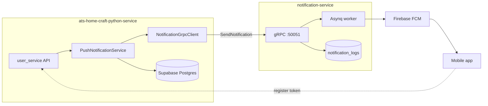

# ADR 0009: Push notifications via notification-service gRPC

|                  |                                                                                                                                                                                          |
| ---------------- | ---------------------------------------------------------------------------------------------------------------------------------------------------------------------------------------- |
| **Status**       | Accepted                                                                                                                                                                                 |
| **Date**         | 2026-07-29                                                                                                                                                                               |
| **Authors**      | Home Craft platform team                                                                                                                                                                 |
| **Depends on**   | [ADR 0001](./0001-resident-onboarding.md) (`communication_preferences`), [ADR 0008](./0008-walk-in-entries.md), existing `user_push_tokens` migration                                    |
| **Related docs** | [push-notifications-flow.md](../push-notifications-flow.md), notification-service `docs/adr/0001-grpc-topic-push-notifications.md`, [0008 walk-in follow-ups](./0008-walk-in-entries.md) |
| **External**     | `notification-service` proto: `notification-service/proto/notification_service.proto`                                                                                                    |

______________________________________________________________________

## Context

Several Home Craft features need **mobile push** and an **in-app notification feed**:

| Feature area    | Example event                                 | ADR / flow reference                            |
| --------------- | --------------------------------------------- | ----------------------------------------------- |
| Walk-in visits  | Resident must approve a flat on a new walk-in | [ADR 0008](./0008-walk-in-entries.md)           |
| Visitor passes  | Household member checked in at gate           | [ADR 0004](./0004-pass-validation-gate.md)      |
| Daily help      | Helper checked in/out at gate                 | [ADR 0013](./0013-daily-help.md)                |
| Tenant requests | Document verified/rejected; request approved  | [ADR 0007](./0007-tenant-requests.md)           |
| Move events     | Move-in / move-out recorded                   | [ADR 0005](./0005-move-events.md)               |
| Fee billing     | Invoice issued, payment overdue               | [ADR 0006](./0006-project-fee-configuration.md) |
| Vehicles        | Vehicle submitted / approved / rejected       | Contact onboarding / vehicles flow              |
| Notices         | Community notice published                    | Notices module                                  |

Today:

- **Device registration** is implemented in `user_service` (`POST /users/me/push-devices`) and persisted in `public.user_push_tokens` (Supabase migration `20260728153000_user_push_tokens.sql`).
- **Outbound push sender** is implemented: `PushNotificationService`, `PushNotificationDispatcher`, `NotificationGrpcClient`, and domain wiring for walk-in, passes, daily help, tenant requests, fees, move events, vehicles, and notices (see [push-notifications-flow.md](../push-notifications-flow.md) §6).

### Constraints

- **Multi-tenancy:** every notification must be scoped to tenant + project + recipient user.
- **Supabase user identity:** push recipients are `auth.users.id` (UUID), not `contacts.id`.
- **Organization scope:** a user may belong to multiple orgs; tokens are stored per `(organization_id, user_id)`.
- **No FCM credentials in python-service:** Firebase credentials and retry logic stay in notification-service.
- **Non-blocking sends:** business HTTP handlers must not wait for FCM delivery; gRPC accept-only is sufficient.
- **Existing client name:** `ISOMETRIK_CLIENT_NAME` (`shared_settings.isometrik.client_name`) is the platform tenant identifier reused across Isometrik integrations.

### What we already store (`user_push_tokens`)

| Column            | Purpose                                    |
| ----------------- | ------------------------------------------ |
| `device_id`       | Client-stable id (unique; upsert on login) |
| `organization_id` | Org the user was active in at registration |
| `user_id`         | Supabase `auth.users.id`                   |
| `push_token`      | FCM registration token                     |
| `platform`        | `ios` \| `android` \| `web`                |
| `provider`        | Default `fcm`                              |

Registration API: `apps/user_service/app/api/user_push_tokens.py`.

A helper `user_push_topic(org_id, user_id) → "org:{org_id}:user:{user_id}"` exists in `user_push_token_service.py` for a **deterministic org-scoped FCM topic**. Topic delivery is optional (Phase 2); Phase 1 uses **stored device tokens**.

______________________________________________________________________

## Decision

Integrate **notification-service** from `ats-home-craft-python-service` using:

1. **gRPC** — `notification.Greeter/SendNotification` with `body_data` as a JSON string (same contract as python-social-service and notification-service ADR-0001).
1. **Token-based delivery (Phase 1)** — resolve FCM tokens from `user_push_tokens` for `(organization_id, recipient_user_id)` and pass them in `body_data.tokens[]`.
1. **Scoped payload fields** — map Home Craft identifiers to notification-service schema:

| `body_data` field | Home Craft source                                                 |
| ----------------- | ----------------------------------------------------------------- |
| `tenant_id`       | `shared_settings.isometrik.client_name` (`ISOMETRIK_CLIENT_NAME`) |
| `project_id`      | `organization_id` (UUID string)                                   |
| `user_id`         | Recipient Supabase user id (UUID string)                          |
| `tokens`          | All non-empty `push_token` values for org + user                  |

4. **Shared library client** — `libs/shared_utils/notification_grpc_client.py` (async gRPC channel, JSON serialize, feature flag, timeout). Pattern mirrors python-social-service `NotificationGrpcClient`.
1. **Application service** — `apps/user_service/app/services/push_notification_service.py` builds typed payloads, loads tokens, respects contact `communication_preferences.push`, and invokes the gRPC client.
1. **Proto stubs** — vendored generated Python stubs from `notification-service/proto/notification_service.proto` under `libs/grpc_stubs/notification/`.
1. **Settings** — new `NotificationSettings` in `libs/shared_config/app_settings.py`:

| Setting                         | Default                      | Purpose                         |
| ------------------------------- | ---------------------------- | ------------------------------- |
| `NOTIFICATION_ENABLED`          | `false`                      | Kill switch                     |
| `NOTIFICATION_GRPC_TARGET`      | `notification-service:50051` | gRPC host:port                  |
| `NOTIFICATION_GRPC_TIMEOUT_MS`  | `3000`                       | RPC timeout                     |
| `NOTIFICATION_RAISE_ON_FAILURE` | `false`                      | Propagate gRPC errors to caller |

8. **Fire-and-forget from domain services** — after successful DB commit, call `PushNotificationService.send(...)` without blocking the HTTP response on FCM. Log and optionally metrics on failure; do not roll back the business transaction.

### gRPC contract (unchanged)

```protobuf
service Greeter {
  rpc SendNotification (NotificationRequest) returns (NotificationReply) {}
}

message NotificationRequest {
  string body_data = 1;  // JSON — see below
}

message NotificationReply {
  string message = 1;    // non-empty JSON string = accepted
}
```

Reference payload (caller fills scope + tokens + event-specific fields):

```json
{
  "tenant_id": "<ISOMETRIK_CLIENT_NAME>",
  "project_id": "<organization_id>",
  "user_id": "<supabase_user_id>",
  "title": "New walk-in request",
  "body": "Security registered a visitor for your flat",
  "type": "NOTIFICATION_TYPE_WALK_IN",
  "feed_type": "walk_in",
  "tokens": ["<fcm_token_from_user_push_tokens>"],
  "data": {
    "walk_in_entry_id": "<uuid>",
    "visit_unit_id": "<uuid>",
    "screen": "walk_in_detail"
  },
  "actor": {
    "user_id": "<actor_supabase_user_id_or_system>",
    "display_name": "Gate Security"
  },
  "entity": {
    "kind": "walk_in",
    "id": "<walk_in_entry_id>"
  },
  "options": {
    "priority": "PRIORITY_HIGH",
    "collapse_key": "walk_in:<visit_unit_id>",
    "ttl_seconds": 3600,
    "save_to_db": true,
    "push_enabled": true,
    "click_action": "OPEN_WALK_IN",
    "idempotency_key": "walk_in:<visit_unit_id>:awaiting"
  }
}
```

### Delivery model: tokens first

| Approach                          | When                                         | Rationale                                                                                                                                                                            |
| --------------------------------- | -------------------------------------------- | ------------------------------------------------------------------------------------------------------------------------------------------------------------------------------------ |
| **`tokens[]` (chosen Phase 1)**   | Always when rows exist in `user_push_tokens` | We already persist FCM tokens server-side; no dependency on client topic subscription timing.                                                                                        |
| **`topics[]` (optional Phase 2)** | Fallback or supplement                       | Use `user_push_topic(org_id, user_id)` only if mobile subscribes to `org:{org_id}:user:{user_id}` via Firebase SDK. Not the notification-service default `user.{userId}` convention. |

If no tokens are found for the recipient, **skip gRPC call**, log `push_skipped reason=no_tokens`, and still allow the business operation to succeed.

### Localized title and body (`en.json`)

Push **title** and **body** are resolved at send time from the same locale files used for HTTP API messages:

- **Path:** `apps/user_service/app/locales/{language}.json` (registered in `main.py` via `register_translation_path`)
- **API:** `translator.get(key, language, **params)` from `libs/shared_utils/translations.py`
- **Key convention:** `notifications.push.{feature}.{event}.title` / `.body`
- **Interpolation:** Python `str.format` placeholders in JSON, e.g. `"Security registered a visitor for {unit_label}"`

Domain services pass a **message key prefix** (not hard-coded English) into `PushNotificationService`. The service resolves copy, then embeds the result in gRPC `body_data.title` and `body_data.body`. notification-service stores these strings on `notification_logs` — it does **not** re-translate on feed GET; localization must happen before the gRPC call.

**Recipient language (Phase 1):** default `en`. When contact/user profile exposes `preferred_language`, use that code (same values as the mobile `lan` header). Fallback chain: `preferred_language` → `en`.

**Example keys** (see `en.json`):

```json
"notifications": {
  "push": {
    "walk_in": {
      "awaiting": {
        "title": "Walk-in approval needed",
        "body": "Security registered a visitor for {unit_label}"
      }
    }
  }
}
```

**Usage in caller:**

```python
await push_notification_service.send(
    message_key="notifications.push.walk_in.awaiting",
    language=recipient_language,
    params={"unit_label": "Flat A-2102"},
    ...
)
```

Add parallel files (`hi.json`, …) with the same key tree when new languages ship.

### Preference gate

Before sending, load the recipient contact's `communication_preferences.push`. Skip push when `push` is **explicitly** `false`. When the field is missing or `push` is not set, send proceeds (subject to token availability). Org-member / staff sends (`send_to_org_members`, security walk-in updates) bypass the preference check.

### In-app feed (notification-service HTTP)

Mobile can read history from notification-service:

- `GET /api/v1/notifications/logs`
- `GET /api/v1/notifications/unread-count`

Required headers (gateway):

| Header          | Value                   |
| --------------- | ----------------------- |
| `x-tenant-id`   | `ISOMETRIK_CLIENT_NAME` |
| `x-project-id`  | `organization_id`       |
| `Authorization` | User JWT (Supabase)     |

Feed rows are keyed by the same `tenant_id`, `project_id`, and `user_id` we send in gRPC.

### Home Craft notification types (integrated)

| `type`                      | `feed_type`  | Events (message key prefix)                                       |
| --------------------------- | ------------ | ----------------------------------------------------------------- |
| `NOTIFICATION_TYPE_WALK_IN` | `walk_in`    | `awaiting`, `approved`, `rejected`, `entered`                     |
| `NOTIFICATION_TYPE_PASS`    | `pass`       | `checked_in`, `checked_out`                                       |
| `NOTIFICATION_TYPE_PASS`    | `daily_help` | `checked_in`, `checked_out` (daily help pass)                     |
| `NOTIFICATION_TYPE_TENANT`  | `tenant`     | `submitted`, `document_verified`, `document_rejected`, `approved` |
| `NOTIFICATION_TYPE_FEE`     | `fee`        | `invoice_issued`, `payment_reminder`                              |
| `NOTIFICATION_TYPE_MOVE`    | `move`       | `recorded`                                                        |
| `NOTIFICATION_TYPE_VEHICLE` | `vehicle`    | `submitted`, `approved`, `rejected`                               |
| `notice_published`          | `notices`    | `published`                                                       |
| `NOTIFICATION_TYPE_SYSTEM`  | `system`     | *(not wired)*                                                     |

Full trigger/recipient/API matrix: [push-notifications-flow.md §6](../push-notifications-flow.md#6-integrated-push-notifications-catalog).

### Repository extension

Add to `UserPushTokensRepository`:

```python
async def list_push_tokens_for_user(
    self, *, organization_id: str, user_id: str
) -> list[str]:
    """Return distinct non-empty FCM tokens for org-scoped user."""
```

Query: `SELECT DISTINCT push_token FROM user_push_tokens WHERE organization_id = $1 AND user_id = $2 AND push_token <> ''`.

### Runtime topology



______________________________________________________________________

## Consequences

### Positive

- Reuses battle-tested notification-service (FCM, retries, audit log, feed API).
- Keeps FCM secrets and queue workers out of python-service.
- Token lookup aligns with existing `user_push_tokens` registration flow.
- `tenant_id` / `project_id` mapping matches Isometrik client name + org id used elsewhere.
- gRPC accept-only preserves low latency for walk-in, pass, and tenant request APIs.

### Negative

- **Stale tokens:** FCM may reject expired tokens; we do not yet prune `user_push_tokens` on delivery failure (notification-service logs failures; pruning is a follow-up).
- **Org switch on device:** `device_id` upsert reassigns org on login — tokens for previous org are updated, not duplicated per org on one device.
- **No tokens → no push:** Users who never call `POST /users/me/push-devices` receive nothing until they register.
- **Weakly typed `body_data`:** Validation lives in notification-service Go code; python-side Pydantic models are our contract tests.
- **Cross-repo proto:** Stub regeneration must be documented when notification-service proto changes.

### Follow-ups

1. ~~Implement `NotificationGrpcClient`, `PushNotificationService`, repository `list_push_tokens_for_user`, and settings~~ **Done**
1. ~~Wire domain notifications (walk-in, pass, tenant, fee, move, vehicle, daily help, notices)~~ **Done** — see flow doc §6
1. Walk-in **exit** push (optional product decision)
1. Prune invalid tokens when notification-service reports permanent FCM token errors (webhook or polling — TBD)
1. Phase 2: optional `topics[]` using `user_push_topic()` if mobile adopts Firebase topic subscription
1. Metrics: `push_sent_total`, `push_skipped_total{reason}`, gRPC error rate
1. `NOTIFICATION_TYPE_SYSTEM` for platform-wide alerts

______________________________________________________________________

## Alternatives considered

| Option                                              | Rejected because                                                                     |
| --------------------------------------------------- | ------------------------------------------------------------------------------------ |
| Direct FCM from python-service                      | Duplicates credentials, retries, and logging already in notification-service.        |
| Kafka event → notification worker in python-service | Extra infra; notification-service already provides queue + worker.                   |
| Topic-only (`user.{userId}`)                        | Home Craft stores tokens in Postgres; topic subscription is not guaranteed at login. |
| Email-only                                          | Product requires real-time mobile push for gate and walk-in flows.                   |
