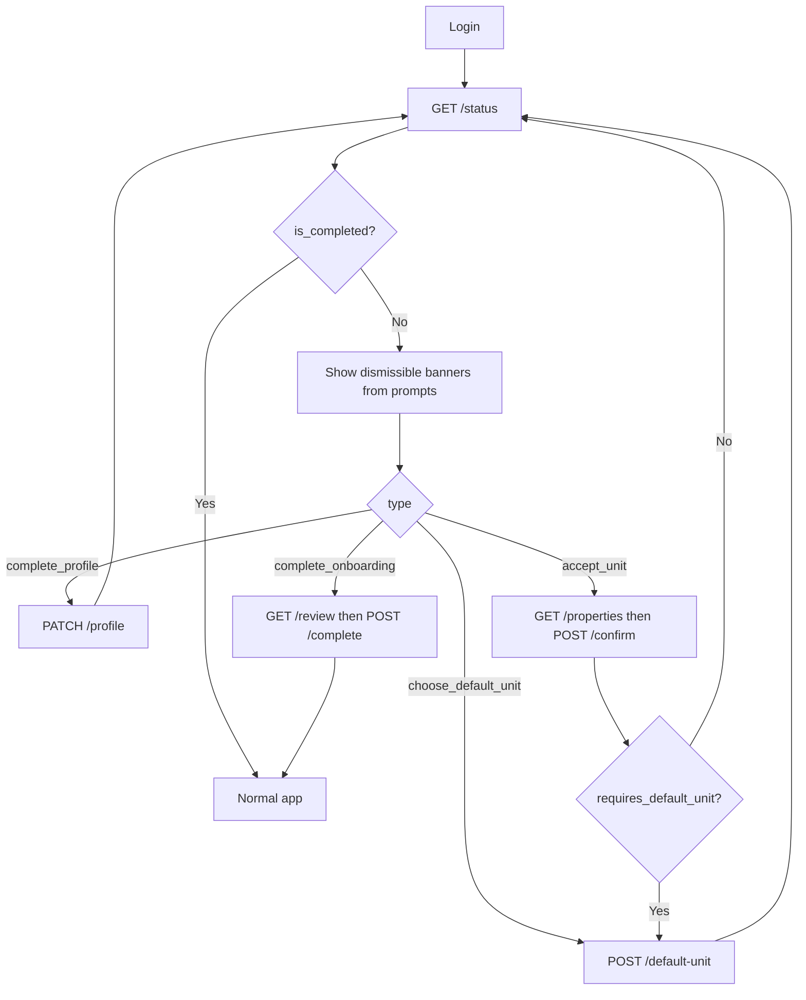

# Contact Onboarding — Mobile App Integration Guide

This document is the **app-side integration reference** for contact onboarding. It complements
[contact-onboarding-flow.md](./contact-onboarding-flow.md) (backend / product context).

- **Base path:** `/v1/contact-onboarding`
- **Auth:** Bearer JWT on every request. The contact is resolved from the token — **no contact id in the path**.
- **Model:** Optional **prompts** (banners). Nothing blocks app usage.

______________________________________________________________________

## 1. Principles

1. **Do not block the app** on onboarding. Show home and features even when `is_completed: false`.
1. **Drive UI from `prompts[]`** on `GET /status`. Do not use removed fields (`steps`, `setup_current_step`, `unit_onboarding`).
1. **Use `is_completed` to hide the onboarding shell** — for owners with units it becomes `true` only after `POST /complete`, not when profile + unit accept alone.
1. **Prompts are dismissible** — user can complete profile or accept units later from Settings.
1. **Order is flexible** — accept unit before profile, or profile first; both work.
1. **Refresh `/status`** after profile update, accept unit, set default unit, or finalize (`POST /complete`).

______________________________________________________________________

## 2. Standard response envelope

All endpoints return:

```json
{
  "status": "success",
  "message": "Human-readable message.",
  "statusCode": 200,
  "code": "2000",
  "data": { }
}
```

Errors use the same envelope with non-2xx `statusCode` and an error `message` / `code`.

**Headers (all requests):**

```http
Authorization: Bearer <access_token>
Content-Type: application/json
```

______________________________________________________________________

## 3. Core endpoint: `GET /status`

Call on **login**, **app foreground**, and **after any onboarding action**.

### Request

```http
GET /v1/contact-onboarding/status
Authorization: Bearer <token>
```

### Response shape

```json
{
  "status": "success",
  "message": "Onboarding status retrieved successfully.",
  "statusCode": 200,
  "code": "2000",
  "data": {
    "profile_complete": false,
    "pending_unit_count": 0,
    "active_unit_count": 0,
    "requires_default_unit": false,
    "prompts": [],
    "is_completed": true
  }
}
```

| Field                   | Type  | App usage                             |
| ----------------------- | ----- | ------------------------------------- |
| `profile_complete`      | bool  | Profile done; hide profile nudge      |
| `pending_unit_count`    | int   | Copy: “N properties waiting”          |
| `active_unit_count`     | int   | Unit switcher; feature eligibility    |
| `requires_default_unit` | bool  | Show default-unit picker when `true`  |
| `prompts`               | array | **Primary UI driver** — see §4        |
| `is_completed`          | bool  | Onboarding wizard finished — see §3.1 |

### 3.1 When is `is_completed` true?

`is_completed` is **computed on every** `GET /status` — it is not a separate DB flag.

| Contact type                                         | `is_completed: true` when                                    |
| ---------------------------------------------------- | ------------------------------------------------------------ |
| **Owner / tenant with ≥1 active unit**               | `POST /complete` has run (backend `review` step is terminal) |
| **No units assigned**                                | Profile complete only                                        |
| **Household-only member** (family link, no own unit) | Profile complete only                                        |

> **Important:** Profile + accept unit alone does **not** set `is_completed: true`. After both are done, status shows `complete_onboarding` until the app calls `POST /complete` on the final review step. This prevents a killed/reopened app from treating onboarding as done prematurely.

### Prompt types

| `type`                | Extra fields                 | Meaning                                                  |
| --------------------- | ---------------------------- | -------------------------------------------------------- |
| `complete_profile`    | —                            | Suggest profile form                                     |
| `accept_unit`         | `contact_unit_id`, `unit_id` | Pending allotment to accept                              |
| `choose_default_unit` | —                            | 2+ active units, no default login                        |
| `complete_onboarding` | —                            | Profile + units ready — show review and call `/complete` |

### Example — contact exists, no unit assigned yet

```json
{
  "data": {
    "profile_complete": false,
    "pending_unit_count": 0,
    "active_unit_count": 0,
    "requires_default_unit": false,
    "prompts": [{ "type": "complete_profile" }],
    "is_completed": false
  }
}
```

### Example — admin assigned one unit

```json
{
  "data": {
    "profile_complete": false,
    "pending_unit_count": 1,
    "active_unit_count": 0,
    "requires_default_unit": false,
    "prompts": [
      { "type": "complete_profile" },
      {
        "type": "accept_unit",
        "contact_unit_id": "c219df4e-73eb-4f5b-90aa-40ab36cba47a",
        "unit_id": "18dbd383-4e0c-4e9c-8ace-74d9ffb1bd42"
      }
    ],
    "is_completed": false
  }
}
```

### Example — profile + unit accepted, finalize pending

User finished profile and accepted a unit but has not called `POST /complete` yet (e.g. app was killed and reopened):

```json
{
  "data": {
    "profile_complete": true,
    "pending_unit_count": 0,
    "active_unit_count": 1,
    "requires_default_unit": false,
    "prompts": [{ "type": "complete_onboarding" }],
    "is_completed": false
  }
}
```

### Example — fully done (owner with unit)

```json
{
  "data": {
    "profile_complete": true,
    "pending_unit_count": 0,
    "active_unit_count": 1,
    "requires_default_unit": false,
    "prompts": [],
    "is_completed": true
  }
}
```

> Requires `POST /complete` after profile + unit steps for owners with active units.

______________________________________________________________________

## 4. Actions per prompt type

### 4.1 Complete profile

**Load existing profile:**

```http
GET /v1/contact-onboarding/profile
Authorization: Bearer <token>
```

```json
{
  "data": {
    "id": "contact-uuid",
    "first_name": "Jane",
    "last_name": "Doe",
    "date_of_birth": "1990-05-15",
    "gender": "female",
    "phones": [{ "number": "+919876543210", "is_primary": true, "type": "mobile" }],
    "emails": []
  }
}
```

**Save profile:**

```http
PATCH /v1/contact-onboarding/profile
Authorization: Bearer <token>
Content-Type: application/json
```

```json
{
  "first_name": "Jane",
  "last_name": "Doe",
  "date_of_birth": "1990-05-15",
  "gender": "female",
  "phones": [
    {
      "number": "+919876543210",
      "is_primary": true,
      "type": "mobile"
    }
  ]
}
```

**After success:** `GET /status` → `complete_profile` prompt removed; `profile_complete: true`.

______________________________________________________________________

### 4.2 Accept unit

**List properties (pending + active), grouped by project:**

```http
GET /v1/contact-onboarding/properties
Authorization: Bearer <token>
```

```json
{
  "data": [
    {
      "project": {
        "id": "proj-uuid",
        "code": "ST-01",
        "name": "Sunrise Towers",
        "city": "Mumbai",
        "state": "Maharashtra",
        "country": "India",
        "address_line_1": "1 Main Street",
        "pin_code": "400001",
        "property_types": ["residential"]
      },
      "units": [
        {
          "id": "c219df4e-73eb-4f5b-90aa-40ab36cba47a",
          "unit_id": "18dbd383-4e0c-4e9c-8ace-74d9ffb1bd42",
          "project_id": "proj-uuid",
          "contact_id": "contact-uuid",
          "code": "A-101",
          "tower_name": "Tower A",
          "floor_name": "10",
          "status": "pending",
          "is_primary": true,
          "is_default_login": false,
          "relationship": "self",
          "parking_entitlement": 2,
          "assign_date": "2026-07-15"
        }
      ]
    }
  ]
}
```

> **Important:** Use `units[].id` as `contact_unit_id` in confirm/claim bodies (not `unit_id`).

**Accept one unit:**

```http
POST /v1/contact-onboarding/properties/confirm
Authorization: Bearer <token>
Content-Type: application/json
```

```json
{
  "contact_unit_ids": ["c219df4e-73eb-4f5b-90aa-40ab36cba47a"]
}
```

**Accept multiple units + set default in one call:**

```json
{
  "contact_unit_ids": [
    "cu-unit-a-uuid",
    "cu-unit-b-uuid",
    "cu-unit-c-uuid"
  ],
  "default_contact_unit_id": "cu-unit-a-uuid"
}
```

**Response:**

```json
{
  "data": {
    "items": [
      {
        "id": "c219df4e-73eb-4f5b-90aa-40ab36cba47a",
        "status": "active"
      }
    ],
    "requires_default_unit": false
  }
}
```

| `requires_default_unit` | App action                                      |
| ----------------------- | ----------------------------------------------- |
| `false`                 | Refresh `/status`; continue prompts or finalize |
| `true`                  | Open default-unit picker → §4.3                 |

**Claim (same activation, use anytime):**

```http
POST /v1/contact-onboarding/properties/claim
Authorization: Bearer <token>
Content-Type: application/json
```

```json
{
  "contact_unit_ids": ["c219df4e-73eb-4f5b-90aa-40ab36cba47a"]
}
```

Same response shape as confirm. Claim does not accept `default_contact_unit_id` — use
`POST /default-unit` if `requires_default_unit: true`.

______________________________________________________________________

### 4.3 Choose default unit

When `prompts` contains `choose_default_unit` or confirm returns `requires_default_unit: true`:

```http
POST /v1/contact-onboarding/default-unit
Authorization: Bearer <token>
Content-Type: application/json
```

```json
{
  "contact_unit_id": "cu-unit-a-uuid"
}
```

**After success:** `GET /status` → `choose_default_unit` prompt cleared.

______________________________________________________________________

### 4.4 Finalize onboarding (`POST /complete`)

Call on the **last wizard screen** (review / finish) when profile and unit steps are done.
Required for **`is_completed: true`** when the contact has at least one active unit.

**Optional preview (review screen):**

```http
GET /v1/contact-onboarding/review
Authorization: Bearer <token>
```

Returns contact profile, units, vehicles, and household aggregate.

**Finalize:**

```http
POST /v1/contact-onboarding/complete
Authorization: Bearer <token>
Content-Type: application/json
```

Empty body finalizes all active units:

```json
{}
```

Optional partial finalize (legacy — defers unselected active units back to `pending`):

```json
{
  "contact_unit_ids": ["cu-A"]
}
```

**Response** (same shape as `GET /status`, plus activation metadata):

```json
{
  "data": {
    "profile_complete": true,
    "pending_unit_count": 0,
    "active_unit_count": 1,
    "requires_default_unit": false,
    "prompts": [],
    "is_completed": true,
    "completed_contact_unit_ids": ["cu-A"]
  }
}
```

**After success:** `is_completed: true`; hide onboarding UI.

| Error               | When                                                        |
| ------------------- | ----------------------------------------------------------- |
| `no_active_units`   | No active self unit — accept a unit via confirm/claim first |
| `already_completed` | `GET /status` already returned `is_completed: true`         |

______________________________________________________________________

## 5. Optional features (no onboarding gate)

Available when `active_unit_count >= 1`. Accept units via confirm/claim only.

### Vehicles

```http
GET /v1/contact-onboarding/vehicles?unit_id=<unit_id>
POST /v1/contact-onboarding/vehicles
```

```json
{
  "unit_id": "18dbd383-4e0c-4e9c-8ace-74d9ffb1bd42",
  "vehicle_type": "four_wheeler",
  "registration_number": "MH12AB1234",
  "make": "Tata",
  "model": "Nexon",
  "color": "White",
  "fuel_type": "ev",
  "photo_paths": ["org/project/vehicles/photo1.jpg"]
}
```

### Household

```http
GET /v1/contact-onboarding/household?unit_id=<unit_id>
POST /v1/contact-onboarding/household
```

```json
{
  "unit_id": "18dbd383-4e0c-4e9c-8ace-74d9ffb1bd42",
  "first_name": "John",
  "last_name": "Doe",
  "relationship": "spouse",
  "portal_access": false,
  "phones": [{ "number": "+919811122233", "is_primary": true, "type": "mobile" }]
}
```

______________________________________________________________________

## 6. App flow diagram



______________________________________________________________________

## 7. All scenarios with example API sequences

Placeholder IDs used below:

| Symbol                 | Meaning                                    |
| ---------------------- | ------------------------------------------ |
| `contact-uuid`         | Authenticated contact                      |
| `cu-A`, `cu-B`, `cu-C` | `contact_unit_id` (row id in confirm body) |
| `unit-A`, `unit-B`     | Physical `unit_id`                         |

______________________________________________________________________

### Scenario 1 — Single unit (simplest)

**Setup:** Admin assigns one unit → contact sees accept prompt.

| Step                  | Request                                                       | Expected `data` after                                                                                |
| --------------------- | ------------------------------------------------------------- | ---------------------------------------------------------------------------------------------------- |
| 1. Login              | `GET /status`                                                 | `prompts: [complete_profile, accept_unit]`, `pending_unit_count: 1`                                  |
| 2. (Optional) Profile | `PATCH /profile` `{ "first_name": "Jane", ... }`              | —                                                                                                    |
| 3. Accept unit        | `POST /properties/confirm` `{ "contact_unit_ids": ["cu-A"] }` | `items[0].status: active`, `requires_default_unit: false`                                            |
| 4. Refresh            | `GET /status`                                                 | `prompts: [complete_onboarding]` or `[complete_profile, complete_onboarding]`; `is_completed: false` |
| 5. Profile if skipped | `PATCH /profile`                                              | —                                                                                                    |
| 6. Finalize           | `POST /complete`                                              | `is_completed: true`, `prompts: []`                                                                  |

**Minimal path (accept first, profile later, then finalize):**

```http
GET  /v1/contact-onboarding/status
POST /v1/contact-onboarding/properties/confirm
     {"contact_unit_ids":["cu-A"]}
GET  /v1/contact-onboarding/status
PATCH /v1/contact-onboarding/profile
      {"first_name":"Jane","last_name":"Doe","phones":[{"number":"+919876543210","is_primary":true,"type":"mobile"}]}
GET  /v1/contact-onboarding/status
POST /v1/contact-onboarding/complete
GET  /v1/contact-onboarding/status
```

Expect final `GET /status`: `prompts: []`, `is_completed: true`.

______________________________________________________________________

### Scenario 2 — Multiple units, accept one now (recommended)

**Setup:** Admin assigns units A, B, C → all `pending`.

| Step | Request                    | Notes                                                      |
| ---- | -------------------------- | ---------------------------------------------------------- |
| 1    | `GET /status`              | Up to 3× `accept_unit` prompts (one per pending self unit) |
| 2    | `GET /properties`          | Show all pending units grouped by project                  |
| 3    | `POST /properties/confirm` | `{"contact_unit_ids":["cu-A"]}` — only A                   |
| 4    | `GET /status`              | `active_unit_count: 1`, B/C still pending                  |
| 5    | Use app with unit A        | Vehicles/household for A optional                          |
| 6    | Later accept B             | `POST /properties/claim` `{"contact_unit_ids":["cu-B"]}`   |
| 7    | `GET /status`              | If 2 active, may show `choose_default_unit`                |
| 8    | Set default                | `POST /default-unit` `{"contact_unit_id":"cu-A"}`          |

______________________________________________________________________

### Scenario 3 — Accept all units at once

```http
POST /v1/contact-onboarding/properties/confirm
Content-Type: application/json

{
  "contact_unit_ids": ["cu-A", "cu-B", "cu-C"],
  "default_contact_unit_id": "cu-A"
}
```

**Response:**

```json
{
  "data": {
    "items": [
      { "id": "cu-A", "status": "active" },
      { "id": "cu-B", "status": "active" },
      { "id": "cu-C", "status": "active" }
    ],
    "requires_default_unit": false
  }
}
```

```http
GET /v1/contact-onboarding/status
```

Expect: `active_unit_count: 3`, no `accept_unit` prompts, no `choose_default_unit` if default was sent on confirm. Then `POST /complete` → `is_completed: true`.

______________________________________________________________________

### Scenario 3b — App killed after profile + accept (regression guard)

User completes profile and accepts a unit, then force-closes the app before the review/finish screen.

```http
GET /v1/contact-onboarding/status
```

```json
{
  "data": {
    "profile_complete": true,
    "active_unit_count": 1,
    "pending_unit_count": 0,
    "prompts": [{ "type": "complete_onboarding" }],
    "is_completed": false
  }
}
```

Resume wizard → `GET /review` (optional) → `POST /complete` → `is_completed: true`.

______________________________________________________________________

### Scenario 4 — Two active units, need default picker

User accepted A and B without default on confirm.

```http
GET /v1/contact-onboarding/status
```

```json
{
  "data": {
    "active_unit_count": 2,
    "requires_default_unit": true,
    "prompts": [
      { "type": "choose_default_unit" }
    ],
    "is_completed": false
  }
}
```

```http
POST /v1/contact-onboarding/default-unit
{"contact_unit_id":"cu-A"}
GET  /v1/contact-onboarding/status
```

Expect: `requires_default_unit: false`, `choose_default_unit` prompt gone; may show `complete_onboarding` until `POST /complete`.

______________________________________________________________________

### Scenario 5 — Profile only, no units (contact created, not assigned)

```http
GET /v1/contact-onboarding/status
```

```json
{
  "data": {
    "pending_unit_count": 0,
    "active_unit_count": 0,
    "prompts": [{ "type": "complete_profile" }],
    "is_completed": false
  }
}
```

App: show profile nudge only; main app still usable where role allows.

```http
PATCH /v1/contact-onboarding/profile
{"first_name":"Jane","last_name":"Doe","phones":[{"number":"+919876543210","is_primary":true,"type":"mobile"}]}
GET  /v1/contact-onboarding/status
```

Expect: `is_completed: true`, `prompts: []`.

______________________________________________________________________

### Scenario 6 — Post-onboarding: admin adds another unit

**Precondition:** `is_completed: true`, one active unit.

Admin assigns unit D → `pending`.

```http
GET /v1/contact-onboarding/status
```

```json
{
  "data": {
    "active_unit_count": 1,
    "pending_unit_count": 1,
    "prompts": [
      {
        "type": "accept_unit",
        "contact_unit_id": "cu-D",
        "unit_id": "unit-D"
      }
    ],
    "is_completed": true
  }
}
```

> `is_completed` stays `true` because onboarding was already finalized (`review` step complete). Still show the `accept_unit` banner from `prompts[]`.

```http
POST /v1/contact-onboarding/properties/claim
{"contact_unit_ids":["cu-D"]}
GET  /v1/contact-onboarding/status
```

If `requires_default_unit: true` → `POST /default-unit`. No need to call `POST /complete` again.

No full wizard reopens — accept banner only.

______________________________________________________________________

### Scenario 7 — Household-only member (family, not owner)

Contact linked only as family on someone else's unit (`relationship: spouse|parent|child|...`).

```http
GET /v1/contact-onboarding/status
```

```json
{
  "data": {
    "pending_unit_count": 0,
    "active_unit_count": 0,
    "prompts": [{ "type": "complete_profile" }],
    "is_completed": false
  }
}
```

- **No** `accept_unit` prompts
- **No** confirm/claim flow
- Complete profile → done

```http
PATCH /v1/contact-onboarding/profile
{"first_name":"Minaxi","last_name":"Chaudhari","phones":[{"number":"+919900011122","is_primary":true,"type":"mobile"}]}
GET  /v1/contact-onboarding/status
```

Expect: `is_completed: true`.

______________________________________________________________________

### Scenario 8 — Family member later assigned own unit

Contact was family on unit A; admin assigns unit B as owner (`relationship: self`, `pending`).

```http
GET /v1/contact-onboarding/status
```

```json
{
  "data": {
    "prompts": [
      { "type": "complete_profile" },
      {
        "type": "accept_unit",
        "contact_unit_id": "cu-B",
        "unit_id": "unit-B"
      }
    ],
    "is_completed": false
  }
}
```

```http
POST /v1/contact-onboarding/properties/confirm
{"contact_unit_ids":["cu-B"]}
GET  /v1/contact-onboarding/status
```

Family link on unit A remains; owner link on B is now `active`. Both coexist. Call `POST /complete` when ready → `is_completed: true`.

______________________________________________________________________

## 8. Status transition cheat sheet

```
[Created, no units]
  prompts: [complete_profile]
  active: 0, pending: 0
  is_completed: false → true after profile (no /complete needed)

[Admin assigns 1 unit]
  prompts: [complete_profile, accept_unit]
  pending: 1
  is_completed: false

[User accepts unit]
  prompts: [complete_profile, complete_onboarding] or [complete_onboarding]
  active: 1, pending: 0
  is_completed: false

[User completes profile — owner with unit]
  prompts: [complete_onboarding]
  is_completed: false

[User calls POST /complete]
  prompts: []
  is_completed: true

[Admin assigns 2nd unit later — already finalized]
  prompts: [accept_unit]
  is_completed: true (review already done — still show accept banner)

[2+ active, no default]
  prompts: [..., choose_default_unit]
  requires_default_unit: true
  is_completed: false
```

______________________________________________________________________

## 9. Error handling

| Situation                     | Typical code | App action                        |
| ----------------------------- | ------------ | --------------------------------- |
| Unit not in pending list      | 422          | Refresh `GET /properties`         |
| Primary conflict (unit taken) | 422          | Show server `message`             |
| Invalid `contact_unit_id`     | 422          | Refresh lists                     |
| Finalize with no active unit  | 422          | Accept a unit first               |
| Finalize when already done    | 409          | Treat as success / refresh status |

Always refresh `GET /status` and `GET /properties` after a failed confirm.

______________________________________________________________________

## 10. TypeScript types (optional)

```typescript
type OnboardingPrompt =
  | { type: "complete_profile" }
  | { type: "accept_unit"; contact_unit_id: string; unit_id: string }
  | { type: "choose_default_unit" }
  | { type: "complete_onboarding" };

interface OnboardingStatus {
  profile_complete: boolean;
  pending_unit_count: number;
  active_unit_count: number;
  requires_default_unit: boolean;
  prompts: OnboardingPrompt[];
  is_completed: boolean;
}

interface CompleteOnboardingResponse extends OnboardingStatus {
  completed_contact_unit_ids: string[];
  deferred_contact_unit_ids?: string[];
}

interface ConfirmPropertiesResponse {
  items: { id: string; status: string }[];
  requires_default_unit: boolean;
}
```

______________________________________________________________________

## 11. Integration checklist

- [ ] `GET /status` on login and after onboarding actions
- [ ] UI driven by `prompts[]`; use `is_completed` to hide the onboarding shell
- [ ] Main navigation never blocked by `is_completed: false`
- [ ] Confirm body uses `contact_unit_ids` = `units[].id` from `GET /properties`
- [ ] Handle `requires_default_unit` after confirm/claim
- [ ] Handle `complete_onboarding` → `GET /review` (optional) → `POST /complete`
- [ ] `POST /properties/claim` for later accepts (same as confirm)
- [ ] Do not treat profile + unit accept alone as done — wait for `POST /complete` (owners with units)
- [ ] Do not implement linear wizard or read removed status fields

______________________________________________________________________

## 12. Related docs

- Backend flow & rules: [contact-onboarding-flow.md](./contact-onboarding-flow.md)
- Role model: [adr/0010-contact-roles.md](./adr/0010-contact-roles.md)
