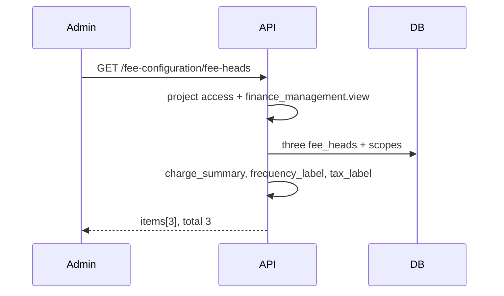

# Fee Configuration Flow — Context & Change Guide

> **Status: Not yet implemented (ADR + flow spec).** No migrations, API, or UI in this phase.
> This document is the build contract for **Finance → Fee Configuration** only.
> Invoices and Collections are separate screens and are not specified here.
>
> Schema and architecture rationale: [ADR 0018](./adr/0018-fee-configuration.md).

- **Service:** `ats-home-craft-python-service` → `apps/user_service`
- **Admin API prefix:** `/v1/projects/{project_id}/fee-configuration`
- **Resident API:** none
- **DB schema:** `ats-home-craft-supabase` (migrations not yet added — names proposed in [ADR 0018](./adr/0018-fee-configuration.md))

______________________________________________________________________

## 1. What this flow does

A society bills residents every month for several different charges. Today those amounts are
worked out in a spreadsheet. **Fee Configuration** is where an admin encodes the rules once,
so a later billing run can produce each resident's invoice without that spreadsheet.

**Nothing on this screen bills anybody.** It stores rules. The billing run (Invoices) is the
only consumer, and it is out of scope for this build. Facility-booking invoices
([ADR 0017](./adr/0017-facility-booking.md)) are a different ledger and are not configured here.

### Who uses it

| Role               | What they do here                                               | How often                                |
| ------------------ | --------------------------------------------------------------- | ---------------------------------------- |
| Community Admin    | Sets rates, switches a fee on or off, sets the dunning schedule | A few times a year, plus a rate revision |
| Accounts / Billing | Reads it to answer "why was I charged this?"                    | Weekly                                   |
| FM Head            | Reads it                                                        | Rarely                                   |

It is a low-frequency, high-consequence screen. A wrong digit lands on every applicable invoice,
so the design favours clarity and immediate feedback.

### Two tabs

| Tab           | Holds                                                                                                  |
| ------------- | ------------------------------------------------------------------------------------------------------ |
| **Fee heads** | The three charges: Maintenance (CAM), Electricity, Club charges                                        |
| **Settings**  | Project-wide payment retries and pre-due reminders. Four numbers. Nothing that belongs to a single fee |

Everything that belongs to one fee — its cycle, its invoice date, its late fee — sits on that
fee head. A reader answers "what does this fee cost and when is it billed?" from the fee editor
alone.

______________________________________________________________________

## 2. Vocabulary

Use these words in code, API, and UI.

| Term                  | Means                                                                                                    |
| --------------------- | -------------------------------------------------------------------------------------------------------- |
| **Fee head**          | One configurable charge. The product word is "fee head", never "fee type" or "charge head"               |
| **Kind**              | The immutable machine key: `maintenance`, `electricity`, `club`                                          |
| **Property type**     | Apartment, plot, or commercial. Resolved from Inventory, not chosen on this screen                       |
| **Applies to**        | Which property types a fee head bills                                                                    |
| **Frequency**         | `monthly`, `quarterly`, `half_yearly`, `annual`                                                          |
| **Billing cycle**     | Which months a non-monthly fee lands in                                                                  |
| **Invoice date**      | The day of the month a fee's invoice is raised (`invoice_day`)                                           |
| **Due date**          | Invoice date plus `due_within_days`                                                                      |
| **Late fee step**     | One row of a stepped flat charge. The bill carries the step it has reached, not the sum of earlier steps |
| **Active / Inactive** | Whether the next billing run includes the fee head                                                       |

A fee head is only Active or Inactive. The word *draft* is reserved for invoices that have been
generated and not yet approved. Do not introduce paused or suspended for fee heads.

______________________________________________________________________

## 3. Product rules

| Rule                                          | Enforcement                                                                                                                   |
| --------------------------------------------- | ----------------------------------------------------------------------------------------------------------------------------- |
| **Up to three fee heads per project**         | Created by `POST /fee-heads`, one row per kind. No delete route                                                               |
| **Switch off by status, keep the row**        | `inactive` skips the next run and keeps rates and history                                                                     |
| **Category is derived from kind**             | `maintenance` → Maintenance, `electricity` → Utility, `club` → Amenity. Not accepted in the write body                        |
| **Billed to the unit**                        | Every fee head charges the unit. Owner and occupant are not a billing split                                                   |
| **Maintenance ticks are Applies to**          | The rate-table checkbox is the only Applies-to control for maintenance                                                        |
| **Unticked maintenance row keeps its rate**   | Inputs disabled, row marked "Not billed"                                                                                      |
| **At least one property type ticked**         | Save returns 422 otherwise                                                                                                    |
| **Name required**                             | Trimmed, 1–80 characters                                                                                                      |
| **Electricity frequency locked**              | `monthly` only. Server rejects anything else. UI shows the reason                                                             |
| **Electricity is in arrears**                 | The invoice raised in October carries September's reading. Derived from kind, not a field                                     |
| **Electricity has no billing-cycle section**  | Hidden in the UI and rejected by the server                                                                                   |
| **Cycle section only for non-monthly fees**   | Hidden while frequency is `monthly`                                                                                           |
| **Tax is one object**                         | `{ applicable, rate_percent }` on the whole fee. Off hides the rate field and does not tax the fee                            |
| **Tax splits 50/50**                          | The billing run splits the tax into two equal parts                                                                           |
| **Late fee is one of three modes**            | `none`, `flat` (1–4 steps), `interest`                                                                                        |
| **Flat steps sort and refuse duplicate days** | Server sorts by `days_overdue` ascending                                                                                      |
| **No grace period**                           | Late fees start the day after the due date                                                                                    |
| **Late fee lands on the next invoice**        | The overdue invoice keeps the amount it was issued with. Collected by the billing run, not this screen                        |
| **Interest is simple**                        | Percent per year, per started month, on the outstanding amount. Uncapped until the client decides otherwise (open question 4) |
| **Rounding is always on**                     | Nearest rupee, half up, at invoice time. No toggle on this screen. The difference is a round-off line on the invoice          |
| **Rate change applies on the next run**       | No `effective_from`. Already-issued invoices stay as issued                                                                   |
| **Concurrent save loses cleanly**             | `version` mismatch → 409, "reload, someone else changed this"                                                                 |
| **Area comes from Inventory**                 | This screen does not choose carpet vs built-up vs plot size                                                                   |
| **Club does not write facility pricing**      | "Included in membership" is read from facility booking config. Turning club off does not start per-booking charges            |

______________________________________________________________________

## 4. Screen → capability map

Nav: **Finance → Fee Configuration**. Breadcrumb `Finance / Fee Configuration`.

### 4.1 Fee heads tab

| Screen element          | Capability                                                                                                             |
| ----------------------- | ---------------------------------------------------------------------------------------------------------------------- |
| Tab badge `Fee heads 3` | `GET .../fee-heads` → `total`                                                                                          |
| Table row               | Same list. Columns: name, category, charge summary, frequency, tax, status                                             |
| Row click or pencil     | Navigate to the editor. `GET .../fee-heads/{id}`                                                                       |
| Active toggle           | `PATCH .../fee-heads/{id}/status`. Badge updates from the response. Does not open the editor                           |
| Footer                  | Static copy: "Each fee head is billed to every applicable unit on its own invoice date." Count: `{n} of {n} fee heads` |
| Create / delete         | Not present                                                                                                            |

Charge summary and frequency label are **server-computed**. The client renders them; it does not
assemble them from rates.

### 4.2 Editor (one column of panels)

Header: breadcrumb `Fee Configuration / {name}`, title, kind subtitle, **All fee heads**, **Save fee head**.
Footer repeats **Cancel** and **Save fee head**.

| Panel                | Maintenance                                                                                      | Electricity                                                                     | Club                                           |
| -------------------- | ------------------------------------------------------------------------------------------------ | ------------------------------------------------------------------------------- | ---------------------------------------------- |
| **Fee head**         | Name, status, frequency, line description. No Applies-to chips                                   | Same, plus Applies-to chips. Frequency visible and locked                       | Same as electricity, frequency editable        |
| **Charge**           | Rate table: property type, tick, ₹ / sq ft, minimum ₹ / month                                    | Four rates in two pairs (grid, DG)                                              | One ₹ / month amount, plus the membership note |
| **Billing schedule** | Fee starts from, due within, invoice raised on. Cycle section only when frequency is not monthly | Meter read on, fee starts from, due within, invoice raised on. No cycle section | Same as maintenance                            |
| **Tax**              | Applicable toggle beside the heading. Rate field when on                                         | Same                                                                            | Same                                           |
| **Late payment**     | None / flat stepped / interest, plus the example sentence                                        | Same                                                                            | Same                                           |

Kind subtitles (client copy, keyed by `kind`):

| Kind          | Subtitle                                                                                       |
| ------------- | ---------------------------------------------------------------------------------------------- |
| `maintenance` | Maintenance (CAM) template — Common area maintenance charged on unit area, with a minimum fee. |
| `electricity` | Electricity template — Grid supply and DG backup — fixed charges plus metered units.           |
| `club`        | Club charges template — A flat monthly amount for clubhouse and amenity access.                |

**Save** sends the full editable document plus `version`. **Cancel** discards local edits and returns to the list.

### 4.3 Settings tab

| Screen element                    | Capability                                                  |
| --------------------------------- | ----------------------------------------------------------- |
| Four number fields                | `GET` / `PATCH .../finance-settings`                        |
| Reminder sentence                 | `summary` on the response, recomputed from the four numbers |
| Fee rates, cycles, tax, late fees | Do not appear on this tab                                   |

______________________________________________________________________

## 5. The three fee heads

### 5.1 Maintenance (`maintenance`)

Common area maintenance: housekeeping, security, lifts, landscaping, common-area power.

Charged as a **rate per square foot with a minimum**, per property type. A minimum of 0 means
no floor. The list summary uses the Apartments row when that row is enabled, and appends
"varies by type" when enabled rows differ. See §7.

Property-type order in the table is always Apartments, Plots, Commercial.

### 5.2 Electricity (`electricity`)

Four rates, two pairs:

| #   | Field               | Basis                          |
| --- | ------------------- | ------------------------------ |
| 1   | `grid_fixed_amount` | Flat amount every month        |
| 2   | `grid_unit_rate`    | Per kWh from the grid register |
| 3   | `dg_fixed_amount`   | Flat amount every month        |
| 4   | `dg_unit_rate`      | Per kWh from the DG register   |

Both registers come from one dual-source meter. This screen stores the rates. It does not
ingest readings. Sanctioned DG load on the unit config is reference data for Inventory;
**do not multiply the fixed charge by it.**

Frequency control is shown and disabled. Helper text: "Metered fees are always billed monthly, in arrears."

Applies-to is a chip group (Apartments, Plots, Commercial), separate from the four rates.

### 5.3 Club (`club`)

One flat amount per month, charged whether or not the resident uses the clubhouse.

Applies-to is a chip group. The prototype leaves Commercial unticked; that is society data,
not a platform default. The create request includes all three property types, and the client chooses which are enabled.

Static note under the amount:

> Facilities set to Included in membership in Facilities → Pricing are covered by this charge, so residents are not billed again per booking.

That note describes `FacilityPriceMode.INCLUDED` on facility booking config
([facility-booking-flow.md](./facility-booking-flow.md)). This API does not read or write it.
Deactivating the club fee head does not flip those facilities back to a per-booking charge.

______________________________________________________________________

## 6. How the pieces interact

### 6.1 Applies to → who is billed

A fee bills a unit only when the unit's resolved property type is enabled on that fee head.

Resolution already exists: `resolve_unit_property_type()` in
`app/services/units_service.py`.

| UI label   | API `property_type` | Inventory source                                  |
| ---------- | ------------------- | ------------------------------------------------- |
| Apartments | `residential`       | `unit_configs.config_kind = apartment`            |
| Plots      | `plots`             | `config_kind = plot`, or `units.plot_item_id` set |
| Commercial | `commercial`        | `unit_configs.config_kind = commercial`           |

The editor always offers all three labels, in that order, including types the project has no units for.

### 6.2 The charge sits on the unit

A fee head bills the **unit**. It does not choose an owner or an occupant, and a let-out unit
does not split maintenance, electricity, and club across two people. Who lives in the unit is
not an input to this configuration and is not stored on the fee head.

### 6.3 Frequency + cycle → which months

A monthly fee bills every month. `billing_cycle` and `cycle_anchor_month` are null, and the
cycle section is hidden.

A quarterly, half-yearly, or annual fee stores a cycle:

| `billing_cycle`  | Anchor month                           | Quarterly example         |
| ---------------- | -------------------------------------- | ------------------------- |
| `calendar_year`  | January (`1`), server-set              | Jan, Apr, Jul, Oct        |
| `financial_year` | April (`4`), server-set                | Apr, Jul, Oct, Jan        |
| `custom`         | Client sends `cycle_anchor_month` 1–12 | July → Jul, Oct, Jan, Apr |
| `pro_rata`       | Each unit's possession month           | Different months per unit |

Period starts, wrapping at 12:

| Frequency     | Months                               |
| ------------- | ------------------------------------ |
| `quarterly`   | anchor, anchor+3, anchor+6, anchor+9 |
| `half_yearly` | anchor, anchor+6                     |
| `annual`      | anchor                               |

The editor shows a 12-month strip: anchor highlighted, each period start marked, plus the
sentence `Raised in Jul, Oct, Jan, Apr each year.` The list frequency label carries the same
months (`Quarterly · Jul, Oct, Jan, Apr`) so the list is readable without opening the fee.

`pro_rata` has no single strip of months. Sentence: `Raised in each unit's possession month, then every quarter.` (or half-year / year). List label: `Quarterly · by possession`.

**Gap:** `units` has no possession date. `projects.possession_date` is the project's date, not
the unit's. The editor may store `pro_rata`. The billing run must refuse to generate that fee
head until Inventory has a per-unit possession month. See [ADR 0018](./adr/0018-fee-configuration.md).

### 6.4 Invoice date → which invoice a fee lands on

Each fee has its own `invoice_day`. The billing run merges lines for one unit that share an
invoice day.

Maintenance and club on day 1, and electricity on day 10, produce two invoices for that unit
that month. All three on day 1 produce one invoice with three lines.

There is no project-wide "one combined invoice" switch.

### 6.5 Status → whether it bills

The list toggle and the editor Status dropdown write the same column. Inactive fees are skipped
by the next billing run and named in that run's preview. Invoices already issued do not change.

### 6.6 Area the billing run will use

This screen does not store area. When the billing run is built, maintenance uses one resolved
square-foot figure per unit:

| Property type | Column                                                 |
| ------------- | ------------------------------------------------------ |
| `residential` | `unit_configs.area_sqft`                               |
| `commercial`  | `unit_configs.carpet_area_sqft`                        |
| `plots`       | `plot_config_items.size_sqft` via `units.plot_item_id` |

A unit with no area cannot be maintenance-billed; the run names it. If the society wants super
built-up and Inventory holds carpet, that is an Inventory data fix.

______________________________________________________________________

## 7. Computed labels

The service computes these on every read and on every successful write response. They are not
stored. Money formatting is en-IN, rupee symbol, fraction digits 0–2 with trailing zeros stripped
(`₹3.25`, `₹1,500`, `₹8.5`).

### 7.1 Charge summary

**Maintenance.** Among enabled rows, prefer the `residential` row, else the first enabled row
in Apartments → Plots → Commercial order. Call that row the lead.

- Lead minimum is 0: `₹{rate} / sq ft · no minimum`
- Lead minimum is greater than 0: `₹{rate} / sq ft · min ₹{min}`
- Enabled rows are not all equal on rate and minimum: append ` · varies by type`

Prototype check: Apartments ₹3.25 / min ₹500, Plots ₹1.75 / ₹400, Commercial ₹5.5 / ₹1,200 →
`₹3.25 / sq ft · min ₹500 · varies by type`.

**Electricity.** `₹{grid_fixed} + ₹{grid_unit}/kWh · DG ₹{dg_fixed} + ₹{dg_unit}/kWh`

Prototype check: `₹120 + ₹8.5/kWh · DG ₹150 + ₹22/kWh`.

**Club.** `₹{amount} / month`

Prototype check: `₹1,500 / month`.

### 7.2 Frequency label

| Case                        | Label                                              |
| --------------------------- | -------------------------------------------------- |
| Monthly maintenance or club | `Monthly`                                          |
| Electricity                 | `Monthly · on reading`                             |
| Non-monthly, not pro-rata   | `{Quarterly\|Half-yearly\|Annual} · {Mon, Mon, …}` |
| Pro-rata                    | `{Quarterly\|Half-yearly\|Annual} · by possession` |

### 7.3 Tax label

| Case               | Label                      |
| ------------------ | -------------------------- |
| `applicable` true  | `{rate}%` (`18%`, `18.5%`) |
| `applicable` false | `—`                        |

### 7.4 Late-fee example sentence

Returned as `late_fee_example`. Rounding is half up, away from zero, to the nearest rupee.
Do not use Python's built-in `round` (banker's rounding).

**None.** `Dues simply carry forward.`

**Interest.** Build a sample taxable amount, add tax when applicable, then one month of simple interest.

| Kind          | Sample taxable amount                                                                                                                          |
| ------------- | ---------------------------------------------------------------------------------------------------------------------------------------------- |
| `maintenance` | `max(lead_rate × 1000, lead_minimum)` using the same lead row as the charge summary. 1,000 sq ft is a fixed example, not a unit from Inventory |
| `electricity` | both fixed charges + `100 × grid_unit_rate` + `50 × dg_unit_rate`                                                                              |
| `club`        | the flat amount                                                                                                                                |

`bill = half_up(taxable)` when tax is off, else `half_up(taxable × (1 + rate_percent / 100))`.
`monthly = half_up(bill × annual_percent / 100 / 12)`.

Sentence: `A ₹{bill} bill left unpaid picks up ₹{monthly} for each month it stays overdue.`

Worked check, club, ₹1,500, tax 18%, interest 18%: taxable 1500, bill 1770, monthly interest
26.55 → **₹27**. That matches the club prototype sentence. Maintenance and electricity prototype
sentences use the same formula on a different illustrative bill; implement the formula, do not
hardcode ₹6,328 or ₹3,995.

**Flat.** Steps are sorted. For every step except the last, the range label is
`{days} to {next_days - 1} days`. The last step is `{days} days and beyond`.
The sentence uses five days past the last step so it is obvious the charge is the step reached:

`A bill {last_days + 5} days overdue carries ₹{last_amount}.`

With steps 1 → ₹100 and 15 → ₹250, a bill 20 days overdue carries ₹250, not ₹350.

______________________________________________________________________

## 8. Architecture (layers)

```
HTTP → API router → FeeConfigurationService → FeeConfigurationRepository → Postgres
         │
         └── ensure_staff_project_access(project_id)
```

Same 3-layer FastAPI pattern as the rest of `user_service`. Reads use `db_conn`. Writes use `db_uow`.
Mutations use `@audit_api_call`.

### File map (to create)

| Concern                         | File                                                                                                                |
| ------------------------------- | ------------------------------------------------------------------------------------------------------------------- |
| Routes                          | `app/api/fee_configuration.py`                                                                                      |
| Route registration              | `app/api/routes.py`                                                                                                 |
| Rules, summaries, version check | `app/services/fee_configuration_service.py`                                                                         |
| SQL                             | `app/db/repositories/fee_configuration_repository.py`                                                               |
| Schemas                         | `app/schemas/fee_configuration.py`                                                                                  |
| Enums                           | `app/schemas/enums/fee_configuration.py`                                                                            |
| Create routes                   | `POST /fee-heads` and `POST /finance-settings` in `app/api/fee_configuration.py`                                    |
| i18n                            | `app/locales/en.json` under `fee_configuration.*`                                                                   |
| Tests                           | `tests/unit/test_fee_configuration_service.py`, `tests/integration/fee_configuration/test_fee_configuration_api.py` |

### Permissions

Already seeded. Do not add new permission codes.

| Code                       | Use                                                            |
| -------------------------- | -------------------------------------------------------------- |
| `finance_management.view`  | List, detail, settings read                                    |
| `finance_management.edit`  | Fee-head save, status toggle, settings save                    |
| `finance_management.admin` | Reserved for the billing run. Not required to edit this screen |

`community_admin`, `accountant`, and `viewer` already have view. `community_admin` and
`accountant` already have edit. `facility_manager` does not have view; implementation adds
`finance_management.view` to that role so FM Head can read. See [ADR 0018](./adr/0018-fee-configuration.md).

______________________________________________________________________

## 9. Data model

Full columns and checks: [ADR 0018 § Schema](./adr/0018-fee-configuration.md#schema-proposed).

| Table                      | Purpose                                                                                                              |
| -------------------------- | -------------------------------------------------------------------------------------------------------------------- |
| `fee_heads`                | One row per project per kind. Identity, schedule, tax object, late-fee object, electricity or club charge, `version` |
| `fee_head_property_scopes` | Exactly three rows per fee head (residential, plots, commercial): enabled flag, and maintenance rate + minimum       |
| `finance_settings`         | One row per project. Four dunning numbers and `version`                                                              |

Seed, on project create and as a backfill for existing projects:

| Field             | Seed                                                                                                                |
| ----------------- | ------------------------------------------------------------------------------------------------------------------- |
| Status            | `inactive`                                                                                                          |
| Names             | `Maintenance (CAM)`, `Electricity`, `Club charges`                                                                  |
| Line descriptions | The prototype sentences in §5 (product copy)                                                                        |
| Frequency         | `monthly`                                                                                                           |
| Schedule          | `fee_start_rule = first_of_next_month`, `due_within_days = 10`, `invoice_day = 1`, electricity `meter_read_day = 1` |
| Amounts           | `0`                                                                                                                 |
| Scopes            | All three property types `enabled = true`                                                                           |
| Tax               | `applicable = false`, `rate_percent = null`                                                                         |
| Late fee          | `{ "mode": "none" }`                                                                                                |
| Settings          | 3 retries, 2 days apart; 2 reminders, 3 days apart                                                                  |

Rupee amounts in the prototype screenshots are a worked example for one society. They are not
platform defaults. A new project stays inactive at zero until an admin saves real rates and
switches the head Active.

______________________________________________________________________

## 10. API catalog

Staff JWT, org context, `ensure_staff_project_access`, and the permission in §8.

Base: `/v1/projects/{project_id}/fee-configuration`

| Method | Path                              | Permission | Purpose                         |
| ------ | --------------------------------- | ---------- | ------------------------------- |
| GET    | `/fee-heads`                      | view       | List the project's fee heads    |
| POST   | `/fee-heads`                      | edit       | Create one fee head of a kind   |
| GET    | `/fee-heads/{fee_head_id}`        | view       | Editor payload                  |
| PATCH  | `/fee-heads/{fee_head_id}`        | edit       | Save the full editable document |
| PATCH  | `/fee-heads/{fee_head_id}/status` | edit       | List toggle                     |
| GET    | `/finance-settings`               | view       | Settings tab                    |
| POST   | `/finance-settings`               | edit       | Create the four dunning numbers |
| PATCH  | `/finance-settings`               | edit       | Save the four numbers           |

No `DELETE`. A second create of the same kind, or of settings, returns 409.

### 10.1 List item

```json
{
  "id": "fee-head-uuid",
  "kind": "maintenance",
  "name": "Maintenance (CAM)",
  "category": "maintenance",
  "category_label": "Maintenance",
  "charge_summary": "₹3.25 / sq ft · min ₹500 · varies by type",
  "frequency": "monthly",
  "frequency_label": "Monthly",
  "tax_label": "18%",
  "status": "active",
  "version": 4
}
```

`GET /fee-heads` returns `{ "items": [ ...three, kind order maintenance, electricity, club ], "total": 3 }`.

### 10.2 Detail

Detail is the list fields plus the editor document: `line_description`, `fee_start_rule`,
`due_within_days`, `invoice_day`, `billing_cycle`, `cycle_anchor_month`, `billing_months`,
`billing_months_sentence`, `tax`, `late_fee`, `late_fee_example`, `scopes`, and the kind-specific
charge.

`billing_months` is the computed month list (`[7, 10, 1, 4]`) or `null` for monthly and pro-rata.

**Maintenance `scopes`:**

```json
[
  {
    "property_type": "residential",
    "label": "Apartments",
    "enabled": true,
    "rate_per_sqft": "3.25",
    "minimum_amount": "500.00"
  },
  {
    "property_type": "plots",
    "label": "Plots",
    "enabled": true,
    "rate_per_sqft": "1.75",
    "minimum_amount": "400.00"
  },
  {
    "property_type": "commercial",
    "label": "Commercial",
    "enabled": true,
    "rate_per_sqft": "5.50",
    "minimum_amount": "1200.00"
  }
]
```

Money fields are decimal strings, not floats.

**Electricity charge:**

```json
{
  "grid_fixed_amount": "120.00",
  "grid_unit_rate": "8.50",
  "dg_fixed_amount": "150.00",
  "dg_unit_rate": "22.00",
  "meter_read_day": 1
}
```

Electricity `scopes` carry `enabled` only. Rate fields are null.

**Club charge:** `{ "amount": "1500.00" }`. Scopes carry `enabled` only.

**Tax:**

```json
{ "applicable": true, "rate_percent": "18.00" }
```

When `applicable` is false the stored `rate_percent` may still be present (the last typed rate).
The UI hides the field. The billing run does not tax the fee. A save with `applicable: false`
may omit `rate_percent`; the server keeps the previous rate.

**Late fee:**

```json
{ "mode": "none" }
```

```json
{
  "mode": "flat",
  "steps": [
    { "days_overdue": 1, "amount": "100.00" },
    { "days_overdue": 15, "amount": "250.00" }
  ]
}
```

```json
{ "mode": "interest", "annual_percent": "18.00" }
```

### 10.3 Save fee head

`PATCH` replaces the editable document. Omitted required fields are 422, not "leave unchanged".
The body must not include `kind` or `category`. Electricity must send `frequency: "monthly"`.

```json
{
  "version": 4,
  "name": "Maintenance (CAM)",
  "status": "active",
  "frequency": "monthly",
  "line_description": "Housekeeping, security, lifts, landscaping and common-area power.",
  "fee_start_rule": "first_of_next_month",
  "fee_start_date": null,
  "due_within_days": 10,
  "invoice_day": 1,
  "billing_cycle": null,
  "cycle_anchor_month": null,
  "tax": { "applicable": true, "rate_percent": "18" },
  "late_fee": { "mode": "interest", "annual_percent": "18" },
  "scopes": [
    { "property_type": "residential", "enabled": true, "rate_per_sqft": "3.25", "minimum_amount": "500" },
    { "property_type": "plots", "enabled": true, "rate_per_sqft": "1.75", "minimum_amount": "400" },
    { "property_type": "commercial", "enabled": false, "rate_per_sqft": "5.50", "minimum_amount": "1200" }
  ]
}
```

Electricity adds `meter_read_day` and `charge` with the four rates, and its scopes omit rate fields.
Club adds `charge.amount` and omits rate fields. A disabled maintenance scope still sends its stored rate and minimum.

Success returns the detail, with `version` incremented by 1.

### 10.4 Status toggle

```json
PATCH /fee-heads/{id}/status
{ "version": 4, "status": "inactive" }
```

Response is the list item, new version. The editor Status dropdown uses the full save, not this route.

### 10.5 Settings

```json
{
  "payment_retry_count": 3,
  "payment_retry_interval_days": 2,
  "pre_due_reminder_count": 2,
  "pre_due_reminder_interval_days": 3,
  "summary": "A failed payment is retried 3 times, 2 days apart. 2 reminders go out before the due date, 3 days apart. Exhausted retries escalate to the billing team.",
  "version": 1
}
```

Pluralise `time` / `times` and `day` / `days`. When a count is 0, drop that interval from the sentence:

- Retries 0: `Failed payments are not retried.`
- Reminders 0: `No reminders go out before the due date.`

The last sentence is always `Exhausted retries escalate to the billing team.`

______________________________________________________________________

## 11. Validation

| Field                                 | Rule                                                                                                      | Error key                                          |
| ------------------------------------- | --------------------------------------------------------------------------------------------------------- | -------------------------------------------------- |
| `version`                             | Must match the row. Else **409**                                                                          | `fee_configuration.errors.version_conflict`        |
| `name`                                | Required after trim, 1–80                                                                                 | `fee_configuration.errors.name_required`           |
| `scopes`                              | Exactly the three property types, at least one `enabled`                                                  | `fee_configuration.errors.no_property_type`        |
| Maintenance rates                     | On every scope, `rate_per_sqft` and `minimum_amount` present, ≥ 0, two decimal places, even when disabled | `fee_configuration.errors.invalid_rate`            |
| Electricity `frequency`               | `monthly` only                                                                                            | `fee_configuration.errors.frequency_locked`        |
| Electricity `charge`                  | All four amounts ≥ 0                                                                                      | `fee_configuration.errors.invalid_rate`            |
| Club `amount`                         | ≥ 0                                                                                                       | `fee_configuration.errors.invalid_rate`            |
| `frequency`                           | Enum. Non-monthly requires `billing_cycle`                                                                | `fee_configuration.errors.billing_cycle_required`  |
| `billing_cycle = custom`              | `cycle_anchor_month` 1–12                                                                                 | `fee_configuration.errors.anchor_month_required`   |
| `billing_cycle` calendar or financial | Client anchor ignored; server writes 1 or 4                                                               | —                                                  |
| Monthly                               | `billing_cycle` and `cycle_anchor_month` stored null                                                      | —                                                  |
| `invoice_day`, `meter_read_day`       | Integer 1–28                                                                                              | `fee_configuration.errors.invalid_day`             |
| `due_within_days`                     | Integer 0–365. 0 means due on the invoice date                                                            | `fee_configuration.errors.invalid_due_days`        |
| `fee_start_rule`                      | `first_of_next_month`, `unit_possession_date`, or `specific_date`                                         | `fee_configuration.errors.invalid_fee_start`       |
| `fee_start_date`                      | Required as `YYYY-MM-DD` when the rule is `specific_date`. Omitted for the other two rules                | `fee_configuration.errors.fee_start_date_required` |
| Tax on                                | `rate_percent` present, 0–100, up to 2 decimals                                                           | `fee_configuration.errors.invalid_tax_rate`        |
| Flat late fee                         | 1–4 steps, `days_overdue` ≥ 1, unique, amount ≥ 0                                                         | `fee_configuration.errors.late_fee_steps`          |
| Interest                              | `annual_percent` > 0 and ≤ 100. Zero is not a substitute for mode `none`                                  | `fee_configuration.errors.invalid_interest_rate`   |
| Settings counts                       | Integers 0–12                                                                                             | `fee_configuration.errors.invalid_dunning`         |
| Settings intervals                    | Integers 1–30 when the matching count is > 0                                                              | `fee_configuration.errors.invalid_dunning`         |
| `line_description`                    | Optional, trimmed, ≤ 240. Empty string stores null                                                        | —                                                  |

User-facing 409 copy: "Someone else changed this fee head. Reload and try again." Settings uses
the same key with "settings" in the sentence.

Day-of-month stops at 28 so February always has that day.

______________________________________________________________________

## 12. End-to-end flows

### 12.1 Open the list



### 12.2 Toggle Active

1. Client sends `version` from the row.
1. Service updates `status` only when `version` matches, then increments `version`.
1. Response list item replaces the row. The badge follows `status`.
1. On 409 the client reloads the list and shows the conflict message. The toggle does not stick.

### 12.3 Edit and save

1. `GET .../fee-heads/{id}`.
1. Client edits locally. Maintenance rows with `enabled: false` render disabled and "Not billed", with the stored rate still visible.
1. Non-monthly frequency reveals the cycle section. The month strip and sentence use the same rules as §6.3; the client may compute the strip for live editing, and the save response's `billing_months_sentence` is what gets shown after save.
1. Tax off hides the rate input and keeps the last number in component state so turning it back on restores it.
1. Late-fee example updates as rates, tax, steps, or interest change. After save, render `late_fee_example` from the response.
1. `PATCH` the full document. 422 leaves the form open with the field message. 409 asks for a reload.

### 12.4 Settings

1. `GET .../finance-settings`.
1. Editing any number updates the sentence locally with the pluralisation rules in §10.5.
1. `PATCH` the four numbers plus `version`. The response `summary` replaces the local sentence.

______________________________________________________________________

## 13. What the billing run will rely on

Not built with this screen. Recorded so Invoices and Collections do not reinterpret the rules.

| Promise         | Meaning                                                                                                                  |
| --------------- | ------------------------------------------------------------------------------------------------------------------------ |
| Snapshot        | Generation copies the fee head `version` and the rate values onto the invoice line                                       |
| Inactive        | Excluded from the run and named in the preview                                                                           |
| Unit            | Every line is for the unit. Owner and occupant do not split the bill                                                     |
| Merge           | Same unit and same `invoice_day` → one invoice                                                                           |
| Split           | Different invoice days → separate invoices for that unit                                                                 |
| Immutability    | A later config edit does not change an issued invoice                                                                    |
| Arrears         | Electricity in month M bills the reading from month M−1                                                                  |
| Area            | §6.6. Missing area skips that unit for maintenance and names it                                                          |
| Tax             | One rate on the whole fee, split into two equal parts, when `applicable`                                                 |
| Late fee        | Posted on the **next** invoice. Flat = the step reached. Interest = simple, per started month, on the outstanding amount |
| Rounding        | Half up to the nearest rupee. Difference is a round-off line                                                             |
| Pro-rata        | Refused at generation until a unit possession month exists                                                               |
| Dunning         | Collections reads `finance_settings` for retry and reminder spacing                                                      |
| Club vs booking | A facility with price mode `included` is not charged again per booking                                                   |

______________________________________________________________________

## 14. Cross-cutting conventions

- **Auth:** staff JWT, `organization_id` on every query, `ensure_staff_project_access(project_id)`.
- **Responses:** `success_response` for detail and settings, `list_response` for the fee-head list.
- **Writes:** compare-and-swap on `version`, same pattern as `facility_booking_configs`.
- **Audit:** `@audit_api_call` on both PATCH routes and on settings save.
- **Serialization:** UUID as string, money as decimal strings, dates as ISO.
- **i18n:** validation and conflict copy under `fee_configuration.*`. Category labels and the sentence templates live in the service so list copy cannot drift per client.

______________________________________________________________________

## 15. How to make common changes

| I want to…                                         | Change here                                                                            |
| -------------------------------------------------- | -------------------------------------------------------------------------------------- |
| Change summary or example wording                  | `FeeConfigurationService` label helpers, and the tests that lock the prototype strings |
| Add a billing-cycle option                         | Enum migration, service month math, editor section. Keep monthly fees free of a cycle  |
| Add a fee head kind (water, sinking fund)          | New enum value, charge schema, summary branch. Create still accepts only known kinds   |
| Teach tax the ₹7,500 exemption or a grid exemption | Extend the `tax` object. Do not collapse it to a single column                         |
| Schedule a rate from 1 April                       | New effective-dated rows. Out of scope until open question 3 is a yes                  |
| Change who may read                                | `facility_manager` role defaults, not a new permission code                            |

______________________________________________________________________

## 16. Tests to write

| Test              | Covers                                                                                             |
| ----------------- | -------------------------------------------------------------------------------------------------- |
| Summary snapshots | The three prototype charge summaries and the club late-fee sentence (₹1,770 / ₹27)                 |
| Month math        | Calendar, financial, custom July quarterly, half-yearly, annual, pro-rata label                    |
| Validation        | Empty name, no scope enabled, electricity frequency, duplicate late-fee days, 5th step, interest 0 |
| Version           | Stale PATCH returns 409 and does not write                                                         |
| Status toggle     | Does not require the charge body; badge source is the response `status`                            |
| Settings sentence | Pluralisation and zero-count branches                                                              |
| Seed              | New project gets three inactive heads and one settings row                                         |
| Auth              | View cannot PATCH. Edit can. Missing project access is 403                                         |

Run: `ENVIRONMENT=test PYTHONPATH=. pytest apps/user_service/tests -q`

______________________________________________________________________

## 17. Open questions

These do not block building the screen. They block specific billing-run behaviour if the client
answers yes. Details and the current default are in [ADR 0018](./adr/0018-fee-configuration.md).

1. Tax on grid electricity — exempt or taxed? Currently one rate on all four components.
1. ₹7,500 per month RWA exemption on maintenance — applied or not? Currently not applied.
1. Effective-dated rates — schedulable from a date, or from the next run? Currently the next run.
1. Interest cap, and simple vs compound? Currently simple, per started month, uncapped.
1. DG unit rate reset each month against diesel spend? Currently one current value.
1. Water, piped gas, sinking fund, and fee heads beyond the three kinds? Currently create accepts maintenance, electricity, and club only.

______________________________________________________________________

## 18. Related docs

| Doc                                                    | Relevance                                                   |
| ------------------------------------------------------ | ----------------------------------------------------------- |
| [ADR 0018](./adr/0018-fee-configuration.md)            | Decisions, schema, alternatives                             |
| [ADR 0011](./adr/0011-project-membership.md)           | Staff project access                                        |
| [ADR 0017](./adr/0017-facility-booking.md)             | Separate booking invoices; membership-included facilities   |
| [project-setup-flow.md](./project-setup-flow.md)       | Where area, property type, and project possession date live |
| [facility-booking-flow.md](./facility-booking-flow.md) | `included` price mode the club note refers to               |
