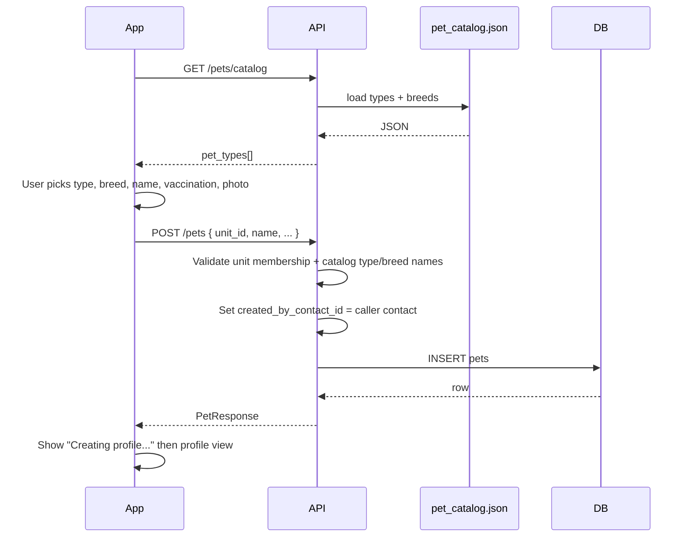

# Pets Flow — Context & Change Guide

> **Status: Implemented** (Phase 1 resident APIs in `user_service`).
> Schema and decisions: [ADR 0016](./adr/0016-pets.md).

- **Service:** `ats-home-craft-python-service` → `apps/user_service`
- **Resident API prefix:** `/v1/pets`
- **Household summary:** `/v1/contact-onboarding/household/summary` (extended with `pets_count`)
- **Static catalog:** `app/data/pet_catalog.json`
- **DB schema:** `ats-home-craft-supabase` (migrations `20260910120000_*`, `20260910121000_*` — proposed)

______________________________________________________________________

## 1. What this flow does

**Pets** lets residents register household pets against their **unit** — name, type, breed,
vaccination status, date of birth/adoption, gender, and profile photo. Pets appear on:

1. **Household hub** — “My Pets” section with count and **+ Add**.
1. **My Profile → Pet tile** — count badge (“2 Members” / “Add Now”).
1. **My Pets list** — all active pets for the selected unit.
1. **Pet profile** — detail view with edit and remove (reason required).

Pets are **optional** household data. They do **not** block onboarding (unlike legacy
vehicles/household wizard steps). See [contact-onboarding-flow.md](./contact-onboarding-flow.md).

### Product rules (must enforce)

| Rule                          | Enforcement                                                                                               |
| ----------------------------- | --------------------------------------------------------------------------------------------------------- |
| **Unit-scoped**               | Every pet row has `unit_id`; writes require active `contact_units` for caller + unit                      |
| **Not a contact / auth user** | Identity on `pets` table only                                                                             |
| **Catalog from JSON**         | Types/breeds from `pet_catalog.json` via `GET /pets/catalog` — not Postgres                               |
| **Catalog selection only**    | `pet_type` and `breed` store catalog display names — validated against `pet_catalog.json`                 |
| **Vaccination self-declared** | `completely` \| `partially` \| `not_taken` at create/edit; admin verify = Phase 2                         |
| **Soft remove with reason**   | `POST /pets/{id}/remove` requires non-empty `reason`; sets `status = removed`                             |
| **Photos = paths only**       | `photo_paths` is a `text[]` of storage paths; upload handled by existing media pipeline                   |
| **Created by resident**       | `created_by_contact_id` set from authenticated caller on create; exposed as `created_by` in API responses |

### Screen → capability map

**Household hub — My Pets**

| Screen / element             | Capability                                                          |
| ---------------------------- | ------------------------------------------------------------------- |
| Pets count on Household card | `GET /contact-onboarding/household/summary?unit_id=` → `pets_count` |
| **+ Add** (wizard or form)   | `POST /v1/pets`                                                     |
| Pet list row                 | `GET /v1/pets?unit_id=`                                             |
| Pet profile                  | `GET /v1/pets/{pet_id}?unit_id=`                                    |

**Add pet wizard (multi-step bottom sheet)**

| Step                | UI                                 | API / data                                                       |
| ------------------- | ---------------------------------- | ---------------------------------------------------------------- |
| 1 — Select pet type | Grid: Dog, Cat, Bird, … + search   | `GET /pets/catalog` → filter client-side or `?search=`           |
| 2 — Select breed    | List filtered by selected type     | `GET /pets/catalog?pet_type_id=dog` (catalog id for filter only) |
| 3 — Name            | “What do we call your dog?”        | Included in `POST /pets`                                         |
| 4 — Vaccination     | Completely / Partially / Not Taken | `vaccination_status` on create                                   |
| 5 — Profile photo   | Gallery or camera (one or more)    | `photo_paths` on create (or PATCH after upload)                  |

**Add pet — single form (alternate UI)**

| Field                  | Notes                                   |
| ---------------------- | --------------------------------------- |
| Profile photo(s)       | Optional; one or more images            |
| Type of pet            | Dropdown from catalog                   |
| Breed                  | Dropdown filtered by selected type      |
| Pet name               | Required                                |
| Vaccinated             | Dropdown → maps to `vaccination_status` |
| Date of birth/adoption | Optional date                           |
| Gender                 | Male / Female toggle                    |

**Pet profile detail**

| Element               | Source                                                                          |
| --------------------- | ------------------------------------------------------------------------------- |
| Vaccination badge     | `vaccination_status` → “Vaccinated” / “Partially vaccinated” / “Not vaccinated” |
| Type • Breed subtitle | `pet_type` • `breed` (stored display names from catalog)                        |
| Unit address          | Join `units` + tower                                                            |
| Created by            | `created_by` — resident who added the profile (name, photo)                     |
| Owner details         | Active `contact_units` on same unit (Owner, Tenant, Family)                     |
| Edit                  | `PATCH /v1/pets/{pet_id}`                                                       |
| Remove profile        | `POST /v1/pets/{pet_id}/remove` with reason modal                               |

**Remove confirmation**

| Rule            | Enforcement                                                          |
| --------------- | -------------------------------------------------------------------- |
| Reason required | `reason` min 3 chars; Remove button disabled until filled            |
| Soft delete     | `status = removed`, `deleted_at`, `removal_reason` stored            |
| Audit           | API audit log + `removal_reason` / `removed_by_contact_id` on `pets` |

______________________________________________________________________

## 2. Architecture (layers)

Same 3-layer FastAPI pattern as the rest of the service:

```
HTTP → API router → Service (business rules) → Repository (SQL) → Postgres
                          │
                          └── PetCatalogService (static JSON — read-only)
```

### File map (to implement)

| Concern            | File                                                                                                                   |
| ------------------ | ---------------------------------------------------------------------------------------------------------------------- |
| Resident routes    | `app/api/pets.py`                                                                                                      |
| Route registration | `app/api/routes.py`                                                                                                    |
| Orchestration      | `app/services/pets_service.py`                                                                                         |
| Catalog reader     | `app/services/pet_catalog_service.py`                                                                                  |
| SQL                | `app/db/repositories/pets_repository.py`                                                                               |
| Schemas            | `app/schemas/pets.py`                                                                                                  |
| Enums              | `app/schemas/enums/pets.py` — mirror Postgres enums                                                                    |
| Static data        | `app/data/pet_catalog.json`                                                                                            |
| Household summary  | `contact_onboarding_service.py` + `HouseholdSummaryCountsResponse`                                                     |
| i18n               | `app/locales/en.json` under `pets.*`                                                                                   |
| Tests              | `tests/unit/test_pets_service.py`, `tests/unit/test_pet_catalog_service.py`, `tests/integration/pets/test_pets_api.py` |

______________________________________________________________________

## 3. Data model

See [ADR 0016 § Schema](./adr/0016-pets.md#schema-proposed) for full DDL.

### New tables summary

| Table      | Purpose                                                                              |
| ---------- | ------------------------------------------------------------------------------------ |
| **`pets`** | Pet profile: name, pet_type, breed, vaccination, gender, DOB, photo_paths, unit link |

### No new Postgres tables for catalog

Pet types and breeds are **not** stored in the database. They live in:

```
apps/user_service/app/data/pet_catalog.json
```

Update this file to add types/breeds; deploy the service to pick up changes (`@lru_cache` — restart or `clear_cache()` in tests).

### `pets` columns (resident-facing)

| Column                  | Type        | Notes                                                                           |
| ----------------------- | ----------- | ------------------------------------------------------------------------------- |
| `id`                    | uuid        |                                                                                 |
| `organization_id`       | uuid        | Tenant scope                                                                    |
| `project_id`            | uuid        | From unit                                                                       |
| `unit_id`               | uuid        | Household unit                                                                  |
| `created_by_contact_id` | uuid        | Resident who created the profile; set server-side on `POST`, immutable          |
| `name`                  | text        | Pet name                                                                        |
| `pet_type`              | text        | Catalog type display name (e.g. `Dog`, `Cat`)                                   |
| `breed`                 | text        | Catalog breed display name under the selected type (e.g. `Golden Retriever`)    |
| `gender`                | enum        | `male` \| `female` (optional)                                                   |
| `date_of_birth`         | date        | Optional                                                                        |
| `vaccination_status`    | enum        | `completely` \| `partially` \| `not_taken`                                      |
| `photo_paths`           | text[]      | Profile photo storage paths; default `'{}'`; first entry = primary avatar in UI |
| `status`                | enum        | `active` \| `removed`                                                           |
| `removal_reason`        | text        | Set on remove                                                                   |
| `removed_by_contact_id` | uuid        | Set on remove                                                                   |
| `deleted_at`            | timestamptz | Set on remove                                                                   |

### Display fields (computed in service — not stored)

| API field            | Derivation                                                                        |
| -------------------- | --------------------------------------------------------------------------------- |
| `vaccination_label`  | i18n from `vaccination_status`                                                    |
| `age_years`          | Optional client-side from `date_of_birth`                                         |
| `primary_photo_path` | First element of `photo_paths`, or `null` when empty — convenience for list cards |
| `created_by`         | Nested resident summary joined from `created_by_contact_id` (see below)           |

### `created_by` (API response — not a DB column)

Stored as **`created_by_contact_id`** on `pets`. Resolved on list/detail reads for the pet profile
and admin views. Same pattern as `vehicles.contact_id` + `owner` summary on vehicle detail.

| Field               | Source                                                                               |
| ------------------- | ------------------------------------------------------------------------------------ |
| `contact_id`        | `pets.created_by_contact_id`                                                         |
| `display_name`      | `contacts` — built from prefix + first + last name                                   |
| `profile_photo_url` | `contacts.profile_photo_url`                                                         |
| `relationship`      | Optional — caller’s `contact_units.relationship` to the unit (e.g. `self`, `spouse`) |

**Rules:**

- Set automatically on `POST /pets` from `extract_onboarding_contact_context().contact_id`.
- **Not** accepted in create/update request bodies — clients must not send it.
- **Immutable** after create (editing the pet does not change who created it).
- `PATCH` and remove actions do not overwrite `created_by_contact_id`.
  **Example (detail response fragment):**

```json
{
  "id": "pet-uuid",
  "name": "Romeo",
  "created_by_contact_id": "contact-uuid",
  "created_by": {
    "contact_id": "contact-uuid",
    "display_name": "Ajay Thakur",
    "profile_photo_url": "org/contacts/ajay.jpg",
    "relationship": "self"
  },
  "created_at": "2026-09-10T12:00:00Z"
}
```

______________________________________________________________________

## 4. Static catalog (`pet_catalog.json`)

### Structure

```json
{
  "pet_types": [
    {
      "id": "dog",
      "name": "Dog",
      "icon": "dog",
      "breeds": [
        { "id": "labrador_retriever", "name": "Labrador Retriever" },
        { "id": "golden_retriever", "name": "Golden Retriever" }
      ]
    }
  ]
}
```

### Conventions

| Rule                             | Detail                                                                                             |
| -------------------------------- | -------------------------------------------------------------------------------------------------- |
| **Ids**                          | Lowercase snake_case (`golden_retriever`)                                                          |
| **Icons**                        | Client asset key; not validated by API                                                             |
| **Catalog-only selection**       | Users pick from listed types and breeds; API stores selected `name` values in `pet_type` / `breed` |
| **Catalog `id` vs stored value** | JSON `id` is for picker/filter UX only; `POST`/`PATCH` send display `name`, not id                 |
| **Search**                       | API filters `name` case-insensitively when `?search=` is passed                                    |

### Adding a new type or breed

1. Edit `app/data/pet_catalog.json` — add under `pet_types` or the relevant `breeds` array.
1. Deploy / restart service (catalog is cached in memory).
1. No migration required.

______________________________________________________________________

## 5. API catalog (proposed)

All resident routes require authentication + onboarding contact context.

### Catalog

| Method | Path                               | Purpose                     |
| ------ | ---------------------------------- | --------------------------- |
| GET    | `/v1/pets/catalog`                 | All pet types with breeds   |
| GET    | `/v1/pets/catalog?pet_type_id=dog` | Single type + its breeds    |
| GET    | `/v1/pets/catalog?search=lab`      | Filter types/breeds by name |

**Example response:**

```json
{
  "data": {
    "pet_types": [
      {
        "id": "dog",
        "name": "Dog",
        "icon": "dog",
        "breeds": [
          { "id": "labrador_retriever", "name": "Labrador Retriever" },
          { "id": "golden_retriever", "name": "Golden Retriever" }
        ]
      }
    ]
  }
}
```

### CRUD

| Method | Path                                      | Purpose                                              |
| ------ | ----------------------------------------- | ---------------------------------------------------- |
| GET    | `/v1/pets?unit_id={uuid}`                 | List active pets on unit                             |
| GET    | `/v1/pets/{pet_id}?unit_id={uuid}`        | Detail with unit, `created_by`, and household owners |
| POST   | `/v1/pets`                                | Create pet                                           |
| PATCH  | `/v1/pets/{pet_id}?unit_id={uuid}`        | Update fields                                        |
| POST   | `/v1/pets/{pet_id}/remove?unit_id={uuid}` | Soft-remove with reason                              |

### Create payload

```json
POST /v1/pets
{
  "unit_id": "unit-uuid",
  "name": "Romeo",
  "pet_type": "Dog",
  "breed": "Golden Retriever",
  "vaccination_status": "completely",
  "gender": "male",
  "date_of_birth": "2020-02-01",
  "photo_paths": [
    "org/project/pets/romeo.jpg",
    "org/project/pets/romeo-2.jpg"
  ]
}
```

> `created_by_contact_id` is **not** in the request — the API sets it from the authenticated resident.
> `photo_paths` may be omitted or `[]` when no photos yet; order is preserved (index `0` = primary).
> On `PATCH`, sending `photo_paths` **replaces** the full list (same as vehicles). Max **10** paths per pet.

**Example create response:**

```json
{
  "data": {
    "id": "pet-uuid",
    "unit_id": "unit-uuid",
    "name": "Romeo",
    "pet_type": "Dog",
    "breed": "Golden Retriever",
    "vaccination_status": "completely",
    "gender": "male",
    "date_of_birth": "2020-02-01",
    "photo_paths": [
      "org/project/pets/romeo.jpg",
      "org/project/pets/romeo-2.jpg"
    ],
    "primary_photo_path": "org/project/pets/romeo.jpg",
    "status": "active",
    "created_by_contact_id": "contact-uuid",
    "created_by": {
      "contact_id": "contact-uuid",
      "display_name": "Ajay Thakur",
      "profile_photo_url": "org/contacts/ajay.jpg",
      "relationship": "self"
    },
    "created_at": "2026-09-10T12:00:00Z",
    "updated_at": "2026-09-10T12:00:00Z"
  }
}
```

### Remove payload

```json
POST /v1/pets/{pet_id}/remove?unit_id=unit-uuid
{
  "reason": "He's been adopted by another family"
}
```

### Household summary (extended)

```http
GET /v1/contact-onboarding/household/summary?unit_id={unit_id}
```

```json
{
  "data": {
    "unit_id": "unit-uuid",
    "family_count": 2,
    "daily_help_count": 2,
    "vehicles_count": 2,
    "tenant_count": 1,
    "pets_count": 2
  }
}
```

| Field        | Derivation                                                                              |
| ------------ | --------------------------------------------------------------------------------------- |
| `pets_count` | `COUNT(*)` from `pets` where `unit_id` matches, `status = active`, `deleted_at IS NULL` |

______________________________________________________________________

## 6. Validation reference

| Field                   | Validation                                                                              |
| ----------------------- | --------------------------------------------------------------------------------------- |
| `unit_id`               | Caller has active `contact_units` row                                                   |
| `created_by_contact_id` | Set server-side on create only; not in request body                                     |
| `name`                  | Required, 1–100 chars, trimmed                                                          |
| `pet_type`              | Required; must match a type `name` in catalog                                           |
| `breed`                 | Required; must match a breed `name` under the selected type in catalog                  |
| `vaccination_status`    | Required enum                                                                           |
| `gender`                | Optional enum                                                                           |
| `date_of_birth`         | Optional; not in the future                                                             |
| `photo_paths`           | Optional `list[str]`; each item non-empty; max 10 paths (proposed); duplicates rejected |
| `reason` (remove)       | Required, min 3 chars                                                                   |

### Vaccination status labels (UI)

| Enum value   | Badge / list subtitle |
| ------------ | --------------------- |
| `completely` | Vaccinated            |
| `partially`  | Partially vaccinated  |
| `not_taken`  | Not vaccinated        |

Wizard copy (from design):

- **Completely:** All required and recommended vaccines with valid documentation.
- **Partially:** Some vaccines received; record incomplete or missing required shots.
- **Not taken:** No vaccinations or no valid records provided.

> Footer note in UI: “Vaccination information will be verified by society admin.” — backend Phase 2.

______________________________________________________________________

## 7. End-to-end flows

### 7a. Add pet (wizard)



### 7b. Edit pet

1. `GET /pets/{id}?unit_id=` — load current values + resolved labels.
1. User edits form (type/breed pickers from catalog; add/remove/reorder photos via `photo_paths`).
1. `PATCH /pets/{id}?unit_id=` — partial update; audited via `@audit_api_call`.

### 7c. Remove pet

1. User taps **Remove profile** → modal with reason textarea.
1. Remove button enabled only when `reason` non-empty.
1. `POST /pets/{id}/remove` — sets `status = removed`, stores reason, hides from lists.

### 7d. Household count refresh

After create/remove, client refreshes:

```http
GET /contact-onboarding/household/summary?unit_id=
```

to update the Pets tile count on Household and My Profile.

______________________________________________________________________

## 8. Cross-cutting conventions

- **Auth & org scope:** every request resolves user + `organization_id`; pets queries filter by org.
- **Unit gate:** same as vehicles — `ContactUnitsRepository` confirms active link before write.
- **Responses:** `success_response` / `list_response`; i18n keys under `pets.*`.
- **Writes vs reads:** writes use `db_uow`, reads use `db_conn`.
- **Auditing:** mutations wrapped with `@audit_api_call` on API routes.
- **Serialization:** UUID → string, dates → ISO in service layer.
- **Created by:** join `contacts` on `created_by_contact_id` for `created_by` in list/detail responses.

______________________________________________________________________

## 9. How to make common changes

| I want to…                   | Change here                                                  |
| ---------------------------- | ------------------------------------------------------------ |
| Add a pet type or breed      | `app/data/pet_catalog.json`                                  |
| Change type/breed validation | `app/services/pets_service.py` + `app/schemas/pets.py`       |
| Add a DB column              | migration in `ats-home-craft-supabase` + repository + schema |
| Extend household summary     | `contact_onboarding_service.py` + `HouseholdSummaryResponse` |
| Add admin vaccination review | Phase 2 — `app/api/projects.py` + ADR 0016 follow-up         |
| Change user-facing message   | `app/locales/en.json` under `pets.*`                         |

______________________________________________________________________

## 10. Tests (planned)

| Test file                     | Coverage                                                                                                                    |
| ----------------------------- | --------------------------------------------------------------------------------------------------------------------------- |
| `test_pet_catalog_service.py` | JSON load, search filter, invalid type id                                                                                   |
| `test_pets_service.py`        | Create with catalog type/breed names, `created_by_contact_id` from caller, invalid name rejection, remove reason, unit gate |
| `test_pets_repository.py`     | SQL insert/list/summary count                                                                                               |
| Integration                   | `tests/integration/pets/test_pets_api.py`                                                                                   |

Run: `ENVIRONMENT=test PYTHONPATH=. pytest apps/user_service/tests -q`

______________________________________________________________________

## 11. Related docs

| Doc                                                        | Relevance                                              |
| ---------------------------------------------------------- | ------------------------------------------------------ |
| [contact-onboarding-flow.md](./contact-onboarding-flow.md) | Household hub, unit membership, summary counts         |
| [project-setup-flow.md](./project-setup-flow.md)           | Doc structure reference; vehicles admin review pattern |
| [daily-help-flow.md](./daily-help-flow.md)                 | Household links, resident API split                    |
| [ADR 0016](./adr/0016-pets.md)                             | Schema DDL and architecture decisions                  |
