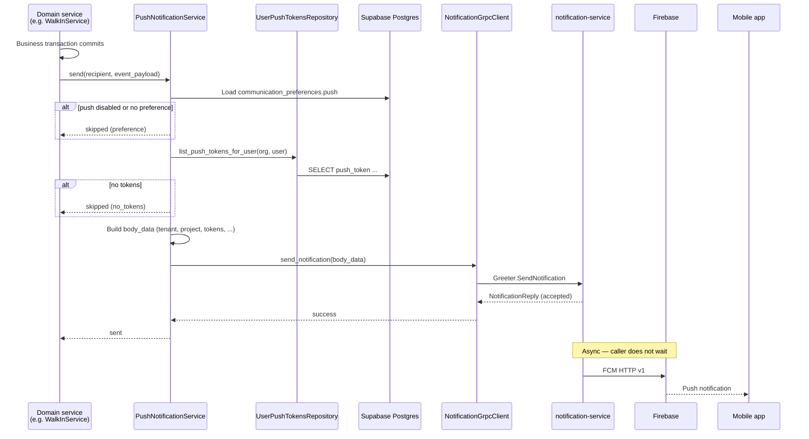

# Push Notifications Flow — Context & Integration Guide

> **Status: Implemented (Phase 1).** Device registration, gRPC sender, `PushNotificationDispatcher`, and feature wiring are live in `user_service`. Topic-based delivery and token pruning remain follow-ups.
>
> Architecture rationale: [ADR 0009](./adr/0009-push-notifications-grpc.md).
>
> External reference: notification-service `docs/fcm-flow.md`.

- **Service:** `ats-home-craft-python-service` → `apps/user_service`
- **Registration API:** `POST /v1/users/me/push-devices`, `DELETE /v1/users/me/push-devices/{device_id}`
- **Sender:** `PushNotificationService` → `PushNotificationDispatcher` → gRPC `notification-service:50051`
- **Token storage:** `public.user_push_tokens` (`ats-home-craft-supabase`)
- **In-app feed (read):** notification-service HTTP `GET /api/v1/notifications/logs` (mobile / gateway)
- **Copy:** `apps/user_service/app/locales/en.json` → `notifications.push.*`

______________________________________________________________________

## 1. What this flow does

Home Craft sends **push notifications** and optional **in-app feed rows** when domain events occur (walk-in approval needed, pass check-in, tenant request update, fee reminder, etc.).

**python-service responsibilities:**

| Step                                                     | Owner                      |
| -------------------------------------------------------- | -------------------------- |
| Register / unregister FCM device tokens                  | `user_service` (done)      |
| Resolve recipient Supabase `user_id` + `organization_id` | Domain service             |
| Load FCM tokens from Postgres                            | `UserPushTokensRepository` |
| Build `body_data` JSON with tenant/project scope         | `PushNotificationService`  |
| Call gRPC `SendNotification`                             | `NotificationGrpcClient`   |

**notification-service responsibilities:**

| Step                                   | Owner                         |
| -------------------------------------- | ----------------------------- |
| Validate payload                       | notification-service API      |
| Persist feed row (`notification_logs`) | notification-service Postgres |
| Enqueue FCM job                        | Redis / Asynq                 |
| Deliver to FCM                         | notification-service worker   |
| Serve feed + unread count              | notification-service HTTP     |

______________________________________________________________________

## 2. Identifier mapping

Every gRPC payload **must** include these top-level fields:

| Field        | Source in Home Craft                                              | Example                  |
| ------------ | ----------------------------------------------------------------- | ------------------------ |
| `tenant_id`  | `shared_settings.isometrik.client_name` (`ISOMETRIK_CLIENT_NAME`) | `home-craft-prod`        |
| `project_id` | `organization_id` (UUID)                                          | `a1b2c3d4-...`           |
| `user_id`    | Recipient Supabase user id (`auth.users.id`)                      | `e5f6g7h8-...`           |
| `tokens`     | `user_push_tokens.push_token` for `(organization_id, user_id)`    | `["dK3x...", "fM9y..."]` |

```python
# Conceptual mapping (implementation in PushNotificationService)
tenant_id = shared_settings.isometrik.client_name
project_id = str(organization_id)
user_id = str(recipient_supabase_user_id)
tokens = await push_tokens_repo.list_push_tokens_for_user(
    organization_id=project_id,
    user_id=user_id,
)
```

The mobile app uses the **same** `tenant_id` and `project_id` when calling notification-service feed APIs (`x-tenant-id`, `x-project-id` headers).

______________________________________________________________________

## 3. Device registration (implemented)

### 3.1 Register on login / token refresh

```http
POST /v1/users/me/push-devices
Authorization: Bearer <supabase_jwt>

{
  "device_id": "stable-client-id",
  "push_token": "<fcm_registration_token>",
  "platform": "android",
  "app_version": "1.2.0"
}
```

**Behaviour:**

1. JWT provides Supabase `user_id`; session/org context provides `organization_id`.
1. Upsert on `device_id` — same physical device reassigned when another user logs in.
1. Row stored in `user_push_tokens` with `provider = 'fcm'`.

**Code:** `user_push_tokens.py` → `UserPushTokenService.register_device`.

### 3.2 Unregister on logout

```http
DELETE /v1/users/me/push-devices/{device_id}
```

Idempotent delete scoped to authenticated user.

### 3.3 Schema

```text
user_push_tokens
├── device_id          (unique)
├── organization_id    → organizations.id
├── user_id            → auth.users.id
├── push_token
├── platform           ios | android | web
├── provider           fcm (default)
└── last_seen_at / updated_at
```

Migration: `20260728153000_user_push_tokens.sql`.

______________________________________________________________________

## 4. Send flow (implemented)

### 4.1 End-to-end sequence



### 4.2 gRPC call shape

**RPC:** `notification.Greeter/SendNotification`

**Request:**

```json
{
  "body_data": "<stringified JSON — full payload>"
}
```

**Success:** `NotificationReply.message` is a non-empty JSON string, e.g.:

```json
{
  "status": "accepted",
  "notificationLogId": "550e8400-e29b-41d4-a716-446655440000",
  "deliveryMode": "multi",
  "targetCount": 2
}
```

**Important:** gRPC returns after accept + enqueue. It does **not** guarantee FCM delivery.

### 4.3 Example payload (walk-in approval)

```json
{
  "tenant_id": "home-craft-prod",
  "project_id": "a1b2c3d4-e5f6-7890-abcd-ef1234567890",
  "user_id": "f47ac10b-58cc-4372-a567-0e02b2c3d479",
  "title": "Walk-in approval needed",
  "body": "Security registered a visitor for Flat A-2102",
  "type": "NOTIFICATION_TYPE_WALK_IN",
  "feed_type": "walk_in",
  "tokens": ["fcm_token_phone", "fcm_token_tablet"],
  "data": {
    "walk_in_entry_id": "entry-uuid",
    "visit_unit_id": "visit-unit-uuid",
    "tower_id": "tower-uuid",
    "unit_id": "unit-uuid",
    "screen": "walk_in_detail"
  },
  "actor": {
    "user_id": "security-user-uuid",
    "display_name": "Gate Security"
  },
  "entity": {
    "kind": "walk_in",
    "id": "entry-uuid"
  },
  "options": {
    "priority": "PRIORITY_HIGH",
    "collapse_key": "walk_in:visit-unit-uuid",
    "ttl_seconds": 3600,
    "save_to_db": true,
    "push_enabled": true,
    "click_action": "OPEN_WALK_IN",
    "idempotency_key": "walk_in:visit-unit-uuid:awaiting"
  }
}
```

### 4.4 Skip conditions (no gRPC call)

| Condition                                           | Log reason       | Business tx |
| --------------------------------------------------- | ---------------- | ----------- |
| `NOTIFICATION_ENABLED=false`                        | `disabled`       | Unaffected  |
| Recipient `communication_preferences.push == false` | `preference_off` | Unaffected  |
| No rows in `user_push_tokens`                       | `no_tokens`      | Unaffected  |
| gRPC error (default)                                | `grpc_failed`    | Unaffected  |

When `NOTIFICATION_RAISE_ON_FAILURE=true`, gRPC errors propagate to the caller (use only in tests or strict batch jobs).

______________________________________________________________________

## 5. Code layout

| Path                                                                   | Role                                               |
| ---------------------------------------------------------------------- | -------------------------------------------------- |
| `libs/shared_config/app_settings.py`                                   | `NotificationSettings`                             |
| `libs/shared_utils/notification_grpc_client.py`                        | Async gRPC client, JSON encode, channel cache      |
| `libs/grpc_stubs/notification/`                                        | Generated `notification_service_pb2*` from proto   |
| `apps/user_service/app/services/push_notification_service.py`          | Payload builder + token lookup + preference gate   |
| `apps/user_service/app/services/push_notification_dispatch.py`         | `PushNotificationDispatcher` (shared send helpers) |
| `apps/user_service/app/db/repositories/user_push_tokens_repository.py` | `list_push_tokens_for_user`                        |

Domain services depend on `PushNotificationDispatcher` (or `PushNotificationService` directly) — not on gRPC.

### 5.1 Localized title and body

Use the existing **`Translator`** and `apps/user_service/app/locales/*.json` — same system as API `success_response` messages.

| Concern            | Approach                                                                                                  |
| ------------------ | --------------------------------------------------------------------------------------------------------- |
| Where strings live | `en.json` (and future `hi.json`, …) under `notifications.push.*`                                          |
| How to resolve     | `translator.get("notifications.push.walk_in.awaiting.title", language, **params)`                         |
| Dynamic values     | `{unit_label}`, `{visitor_name}`, `{actor_name}`, `{document_name}`, `{helper_name}`, etc.                |
| When to resolve    | At send time inside `PushNotificationService`, before gRPC                                                |
| Language           | Recipient `preferred_language` when available, else `en` (not the triggering HTTP request's `lan` header) |

**Why not hard-code in Python?** Keeps copy editable in one place, matches API i18n patterns, and allows new languages without code changes.

**Caller pattern:**

```python
await push_notification_service.send(
    organization_id=org_id,
    recipient_user_id=user_id,
    message_key="notifications.push.walk_in.awaiting",
    language="en",
    params={"unit_label": "Flat A-2102"},
    type="NOTIFICATION_TYPE_WALK_IN",
    feed_type="walk_in",
    data={...},
    entity={...},
    options={...},
)
```

`PushNotificationService` expands `message_key` → `.title` / `.body`, then sends the resolved strings in gRPC `body_data`.

______________________________________________________________________

## 6. Integrated push notifications (catalog)

**22 events** across **8 feature areas** are wired in production code. All copy lives under `notifications.push.*` in `apps/user_service/app/locales/en.json`.

### 6.1 Summary

| Feature          | Events | gRPC `type` / `feed_type`                                                               | Primary API / trigger                  |
| ---------------- | ------ | --------------------------------------------------------------------------------------- | -------------------------------------- |
| Walk-in          | 4      | `NOTIFICATION_TYPE_WALK_IN` / `walk_in`                                                 | `walk_ins.py`, `walk_ins_owner.py`     |
| Visitor pass     | 2      | `NOTIFICATION_TYPE_PASS` / `pass`                                                       | `gate_passes.py`                       |
| Daily help       | 6      | `NOTIFICATION_TYPE_DAILY_HELP` / `daily_help` (review); `NOTIFICATION_TYPE_PASS` (gate) | `daily_help.py`, `gate_passes.py`      |
| Tenant request   | 4      | `NOTIFICATION_TYPE_TENANT` / `tenant`                                                   | `tenant_requests.py`, owner create API |
| Fee invoice      | 2      | `NOTIFICATION_TYPE_FEE` / `fee`                                                         | `fee_invoices.py`, reminder job        |
| Move event       | 1      | `NOTIFICATION_TYPE_MOVE` / `move`                                                       | `move_events.py`                       |
| Vehicle          | 3      | `NOTIFICATION_TYPE_VEHICLE` / `vehicle`                                                 | contact onboarding / admin review APIs |
| Community notice | 1      | `notice_published` / `notices`                                                          | `notices.py`, scheduled publish job    |

### 6.2 Dispatch helpers (`PushNotificationDispatcher`)

| Method                         | Used for                                                                          | Preference check                       |
| ------------------------------ | --------------------------------------------------------------------------------- | -------------------------------------- |
| `send_to_unit_residents`       | Walk-in awaiting/entered; guest pass check-in/out                                 | Yes (`communication_preferences.push`) |
| `send_to_user`                 | Walk-in approve/reject → security; notices                                        | Per call (security: **off**)           |
| `send_to_contact`              | Tenant docs/approve; vehicle approve/reject; move event                           | Yes                                    |
| `send_to_org_members`          | Tenant submitted; vehicle submitted/resubmitted; daily help submitted/resubmitted | **No** (staff/admin)                   |
| `send_to_contact_unit_primary` | Fee invoice issued / payment reminder                                             | Yes                                    |

`DailyHelpNotificationService` calls `send_to_user` directly for Owner/Tenant on linked household units.

### 6.3 Walk-in (`WalkInService`)

| Event                  | Message key                           | Trigger                      | Recipient                                                  | API                                            |
| ---------------------- | ------------------------------------- | ---------------------------- | ---------------------------------------------------------- | ---------------------------------------------- |
| Flat awaiting approval | `notifications.push.walk_in.awaiting` | Security creates walk-in     | Unit residents (per flat)                                  | `POST /projects/{id}/walk-ins`                 |
| Resident approved      | `notifications.push.walk_in.approved` | Resident approves visit unit | Security user who created walk-in (`requested_by_user_id`) | `POST /walk-ins/{id}/visit-units/{id}/approve` |
| Resident rejected      | `notifications.push.walk_in.rejected` | Resident rejects visit unit  | Security user who created walk-in                          | `POST /walk-ins/{id}/visit-units/{id}/reject`  |
| Visitor entered        | `notifications.push.walk_in.entered`  | Security marks entered       | Unit residents on **approved** flats only                  | `POST /projects/{id}/walk-ins/{id}/enter`      |

**Params:** `{unit_label}`, `{actor_name}` (approve/reject).

**Click action:** `OPEN_WALK_IN`.

**Not wired:** `POST .../walk-ins/{id}/exit` (no push on exit).

### 6.4 Visitor passes (`PassVerificationService` — `gate_passes.py`)

| Event       | Message key                           | Trigger                   | Recipient                                          | API                           |
| ----------- | ------------------------------------- | ------------------------- | -------------------------------------------------- | ----------------------------- |
| Checked in  | `notifications.push.pass.checked_in`  | Successful gate check-in  | Pass host + Owner/Tenant on unit (deduped by user) | `POST /passes/{id}/check-in`  |
| Checked out | `notifications.push.pass.checked_out` | Successful gate check-out | Pass host + Owner/Tenant on unit (deduped by user) | `POST /passes/{id}/check-out` |

**Params:** `{visitor_name}` (guest name on pass).

**Click action:** `OPEN_PASS`.

**Skipped when:** pass `is_private == true`, failed check-in validation, or `/passes/verify` (lookup only — no push).

### 6.5 Daily help

#### Security submission review (`DailyHelpService` — `daily_help.py`)

| Event       | Message key                                 | Trigger                         | Recipient                                   | API                                    |
| ----------- | ------------------------------------------- | ------------------------------- | ------------------------------------------- | -------------------------------------- |
| Submitted   | `notifications.push.daily_help.submitted`   | Security submits for review     | Active org members (admins)                 | `POST .../daily-help/submissions`      |
| Resubmitted | `notifications.push.daily_help.resubmitted` | Security resubmits after reject | Active org members (admins)                 | `PATCH .../daily-help/{id}/submission` |
| Approved    | `notifications.push.daily_help.approved`    | Admin approves pending profile  | Security submitter (`submitted_by_user_id`) | `POST .../daily-help/{id}/approve`     |
| Rejected    | `notifications.push.daily_help.rejected`    | Admin rejects pending profile   | Security submitter                          | `POST .../daily-help/{id}/reject`      |

**Params:** `{helper_name}` (profile display name).

**Click actions:** `OPEN_DAILY_HELP_REVIEW` (admins), `OPEN_DAILY_HELP_SUBMISSION` (security).

#### Gate check-in/out (`DailyHelpNotificationService` — via `gate_passes.py`)

When the pass row has `daily_help_id`, check-in/out uses daily-help recipients instead of household pass flow.

| Event       | Message key                                 | Trigger                   | Recipient                                             |
| ----------- | ------------------------------------------- | ------------------------- | ----------------------------------------------------- |
| Checked in  | `notifications.push.daily_help.checked_in`  | Daily help pass check-in  | Owner + Tenant on active `daily_help_household_links` |
| Checked out | `notifications.push.daily_help.checked_out` | Daily help pass check-out | Same                                                  |

**Params:** `{helper_name}`.

**Click action:** `OPEN_DAILY_HELP`.

### 6.6 Tenant requests (`TenantRequestsService`)

| Event             | Message key                                           | Trigger                      | Recipient                         | API                              |
| ----------------- | ----------------------------------------------------- | ---------------------------- | --------------------------------- | -------------------------------- |
| Submitted         | `notifications.push.tenant_request.submitted`         | Owner submits request        | Active org members (admins)       | Owner create API                 |
| Document verified | `notifications.push.tenant_request.document_verified` | Admin verifies document      | Request submitter (owner contact) | `POST .../documents/{id}/verify` |
| Document rejected | `notifications.push.tenant_request.document_rejected` | Admin rejects document       | Request submitter (owner contact) | `POST .../documents/{id}/reject` |
| Request approved  | `notifications.push.tenant_request.approved`          | Admin approves ready request | Request submitter (owner contact) | `POST .../{id}/approve`          |

**Params:** `{unit_label}`, `{document_name}` (verify/reject — readable document type label).

**Click action:** `OPEN_TENANT_REQUEST`.

### 6.7 Fee invoices (`FeeInvoiceService`)

| Event            | Message key                               | Trigger                       | Recipient                            |
| ---------------- | ----------------------------------------- | ----------------------------- | ------------------------------------ |
| Invoice issued   | `notifications.push.fee.invoice_issued`   | Invoice generated for project | Primary contact on `contact_unit_id` |
| Payment reminder | `notifications.push.fee.payment_reminder` | Overdue reminder batch        | Primary contact on `contact_unit_id` |

**Params:** `{invoice_number}`, `{amount}`, `{due_date}` (issued); `{invoice_number}` (reminder).

**Click action:** `OPEN_FEE`.

### 6.8 Move events (`MoveEventsService`)

| Event         | Message key                        | Trigger                      | Recipient                                     | API                 |
| ------------- | ---------------------------------- | ---------------------------- | --------------------------------------------- | ------------------- |
| Move recorded | `notifications.push.move.recorded` | Move-in or move-out recorded | Moving contact + unit Owner (deduped by user) | `POST /move-events` |

**Params:** `{move_type}`, `{unit_label}`.

**Click action:** `OPEN_MOVE`.

### 6.9 Vehicles (`VehiclesService`)

| Event       | Message key                            | Trigger                             | Recipient             |
| ----------- | -------------------------------------- | ----------------------------------- | --------------------- |
| Submitted   | `notifications.push.vehicle.submitted` | Resident creates vehicle            | Org members (admins)  |
| Resubmitted | `notifications.push.vehicle.submitted` | Resident resubmits rejected vehicle | Org members (admins)  |
| Approved    | `notifications.push.vehicle.approved`  | Admin approves vehicle              | Vehicle owner contact |
| Rejected    | `notifications.push.vehicle.rejected`  | Admin rejects vehicle               | Vehicle owner contact |

**Params:** `{registration_number}`, `{unit_label}` (submitted); `{registration_number}` (approve/reject).

**Click actions:** `OPEN_VEHICLE_REQUEST` / `OPEN_VEHICLE`.

### 6.10 Community notices (`NoticesService`)

| Event     | Message key                            | Trigger                                    | Recipient                                               |
| --------- | -------------------------------------- | ------------------------------------------ | ------------------------------------------------------- |
| Published | `notifications.push.notices.published` | Notice published (manual or scheduled job) | Resolved notice audience (`send_to_user` per recipient) |

**Params:** `{title}` (notice title).

**Data:** `notice_id`, `project_id`, `screen: notice_detail`.

**Entity:** `{ kind: "notice", id: <notice_id> }`.

**Click action:** `OPEN_NOTICE`.

### 6.11 Locale keys (`en.json`)

All keys follow `notifications.push.{feature}.{event}.title` / `.body`:

```text
walk_in.awaiting | approved | rejected | entered
pass.checked_in | checked_out
daily_help.submitted | resubmitted | approved | rejected | checked_in | checked_out
tenant_request.submitted | document_verified | document_rejected | approved
fee.invoice_issued | payment_reminder
move.recorded
vehicle.submitted | approved | rejected
notices.published
```

### 6.12 Not yet implemented

| Planned event                | Notes                                                               |
| ---------------------------- | ------------------------------------------------------------------- |
| Walk-in exit                 | No `walk_in.exited` key or send on `exit_walk_in`                   |
| `NOTIFICATION_TYPE_SYSTEM`   | Platform-wide alerts — no caller                                    |
| Topic-based delivery         | Phase 2 — `user_push_topic()` exists but send path uses tokens only |
| Token pruning on FCM failure | Follow-up                                                           |

Each wired integration passes:

- `organization_id` → gRPC `project_id`
- Recipient **Supabase user id** (via contact, unit residents, or org members)
- `entity.kind` + `entity.id` for deep links
- Stable `options.idempotency_key` per event instance

______________________________________________________________________

## 7. Resolving recipient Supabase user id

Push targets **`auth.users.id`**, not `contacts.id`. Domain services must map contact → Supabase user:

| Context                        | Resolution                                                  |
| ------------------------------ | ----------------------------------------------------------- |
| Logged-in resident / owner     | JWT `sub` or `user_context.user_id`                         |
| Another household contact      | `contacts.supabase_user_id` (or join via onboarding tables) |
| Organization member (security) | Member's linked Supabase user                               |

If a contact has no Supabase account yet (invite pending), **skip push** — no `user_push_tokens` row will exist anyway.

______________________________________________________________________

## 8. In-app notification feed (mobile read path)

notification-service stores feed rows when `options.save_to_db = true` (default).

**List notifications:**

```http
GET /api/v1/notifications/logs?skip=0&limit=20
x-tenant-id: <ISOMETRIK_CLIENT_NAME>
x-project-id: <organization_id>
Authorization: Bearer <supabase_jwt>
```

**Unread badge:**

```http
GET /api/v1/notifications/unread-count
```

Same headers. Opening logs marks matching unread rows as read (notification-service behaviour).

Home Craft python-service **does not** proxy these endpoints in Phase 1 — mobile calls notification-service (via API gateway) directly.

______________________________________________________________________

## 9. Environment variables

Add to `.env` / deployment config:

| Variable                        | Example                      | Description                            |
| ------------------------------- | ---------------------------- | -------------------------------------- |
| `NOTIFICATION_ENABLED`          | `true`                       | Master switch                          |
| `NOTIFICATION_GRPC_TARGET`      | `notification-service:50051` | gRPC address                           |
| `NOTIFICATION_GRPC_TIMEOUT_MS`  | `3000`                       | RPC timeout                            |
| `NOTIFICATION_RAISE_ON_FAILURE` | `false`                      | Fail domain tx on gRPC error           |
| `ISOMETRIK_CLIENT_NAME`         | `home-craft-prod`            | Maps to `tenant_id` (already required) |

Existing registration flow also requires valid JWT + org context; no new env vars for token storage.

______________________________________________________________________

## 10. Topic-based delivery (Phase 2, optional)

`UserPushTokenService.user_push_topic(org_id, user_id)` returns:

```text
org:{organization_id}:user:{user_id}
```

If the mobile app subscribes to this topic via Firebase SDK on login, callers may send:

```json
{
  "topics": ["org:a1b2...:user:f47a..."],
  ...
}
```

instead of or in addition to `tokens[]`.

**Phase 1 uses tokens only** because registration already persists FCM tokens server-side. Topic mode requires coordinated mobile changes and does not replace token registration.

______________________________________________________________________

## 11. Local development checklist

1. Postgres with `user_push_tokens` migration applied.
1. Register a device: `POST /v1/users/me/push-devices` with a test FCM token.
1. Run notification-service API (`:50051`) and worker (`FCM_MOCK=true` for local).
1. Set `NOTIFICATION_ENABLED=true`, `NOTIFICATION_GRPC_TARGET=localhost:50051`.
1. Trigger a domain event or call `PushNotificationService` from a test script.
1. Confirm gRPC `accepted` response and `notification_logs` row in notification-service DB.
1. With real FCM: valid token + worker with service account JSON.

______________________________________________________________________

## 12. Troubleshooting

| Symptom                           | Likely cause                                    | Fix                                         |
| --------------------------------- | ----------------------------------------------- | ------------------------------------------- |
| Business action succeeds, no push | `NOTIFICATION_ENABLED=false`                    | Enable flag                                 |
| Log `no_tokens`                   | User never registered device                    | Call push-devices API                       |
| Log `preference_off`              | `communication_preferences.push` is false       | User opt-in                                 |
| gRPC connection refused           | notification-service not running / wrong target | Check `NOTIFICATION_GRPC_TARGET`            |
| Accepted but no FCM               | Worker down or `FCM_MOCK=true`                  | Start worker, check FCM creds               |
| Feed empty in app                 | Wrong `x-tenant-id` / `x-project-id`            | Must match `ISOMETRIK_CLIENT_NAME` + org id |
| Wrong user's device gets push     | Token reassigned on shared device login         | Expected — upsert by `device_id`            |

______________________________________________________________________

## Related

- [ADR 0009 — Push notifications gRPC](./adr/0009-push-notifications-grpc.md)
- [walk-in-flow.md](./walk-in-flow.md) — walk-in domain flow (push wired)
- [ADR 0001 — Resident onboarding](./adr/0001-resident-onboarding.md) — `communication_preferences`
- notification-service: `docs/adr/0001-grpc-topic-push-notifications.md`, `docs/fcm-flow.md`
