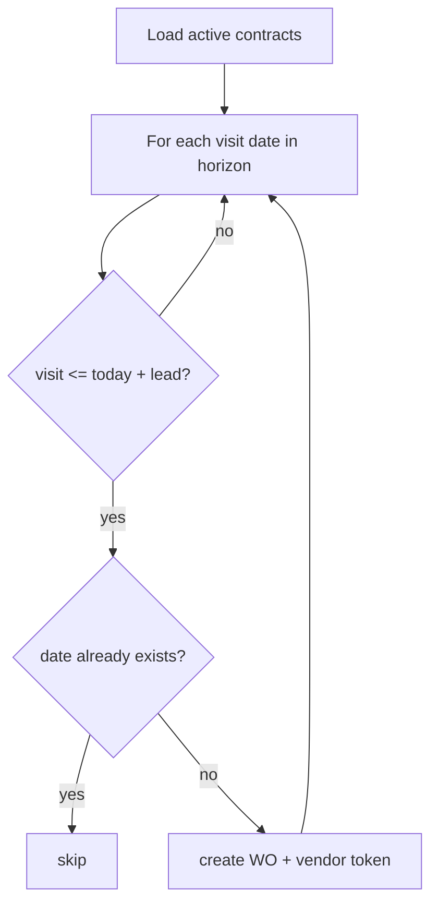

# Contracts & Scheduler Flow — Context & Change Guide

> **Status: V1 implemented.**
> Architecture: [ADR 0003 — Contracts and scheduler](./adr/0003-contracts-and-scheduler.md)
> Part of [Work Order Service](./README.md).

- **Service:** `apps/work_order_service` (port 5001)
- **Staff API:** `/v1/projects/{project_id}/contracts`, `/scheduler/run`
- **DB tables:** `work_order.maintenance_contracts`, `work_order.work_orders` (generated rows)
- **Background job:** `app/services/scheduler_worker.py` (Postgres advisory lock)

______________________________________________________________________

## 1. What this flow does

An **AMC (Annual Maintenance Contract)** ties a CRM **vendor** (`company_id`) to one or more **assets** with
visit frequency (monthly, quarterly, etc.). The **scheduler** lazily generates **work orders** ahead of each
visit date, respecting a configurable **lead window** (default 5 days).

Generation is **idempotent** — existing `(contract_id, scheduled_date)` pairs are skipped.

### Business rules (must enforce)

| Rule                          | Enforcement                                                                                 |
| ----------------------------- | ------------------------------------------------------------------------------------------- |
| **Active contracts only**     | Scheduler reads `status = active`                                                           |
| **Lead days**                 | WOs created when `visit_date <= today + lead_days` (per-contract `auto_generate_lead_days`) |
| **Idempotent dates**          | `existing_contract_schedule_dates()` prevents duplicates                                    |
| **Contract terms change**     | `ContractsService.update` → `SchedulerService.recompute_contract()`                         |
| **Contract delete/terminate** | Cancels upcoming unstarted WOs for that contract                                            |
| **Vendor on WO**              | Generated WOs copy `company_id` from contract                                               |
| **Vendor token**              | Each generated WO gets `secrets.token_urlsafe(32)` → SHA-256 hash stored                    |
| **Multi-instance safety**     | `pg_try_advisory_lock(824731, 1)` in scheduler worker                                       |
| **Terminal contract status**  | `terminated`, `expired` → no new WOs; reconcile existing                                    |

### Visit frequencies

| Value         | Step       |
| ------------- | ---------- |
| `daily`       | +1 day     |
| `weekly`      | +7 days    |
| `fortnightly` | +14 days   |
| `monthly`     | +1 month   |
| `quarterly`   | +3 months  |
| `half_yearly` | +6 months  |
| `yearly`      | +12 months |

Optional `visit_days` (weekday numbers) adjust monthly+ anchors.

### Screen → capability map

| Screen / action      | Capability                                            |
| -------------------- | ----------------------------------------------------- |
| Contract list        | `GET /projects/{project_id}/contracts`                |
| Contract detail      | `GET /projects/{project_id}/contracts/{id}`           |
| Create contract      | `POST /projects/{project_id}/contracts`               |
| Update terms         | `PATCH /projects/{project_id}/contracts/{id}`         |
| Delete contract      | `DELETE /projects/{project_id}/contracts/{id}`        |
| Manual scheduler run | `POST /projects/{project_id}/scheduler/run`           |
| View generated WOs   | `GET /projects/{project_id}/work-orders?contract_id=` |

______________________________________________________________________

## 2. Architecture

```
ContractsService.create/update/delete
    → ContractsRepository
    → SchedulerService.recompute_contract / generate_due_work_orders
    → WorkOrderRepository.create / cancel_contract_work_orders

Background: lifespan → run_scheduler_loop()
    → run_scheduler_once() [advisory lock]
    → SchedulerService.generate_due_work_orders(org_id)
```

### File map

| Concern               | File                                                                                    |
| --------------------- | --------------------------------------------------------------------------------------- |
| Contract API          | `app/api/contracts.py`                                                                  |
| Scheduler trigger API | `app/api/scheduler.py`                                                                  |
| Contract service      | `app/services/contracts_service.py`                                                     |
| Scheduler logic       | `app/services/scheduler_service.py`                                                     |
| Background loop       | `app/services/scheduler_worker.py`                                                      |
| Repositories          | `contracts_repository.py`, `work_orders_repository.py`                                  |
| Config                | `WOM_SCHEDULER_ENABLED`, `WOM_SCHEDULER_INTERVAL_MINUTES`, `WOM_INTERNAL_SERVICE_TOKEN` |

______________________________________________________________________

## 3. Data model

### `maintenance_contracts` (key columns)

| Column                    | Notes                                       |
| ------------------------- | ------------------------------------------- |
| `company_id`              | Vendor → `public.companies`                 |
| `asset_ids`               | `uuid[]` covered equipment                  |
| `visit_frequency`         | Enum — drives date iteration                |
| `start_date`, `end_date`  | Contract validity window                    |
| `last_serviced_date`      | Anchor for next visit after service         |
| `auto_generate_lead_days` | Default 5 if null                           |
| `form_template_id`        | Optional checklist copied to generated WOs  |
| `status`                  | `active`, `expired`, `terminated`, `paused` |

### Generated work order shape

Scheduler builds rows with:

- `source = contract`
- `state = upcoming`
- `contract_id`, `company_id`, `asset_ids`, `scheduled_date`
- `vendor_token_hash` (+ raw token in timeline note for FM retrieval)
- Append-only `timeline` entry: `type=created, by=Scheduler`

______________________________________________________________________

## 4. Staff flow (step by step)

### 4.1 Create contract

```http
POST /v1/projects/{project_id}/contracts
Authorization: Bearer <jwt>

{
  "title": "Annual HVAC AMC — Tower A Plant",
  "company_id": "<crm-company-uuid>",
  "asset_ids": ["<asset-uuid>"],
  "visit_frequency": "quarterly",
  "start_date": "2026-01-01",
  "end_date": "2026-12-31",
  "auto_generate_lead_days": 5,
  "form_template_id": "<uuid>",
  "status": "active"
}
```

Service flow:

1. Insert contract.
1. `EventsService.record_and_dispatch(entity=contract, action=created)`.
1. `SchedulerService.recompute_contract(record)` — generates WOs within lead window.

### 4.2 Update contract terms

```http
PATCH /v1/projects/{project_id}/contracts/{id}
{ "visit_frequency": "monthly", "auto_generate_lead_days": 7 }
```

If `start_date`, `end_date`, `visit_frequency`, `last_serviced_date`, `auto_generate_lead_days`, or
`asset_ids` change → full recompute (cancel stale upcoming WOs, regenerate).

### 4.3 Manual scheduler run

**Staff (project-scoped):**

```http
POST /v1/projects/{project_id}/scheduler/run
Authorization: Bearer <jwt>
```

**Internal automation:**

```http
POST /v1/projects/{project_id}/scheduler/run
X-Internal-Token: <WOM_INTERNAL_SERVICE_TOKEN>
```

Response data example:

```json
{ "created": 3, "cancelled": 0, "skipped": 12, "locked": 0 }
```

When another instance holds the advisory lock: `{ "locked": 1, "created": 0, ... }`.

______________________________________________________________________

## 5. Scheduler algorithm (summary)



Horizon: up to 5 years forward, max 1000 visits per contract per run.

Unit tests: `tests/unit/test_scheduler_service.py`.

______________________________________________________________________

## 6. Where to change things

| Change           | Edit                                                                         |
| ---------------- | ---------------------------------------------------------------------------- |
| New frequency    | `scheduler_service.py` `DAY_STEPS` / `MONTH_STEPS` + Supabase enum migration |
| Lead day default | `DEFAULT_LEAD_DAYS` in `scheduler_service.py`                                |
| Lock key         | `_SCHEDULER_LOCK_KEY` in `scheduler_worker.py`                               |
| Interval         | `WOM_SCHEDULER_INTERVAL_MINUTES` env                                         |
| WO title format  | `SchedulerService._build_work_order()`                                       |
| Cancel rules     | `work_orders_repository.cancel_contract_work_orders()`                       |

______________________________________________________________________

## 7. Related flows

- Generated WOs → [work-orders-flow.md](./work-orders-flow.md)
- Vendor assignment uses CRM company → [assets-flow.md](./assets-flow.md) § cross-schema
- Audit on contract mutations → [integrations-flow.md](./integrations-flow.md)
