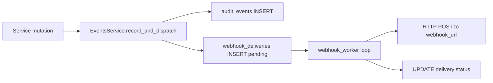

# Integrations Flow — Context & Change Guide

> **Status: V1 implemented (webhooks, audit, API keys). Public API/MCP deferred.**
> Architecture: [ADR 0006 — Integrations](./adr/0006-integrations.md)
> Part of [Work Order Service](./README.md).

- **Service:** `apps/work_order_service` (port 5001)
- **Staff API:** `/triggers`, `/audit-events`, `/webhook-deliveries`, `/api-keys`
- **DB tables:** `trigger_configs`, `audit_events`, `webhook_deliveries`, `api_keys`

______________________________________________________________________

## 1. What this flow does

Every significant mutation in WOM emits:

1. An **audit event** row (immutable log for FM dashboard)
1. Optionally a **webhook delivery** job (outbound HTTP to customer systems)

FM admins configure **trigger rules** (entity + event → URL), manage **API keys** for future public API
access, and inspect delivery logs.

**Deferred in V1:** `api_call_logs` population, public REST API, MCP server, Kafka outbox.

### Event sources

| Source          | When                          |
| --------------- | ----------------------------- |
| `fm`            | Staff JWT mutations (default) |
| `vendor_portal` | Vendor token routes           |
| `scheduler`     | Auto-generated work orders    |
| `api`           | Future public API             |

### Trigger entities & events

| Entity       | Events                                            |
| ------------ | ------------------------------------------------- |
| `work_order` | `created`, `updated`, `deleted`, `status_changed` |
| `contract`   | same                                              |
| `invoice`    | same                                              |
| `payment`    | same                                              |

`status_changed` is derived when an update diff touches `state` or `status`.

### Business rules (must enforce)

| Rule                     | Enforcement                                                       |
| ------------------------ | ----------------------------------------------------------------- |
| **Project scope**        | Triggers, keys, logs filtered by `organization_id` + `project_id` |
| **Webhook retry**        | Background worker with backoff (`webhook_worker.py`)              |
| **API key storage**      | Only SHA-256 hash stored; raw key returned once on create         |
| **Audit immutability**   | Insert-only `audit_events`                                        |
| **Delivery persistence** | `webhook_deliveries` survives process restart (DB-backed queue)   |
| **Push notifications**   | Separate path via gRPC — not a webhook                            |

______________________________________________________________________

## 2. Architecture



Background workers started in `app/lifespan.py`:

- `run_scheduler_loop()` — contract WO generation
- `start_webhook_worker()` — delivery processor

### File map

| Concern          | File                                            |
| ---------------- | ----------------------------------------------- |
| Events pipeline  | `app/services/events_service.py`                |
| Webhook worker   | `app/services/webhook_worker.py`                |
| Trigger API      | `app/api/triggers.py`                           |
| Logs API         | `app/api/logs.py`                               |
| API keys API     | `app/api/api_keys.py`                           |
| Integration repo | `app/db/repositories/integration_repository.py` |
| Push adapter     | `app/adapters/notifications.py`                 |
| CRM adapter      | `app/adapters/vendors_client.py`                |

______________________________________________________________________

## 3. Data model

| Table                | Purpose                                                      |
| -------------------- | ------------------------------------------------------------ |
| `trigger_configs`    | Rule: entity, event, `webhook_url`, `secret`, `is_active`    |
| `audit_events`       | Immutable mutation log with snapshot + diff                  |
| `webhook_deliveries` | Outbound job queue with retry state                          |
| `api_keys`           | Hashed keys for future public API (`key_prefix` for display) |

______________________________________________________________________

## 4. Staff flow (step by step)

### 4.1 Configure webhook trigger

```http
POST /v1/projects/{project_id}/triggers
Authorization: Bearer <jwt>

{
  "name": "Notify ERP on WO complete",
  "entity": "work_order",
  "event": "status_changed",
  "webhook_url": "https://erp.example.com/hooks/wom",
  "secret": "optional-hmac-secret",
  "is_active": true
}
```

### 4.2 Test trigger

```http
POST /v1/projects/{project_id}/triggers/{id}/test
Authorization: Bearer <jwt>
```

Sends sample payload; returns `{ delivered, status, error, duration_ms }`.

### 4.3 View audit log

```http
GET /v1/projects/{project_id}/audit-events?entity=work_order&page=1
Authorization: Bearer <jwt>
```

### 4.4 View webhook deliveries

```http
GET /v1/projects/{project_id}/webhook-deliveries?page=1
Authorization: Bearer <jwt>
```

### 4.5 Manage API keys

```http
POST /v1/projects/{project_id}/api-keys
{ "name": "ERP integration" }

GET /v1/projects/{project_id}/api-keys
DELETE /v1/projects/{project_id}/api-keys/{id}
```

Create response includes one-time `key` field (`ats_<random>`).

______________________________________________________________________

## 5. EventsService internals

Called from entity services after successful DB write:

```python
await self.events.record_and_dispatch(
    entity="work_order",
    action="updated",
    record=record,
    changes=diff_records(before, record),
    actor_name=ctx.email,
    actor_user_id=ctx.user_id,
    source="fm",
)
```

Steps:

1. Compute effective event (`status_changed` if state/status in diff).
1. Insert `audit_events` with JSON snapshot and changes.
1. Find matching active `trigger_configs`.
1. Insert `webhook_deliveries` rows (status `pending`).
1. Worker picks up pending rows asynchronously.

Helper functions in `events_service.py`:

- `diff_records(before, after)` — field-level diff
- `snapshot_record(record)` — JSON-safe copy
- `entity_label(record)` — human label for logs

______________________________________________________________________

## 6. Push notifications (parallel path)

Not part of webhook pipeline. On key lifecycle moments:

```python
await notify_work_order_event(event="created", ...)
await notify_invoice_event(event="submitted", ...)
```

Uses `libs/shared_utils/notification_grpc_client.py` → notification-service gRPC.

Controlled by `NOTIFICATION_ENABLED` / `NOTIFICATION_GRPC_TARGET` in shared config.
Failures are logged; mutations still succeed (best-effort).

See also [push-notifications-flow.md](../../user_service/docs/push-notifications-flow.md).

______________________________________________________________________

## 7. Cross-service integration

| Integration    | Mechanism                                                           |
| -------------- | ------------------------------------------------------------------- |
| CRM vendors    | `vendor_id` FK; optional HTTP fetch via `vendors_client.py`         |
| Custom fields  | Direct import of `CustomFieldService` from user_service (shared DB) |
| JWT auth       | `libs/shared_middleware/jwt_auth.py`                                |
| Project access | `ensure_staff_project_access` from user_service utils               |
| R2 uploads     | Shared `cloudflare_r2` settings                                     |

**Not V1:** Kafka publish, public `/v1/public/*` routes, MCP docs endpoint.

______________________________________________________________________

## 8. Where to change things

| Change                | Edit                                                                        |
| --------------------- | --------------------------------------------------------------------------- |
| New audited entity    | Call `EventsService` from new service; add entity to trigger enum if needed |
| Webhook payload shape | `events_service.py` delivery builder + `webhook_worker.py`                  |
| Retry policy          | `webhook_worker.py` backoff constants                                       |
| HMAC signing          | Worker POST logic (use `trigger.secret`)                                    |
| New integration table | Supabase migration + `integration_repository.py`                            |

______________________________________________________________________

## 9. Environment variables

| Variable                                    | Purpose                     |
| ------------------------------------------- | --------------------------- |
| `WOM_SCHEDULER_ENABLED`                     | Background scheduler on/off |
| `WOM_SCHEDULER_INTERVAL_MINUTES`            | Scheduler loop interval     |
| `WOM_INTERNAL_SERVICE_TOKEN`                | Headless scheduler trigger  |
| `WOM_CORS_ORIGINS`                          | Allowed frontend origins    |
| `NOTIFICATION_GRPC_TARGET`                  | Push notification service   |
| R2 vars via `shared_settings.cloudflare_r2` | Presigned uploads           |

______________________________________________________________________

## 10. Related docs

- End-to-end overview → [README.md](./README.md)
- Team presentation → [overview.md](./overview.md)
- Deep integration review → [integration-review.md](./integration-review.md)
