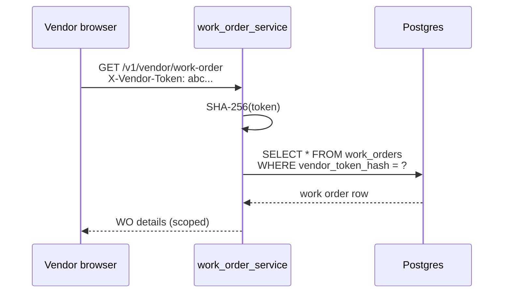

# Vendor Portal Flow — Context & Change Guide

> **Status: V1 implemented.**
> Architecture: [ADR 0004 — Work orders and vendor portal](./adr/0004-work-orders-and-vendor-portal.md)
> Part of [Work Order Service](./README.md).

- **Service:** `apps/work_order_service` (port 5001)
- **API prefix:** `/v1/vendor/...` — **no JWT**; token-scoped only
- **Auth header:** `X-Vendor-Token: <raw_token>`
- **DB lookup:** SHA-256 hash → `work_order.work_orders.vendor_token_hash`

______________________________________________________________________

## 1. What this flow does

Vendors receive a **link** from FM (`/vendor/work-order/{token}`). The portal lets them:

- View assigned work order details (assets, forms, schedule)
- Update allowed fields (`state`, `form_values`, timeline via PATCH body)
- Submit **invoices** for that work order only
- List invoices they submitted for that work order

Every mutation is tagged `source=vendor_portal` in audit events when `X-ATS-Source` / actor headers are set
by the frontend.

### Business rules (must enforce)

| Rule                     | Enforcement                                                                       |
| ------------------------ | --------------------------------------------------------------------------------- |
| **Single WO scope**      | Token resolves to exactly one work order; all ops scoped to it                    |
| **No JWT bypass**        | Vendor routes excluded from staff JWT requirement; token required instead         |
| **Token storage**        | Only hash in DB; raw token shown once at WO creation                              |
| **Minimum token length** | Reject tokens `< 16` chars                                                        |
| **Invalid token**        | `401` / `ValidationException` — no enumeration                                    |
| **Allowed PATCH fields** | Whitelist: `state`, `timeline`, `form_values` only                                |
| **Invoice create**       | Auto-fills `organization_id`, `project_id`, `work_order_id`, `company_id` from WO |
| **Rate limits**          | 60/min read, 30/min PATCH, 20/min invoice POST                                    |

### Screen → capability map

| Vendor portal screen     | Capability                                     |
| ------------------------ | ---------------------------------------------- |
| Load WO                  | `GET /v1/vendor/work-order` + `X-Vendor-Token` |
| Save form / update state | `PATCH /v1/vendor/work-order`                  |
| Submit invoice           | `POST /v1/vendor/invoices`                     |
| View submitted invoices  | `GET /v1/vendor/invoices`                      |

______________________________________________________________________

## 2. Architecture

```
vendor_portal.py
    → get_work_order_from_vendor_token (dependency)
        → hash_vendor_token(raw)
        → WorkOrdersService.get_by_vendor_token(hash)
    → WorkOrdersService.update (no UserContext — vendor)
    → InvoicesService.create (source=vendor_portal)
```

### File map

| Concern             | File                                                |
| ------------------- | --------------------------------------------------- |
| Vendor API          | `app/api/vendor_portal.py`                          |
| Token dependency    | `app/dependencies/vendor_auth.py`                   |
| Token hash/generate | `app/utils/tokens.py`                               |
| WO lookup           | `work_orders_repository.get_by_vendor_token_hash()` |
| Invoice create      | `invoices_service.py`                               |

______________________________________________________________________

## 3. Authentication flow



Frontend setup (prototype):

```typescript
// On portal mount
setVendorToken(tokenFromUrl);
setRequestContext({ source: "vendor_portal", actor: vendorName });

// On unmount
setVendorToken(null);
setRequestContext(null);
```

Proxy: staff UI uses `/wom/v1` → port 5001; see prototype `vite.config.ts`.

______________________________________________________________________

## 4. Vendor flow (step by step)

### 4.1 View work order

```http
GET /v1/vendor/work-order
X-Vendor-Token: <raw-token-from-link>
```

Response: full work order (assets, forms, schedule, state). No access to other WOs in project.

### 4.2 Update progress

```http
PATCH /v1/vendor/work-order
X-Vendor-Token: <token>
Content-Type: application/json

{
  "state": "in_progress",
  "form_values": { "pressure_reading": 42 }
}
```

Non-whitelisted fields stripped in route handler.

### 4.3 Submit invoice

```http
POST /v1/vendor/invoices
X-Vendor-Token: <token>

{
  "invoice_number": "VND-2026-0912",
  "invoice_date": "2026-09-05",
  "line_items": [
    { "description": "Filter replacement", "amount_minor": 150000 }
  ],
  "subtotal_minor": 150000,
  "tax_minor": 27000,
  "total_minor": 177000,
  "currency": "INR",
  "file_paths": ["org/project/invoices/inv.pdf"]
}
```

Service auto-sets:

- `work_order_id`, `organization_id`, `project_id`, `company_id` from resolved WO
- `status = submitted`
- Audit source = `vendor_portal`
- Push notification `invoice.submitted` (best-effort)

### 4.4 List own invoices for this WO

```http
GET /v1/vendor/invoices
X-Vendor-Token: <token>
```

Returns `{ items: [...], total: N }` filtered to the token's work order.

______________________________________________________________________

## 5. Security notes

| Prototype gap      | V1 fix                                               |
| ------------------ | ---------------------------------------------------- |
| Token was UI-only  | Server enforces hash lookup on every vendor route    |
| Open CORS          | `WOM_CORS_ORIGINS` env — restrict to known frontends |
| All WOs readable   | Token scopes to single WO                            |
| Predictable tokens | `secrets.token_urlsafe(32)`                          |

**Future:** token rotation, expiry, revoke endpoint for FM.

______________________________________________________________________

## 6. Where to change things

| Change                      | Edit                                                                                    |
| --------------------------- | --------------------------------------------------------------------------------------- |
| Allowed vendor PATCH fields | `vendor_portal.py` `allowed = {...}` whitelist                                          |
| New vendor endpoint         | Add route under `vendor_portal.py`; always depend on `get_work_order_from_vendor_token` |
| Token format                | `tokens.py`                                                                             |
| Audit source label          | `EventsService.record_and_dispatch(source=...)`                                         |

______________________________________________________________________

## 7. Related flows

- Token issued at WO create → [work-orders-flow.md](./work-orders-flow.md)
- Invoice FM approval → [invoices-payments-flow.md](./invoices-payments-flow.md)
- File upload paths → [assets-flow.md](./assets-flow.md) § presigned URL
