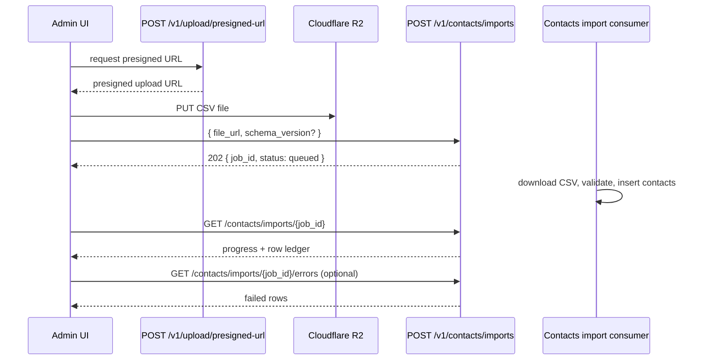

# Contacts API (`/v1/contacts`)

Module: `apps/user_service/app/api/contacts.py`

This is a **production-ready API reference** for the Contacts module. It focuses on **complete, copy/pasteable payloads** and **all supported scenarios**.

## Authentication & headers

- **Authorization**: `Authorization: Bearer <JWT>`
- **Language (optional)**: `lan: en` (affects `message`)
- **Content-Type**: `application/json`

## Standard success / error envelope (all endpoints)

### Success envelope (no `data`)

```json
{
  "status": "success",
  "message": "string",
  "statusCode": 200,
  "code": "2000"
}
```

### Success envelope (with `data`)

```json
{
  "status": "success",
  "message": "string",
  "statusCode": 200,
  "code": "2000",
  "data": {}
}
```

### Paginated list envelope

```json
{
  "status": "success",
  "message": "string",
  "statusCode": 200,
  "code": "2000",
  "data": [],
  "total": 0,
  "page": 1,
  "page_size": 20,
  "total_pages": 0
}
```

### Error envelope

```json
{
  "status": "error",
  "message": "string",
  "statusCode": 422,
  "code": "4004",
  "errors": [
    {
      "field": "string",
      "message": "string"
    }
  ]
}
```

## Endpoints

## `POST /v1/contacts` — Create contact

Creates a contact. Optionally links **one** company (existing or created inline) and can set membership as primary.

**Contact roles:** optional `contact_type` on create assigns an **org-scoped** role only (`Vendor` or
`Staff`) in `contact_roles`. Unit-scoped roles (`Owner`, `Tenant`, `Family`, `Guest`) are assigned
when a unit is linked (allotment, tenant approve, household) — not via bare contact create.
See [ADR 0010](../adr/0010-contact-roles.md).

### Request body (all fields shown)

```json
{
  "contact_type": "Vendor",
  "email": "john@example.com",
  "portal_access": false,
  "prefix": "Mr",
  "first_name": "John",
  "middle_name": null,
  "last_name": "Smith",
  "title": "string",
  "date_of_birth": null,
  "profile_photo_url": "https://example.com/photo.png",
  "phones": [
    {
      "phone_number": "5551234567",
      "phone_isd_code": "+1",
      "label": "mobile",
      "is_primary": true
    }
  ],
  "tags": ["string"],
  "social_pages": [
    {
      "id": "optional-string",
      "platform": "linkedin",
      "url": "https://linkedin.com/in/john"
    }
  ],
  "websites": [
    {
      "id": "optional-string",
      "url": "https://example.com",
      "type": "personal",
      "is_primary": true
    }
  ],
  "custom_fields": [
    {
      "any": "json"
    }
  ],
  "additional_data": {
    "any": "json"
  },
  "lead": {
    "stage_id": "UUID",
    "intake_stage": "string",
    "lead_score": "string"
  },
  "company_association": {
    "add_association": {
      "company_id": "COMPANY_UUID",
      "is_primary": false
    },
    "create_and_associate": null
  },
  "addresses": [
    {
      "place_id": "optional-string",
      "address_line1": "1 Main St",
      "address_line2": "Suite 100",
      "city": "New York",
      "state": "NY",
      "postal_code": "10001",
      "country": "United States",
      "latitude": 40.0,
      "longitude": -73.0,
      "address_type": "work",
      "address_data": {
        "any": "json"
      },
      "is_primary": true
    }
  ]
}
```

### Supported scenarios (association)

#### 1) Contact only

Send the same payload but set:

```json
{ "company_association": null }
```

#### 2) Link existing company

```json
{
  "company_association": {
    "add_association": { "company_id": "COMPANY_UUID", "is_primary": true },
    "create_and_associate": null
  }
}
```

#### 3) Create company inline and associate (full company payload)

```json
{
  "company_association": {
    "add_association": null,
    "create_and_associate": {
      "company": {
        "name": "Acme Corp",
        "industry": "Software",
        "profile_photo_url": null,
        "portal_access": false,
        "email": "info@acme.com",
        "phones": [],
        "tags": [],
        "websites": [],
        "billing_preferences": { "method": null, "terms": null },
        "social_pages": [],
        "target_market_segments": [],
        "current_tech_stack": [],
        "preferred_communication_channels": [],
        "industry_specific_terminologies": [],
        "description": null,
        "custom_fields": [],
        "additional_data": {},
        "lead": null,
        "contact_association": null,
        "addresses": []
      },
      "is_primary": true
    }
  }
}
```

### Response

201 with the standard success envelope. `data` is the created contact details payload (same shape
as `GET /v1/contacts/{contact_id}`).

______________________________________________________________________

## `GET /v1/contacts` — List contacts (DB)

### Query params

- `search` (optional, min 2)
- `status` (optional): `active|inactive|prospect|deleted`
- `contact_type` (optional): `Owner|Tenant|Family|Guest|Vendor|Staff` — filters contacts with an **active** matching row in `contact_roles`
- `page` (default 1)
- `page_size` (default 20, max 100)

### Response payload (`data[]` items include all fields returned)

```json
{
  "status": "success",
  "message": "string",
  "statusCode": 200,
  "code": "2000",
  "data": [
    {
      "id": "UUID",
      "organization_id": "UUID",
      "status": "active",
      "role_types": ["Owner"],
      "first_name": "string",
      "last_name": "string",
      "title": "string",
      "email": "string",
      "profile_photo_url": "string",
      "phones": [],
      "company_names": ["string"],
      "created_at": "2026-01-01T00:00:00Z",
      "updated_at": "2026-01-01T00:00:00Z"
    }
  ],
  "total": 1,
  "page": 1,
  "page_size": 20,
  "total_pages": 1
}
```

Notes:

- **`role_types`** lists distinct active role labels from `contact_roles` (e.g. `["Owner"]`, `["Vendor"]`).
- Use query/body param **`contact_type`** to filter the list by an active role.

______________________________________________________________________

## `GET /v1/contacts/search` — Search contacts (Typesense)

### Query params

- `query` (required, min 2)
- `status` (optional): `active|inactive|prospect|deleted`
- `page` (default 1)
- `page_size` (default 20, max 100)

### Response

Returns raw Typesense hits in the list envelope:

```json
{
  "status": "success",
  "message": "string",
  "statusCode": 200,
  "code": "2000",
  "data": [],
  "total": 0,
  "page": 1,
  "page_size": 20,
  "total_pages": 0
}
```

______________________________________________________________________

## `GET /v1/contacts/overview` — Contact overview

Returns overview card counts for the Contacts registry dashboard (Total Contacts, Owners, Tenants, Vendors).

### Query params

- `status` (optional): `active|inactive|prospect|deleted`
  - omitted — **All** tab: counts all non-deleted contacts
  - `active` — **Active** tab
  - `deleted` — **Deleted** tab
- `project_id` (optional): UUID — limits counts to contacts linked via active/pending `contact_units` (Community Contacts registry)

### Response payload (`data`)

```json
{
  "status": "success",
  "message": "Contact overview retrieved successfully.",
  "statusCode": 200,
  "code": "2000",
  "data": {
    "total": 26,
    "owners": 16,
    "tenants": 2,
    "vendors": 8
  }
}
```

Notes:

- Counts are org-scoped aggregates (same RBAC as list/search: `contacts_management.view`).
- Typed sub-counts (`owners`, `tenants`, `vendors`) are derived from **active** rows in `contact_roles`; contacts with only other roles (e.g. `Family`, `Staff`) contribute to `total` only.
- Optional query param **`project_id`** limits counts to contacts linked via active/pending `contact_units` (Community Contacts registry).

______________________________________________________________________

## `GET /v1/contacts/export` — Export contacts (CSV)

Exports the filtered contacts registry as a CSV file download. Uses the **same filters** as
`POST /v1/contacts/list`, including optional Community scoping via `project_id`.

Module: `apps/user_service/app/api/contacts.py`

### Query params

- `search` (optional, min 2, max 200)
- `status` (optional): `active|inactive|prospect|deleted`
  - omitted — excludes deleted contacts (same default as list)
- `contact_type` (optional): `Owner|Tenant|Family|Guest|Vendor|Staff`
- `project_id` (optional): UUID — limits export to contacts linked via active/pending `contact_units` in that project (Community Contacts screen)
- `format` (optional, default `csv`): only `csv` is supported today

### Permissions

- `contacts_management.view`

### Response

- **Content-Type**: `text/csv`
- **Content-Disposition**: `attachment; filename="contacts.csv"` or `contacts-{project_id}.csv` when `project_id` is set
- **Body**: CSV (max 10,000 rows)

### CSV columns

| Column           | Description                                             |
| ---------------- | ------------------------------------------------------- |
| `first_name`     | Contact first name                                      |
| `last_name`      | Contact last name                                       |
| `email`          | Primary email                                           |
| `phone_number`   | Primary phone number                                    |
| `phone_isd_code` | Primary phone ISD code (e.g. `+91`)                     |
| `status`         | Contact status                                          |
| `role_types`     | Active roles, semicolon-separated (e.g. `Owner;Family`) |
| `company_names`  | Linked company names, semicolon-separated               |

### Example (Community Contacts export)

```http
GET /v1/contacts/export?project_id=990e8400-e29b-41d4-a716-446655440004&status=active
Authorization: Bearer <JWT>
```

### Frontend notes

- Wire the **Export** button on Community → Contacts to this endpoint with the active `project_id` and current tab filter (`status=active` for the Active tab).
- Trigger a browser file download from the CSV response; do not expect a JSON envelope.

______________________________________________________________________

## `GET /v1/contacts/{contact_id}` — Contact details

### Path params

- `contact_id`: UUID string

### Response payload (`data` includes all fields returned)

```json
{
  "status": "success",
  "message": "string",
  "statusCode": 200,
  "code": "2000",
  "data": {
    "id": "UUID",
    "organization_id": "UUID",
    "status": "active",
    "roles": [
      {
        "id": "UUID",
        "role_type": "Owner",
        "status": "active",
        "project_id": "UUID",
        "unit_id": "UUID",
        "relationship": null,
        "started_at": "2026-01-01T00:00:00Z",
        "ended_at": null,
        "contact_unit_id": "UUID"
      }
    ],
    "created_by": "UUID",
    "created_by_name": "Priya Verma",
    "user_id": "UUID",
    "isometrik_user_id": "string",
    "prefix": "string",
    "first_name": "string",
    "middle_name": "string",
    "last_name": "string",
    "title": "string",
    "date_of_birth": "2026-01-01",
    "profile_photo_url": "string",
    "email": "string",
    "phones": [],
    "tags": [],
    "custom_fields": [],
    "additional_data": {},
    "social_pages": [],
    "work_history": [],
    "educational_history": [],
    "skills": [],
    "enrichment_done": false,
    "enrichment_status": null,
    "last_enriched_at": null,
    "companies": [],
    "leads": [],
    "addresses": [],
    "created_at": "2026-01-01T00:00:00Z",
    "updated_at": "2026-01-01T00:00:00Z"
  }
}
```

Notes:

- **`roles`** includes active and ended assignments from `contact_roles` (unit- and org-scoped).
- **`created_by`** / **`created_by_name`** identify the auth user who created the contact (staff, import owner, or resident). Omitted on list/search responses. Legacy rows may have null values.
- There is no `contact_type` field on the contact row; use `roles[].role_type` for labels.

______________________________________________________________________

## `PATCH /v1/contacts/{contact_id}` — Update contact

Updates contact fields, nested deltas, addresses delta, and optional company association delta.

### Path params

- `contact_id`: UUID string

### Request body (all fields shown)

All fields are optional; only provided fields are applied. The payload below shows **every field** and the **full nested shapes**.

```json
{
  "status": "active",
  "prefix": "string",
  "first_name": "string",
  "middle_name": "string",
  "last_name": "string",
  "title": "string",
  "date_of_birth": "2026-01-01",
  "profile_photo_url": "string",
  "phones": {
    "add": [{ "phone_number": "5551234567", "phone_isd_code": "+1", "label": "mobile", "is_primary": true }],
    "update": [{ "id": "PHONE_ID", "phone_number": "5551234567", "phone_isd_code": "+1", "label": "mobile", "is_primary": true }],
    "remove": ["PHONE_ID"]
  },
  "tags": ["string"],
  "social_pages": {
    "add": [{ "platform": "linkedin", "url": "https://linkedin.com/in/x" }],
    "update": [{ "id": "SOCIAL_ID", "platform": "linkedin", "url": "https://linkedin.com/in/x" }],
    "remove": ["SOCIAL_ID"]
  },
  "custom_fields": [{ "any": "json" }],
  "additional_data": { "any": "json" },
  "description": "string",
  "work_history": {
    "add": [{ "job_title": "string", "company": "string", "start_date": "Jan 2023", "end_date": null, "current": true }],
    "update": [{ "id": "WORK_ID", "job_title": "string", "company": "string", "start_date": "Jan 2023", "end_date": null, "current": true }],
    "remove": ["WORK_ID"]
  },
  "educational_history": {
    "add": [{ "university": "string", "degree": "string", "field_of_study": "string", "start_date": "Sep 2018", "end_date": "May 2022" }],
    "update": [{ "id": "EDU_ID", "university": "string", "degree": "string", "field_of_study": "string", "start_date": "Sep 2018", "end_date": "May 2022" }],
    "remove": ["EDU_ID"]
  },
  "skills": ["string"],
  "addresses": {
    "add": [
      {
        "place_id": "optional-string",
        "address_line1": "1 Main St",
        "address_line2": "Suite 100",
        "city": "New York",
        "state": "NY",
        "postal_code": "10001",
        "country": "United States",
        "latitude": 40.0,
        "longitude": -73.0,
        "address_type": "work",
        "address_data": {},
        "is_primary": true
      }
    ],
    "update": [
      {
        "id": "ADDRESS_ID",
        "place_id": "optional-string",
        "address_line1": "1 Main St",
        "address_line2": "Suite 100",
        "city": "New York",
        "state": "NY",
        "postal_code": "10001",
        "country": "United States",
        "latitude": 40.0,
        "longitude": -73.0,
        "address_type": "work",
        "address_data": {},
        "is_primary": true
      }
    ],
    "remove": ["ADDRESS_ID"]
  },
  "company_association": {
    "remove_associations": ["COMPANY_UUID"],
    "add_associations": [{ "company_id": "COMPANY_UUID", "is_primary": false }],
    "update_associations": [{ "company_id": "COMPANY_UUID", "is_primary": true }],
    "create_and_associate": { "name": "New Co LLC", "is_primary": true }
  }
}
```

### Supported scenarios (company association delta)

Use any combination of:

- unlink companies: `company_association.remove_associations[]`
- link existing companies: `company_association.add_associations[]`
- toggle primary without unlinking: `company_association.update_associations[]`
- create one company (by name) and link: `company_association.create_and_associate`

### Response

200 with the standard success envelope (no `data`).

______________________________________________________________________

## `POST /v1/contacts/{contact_id}/enrich` — Trigger contact enrichment

Queues enrichment for the contact using latest persisted data.

### Path params

- `contact_id`: UUID string

### Response

200 with the standard success envelope (no `data`).

______________________________________________________________________

## `DELETE /v1/contacts/{contact_id}` — Soft delete contact

### Path params

- `contact_id`: UUID string

### Response

200 with the standard success envelope (no `data`).

______________________________________________________________________

## Contacts bulk import (`/v1/contacts/imports`)

Module: `apps/user_service/app/api/contacts_imports.py`

Bulk import is **async**: the API creates an import job, publishes a Kafka event
(`contacts.import.requested`), and a background worker downloads the CSV, validates rows, and
inserts contacts. The UI must **poll job status** — do not show success until the job reaches
`completed` (or surface errors from `failed` / row ledger).

### Permissions

| Action                                  | Permission                   |
| --------------------------------------- | ---------------------------- |
| Create / retry import                   | `contacts_management.create` |
| View job status, logs, errors, template | `contacts_management.view`   |

### End-to-end flow (Community Contacts **Import** button)



1. **Download template (optional):** `GET /v1/contacts/imports/template`
1. User selects a CSV file.
1. **Upload file:** `POST /v1/upload/presigned-url` → upload to R2 → obtain reachable `file_url`.
1. **Create job:** `POST /v1/contacts/imports` with `{ "file_url": "https://..." }`.
1. **Poll status:** `GET /v1/contacts/imports/{job_id}` until `status` is `completed` or `failed`.
1. **On failure:** `GET /v1/contacts/imports/{job_id}/errors` for row-level errors.
1. **Retry (optional):** `POST /v1/contacts/imports/{job_id}/retry`.

### Import templates

| Template           | Path                                                               | Use case                                                                                           |
| ------------------ | ------------------------------------------------------------------ | -------------------------------------------------------------------------------------------------- |
| Community (simple) | `apps/user_service/samples/community_contacts_import_template.csv` | Community Contacts registry — `first_name`, `last_name`, `email`, `phone_number`, `phone_isd_code` |
| CRM (full)         | `apps/user_service/samples/contacts_bulk_import_template.csv`      | Full CRM bulk import with JSON columns                                                             |

Phone-only rows are supported; the worker assigns a synthetic email (`{digits}@email.com`) when
email is omitted.

**Note:** Import creates contact records only. Unit-scoped roles (`Owner`, `Tenant`, `Family`) are
assigned when a unit is linked (allotment / onboarding), not during CSV import. See
[ADR 0010](../adr/0010-contact-roles.md).

______________________________________________________________________

## `GET /v1/contacts/imports/template` — Download import CSV template

Returns the Community Contacts bulk-import CSV template as a file download.

### Permissions

- `contacts_management.view`

### Response

- **Content-Type**: `text/csv`
- **Content-Disposition**: `attachment; filename="contacts-import-template.csv"`

______________________________________________________________________

## `POST /v1/contacts/imports` — Create import job

Creates a contacts import job and enqueues it for async processing.

### Request body

```json
{
  "file_url": "https://cdn.example.com/uploads/contacts.csv",
  "file_type": "csv",
  "schema_version": 1,
  "mapping": null,
  "options": {
    "mode": "upsert",
    "dedupe_key": "email",
    "has_header": true,
    "create_customer_list": false,
    "customer_list_name": null
  }
}
```

| Field            | Required | Notes                                                              |
| ---------------- | -------- | ------------------------------------------------------------------ |
| `file_url`       | yes      | Reachable HTTPS URL (typically presigned R2 upload)                |
| `file_type`      | no       | Default `csv`. `xlsx` is declared but not implemented yet          |
| `schema_version` | no       | Default `1`                                                        |
| `mapping`        | no       | Canonical field → CSV header map when headers differ from defaults |
| `options`        | no       | Import behaviour (dedupe, header row, optional contact list)       |

### Response

202 Accepted:

```json
{
  "status": "success",
  "message": "string",
  "statusCode": 202,
  "code": "2020",
  "data": {
    "job_id": "imp_abc123...",
    "status": "queued"
  }
}
```

______________________________________________________________________

## `GET /v1/contacts/imports/logs` — List import logs

Paginated import log entries for the organization.

### Query params

- `page` (default 1)
- `page_size` (default 50, max 200)

### Permissions

- `contacts_management.view`

______________________________________________________________________

## `GET /v1/contacts/imports/{job_id}` — Get import job status

Returns job progress and a paginated row ledger.

### Path params

- `job_id`: import job identifier (e.g. `imp_abc123...`)

### Query params

- `rows_page` (default 1)
- `rows_page_size` (default 50, max 200)

### Response payload (`data`)

```json
{
  "job_id": "imp_abc123",
  "status": "running",
  "import_type": "contacts",
  "file_url": "https://cdn.example.com/uploads/contacts.csv",
  "file_type": "csv",
  "schema_version": 1,
  "total_rows": 100,
  "processed_rows": 45,
  "success_rows": 40,
  "error_rows": 5,
  "errors_file_url": null,
  "created_at": "2026-01-01T00:00:00Z",
  "updated_at": "2026-01-01T00:00:01Z",
  "started_at": "2026-01-01T00:00:00Z",
  "finished_at": null,
  "rows": {
    "items": [],
    "total": 0,
    "page": 1,
    "page_size": 50
  }
}
```

Job `status` values: `queued` → `running` → `completed` | `failed`.

______________________________________________________________________

## `GET /v1/contacts/imports/{job_id}/errors` — List import row errors

Returns paginated row-level errors for a job. Use after `failed` or when `error_rows` > 0.

### Path params

- `job_id`: import job identifier

### Query params

- `page` (default 1)
- `page_size` (default 50, max 200)

### Response

Paginated list envelope; each item includes `row_number`, `status`, and `error` (`code`, `message`).

Returns 404 when the job exists but has no error rows.

______________________________________________________________________

## `POST /v1/contacts/imports/{job_id}/retry` — Retry import job

Re-queues a previously created import job.

### Path params

- `job_id`: import job identifier

### Response

202 Accepted with `{ "job_id", "status": "queued" }`.

### Permissions

- `contacts_management.create`
