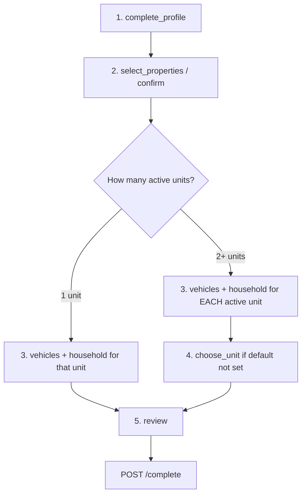
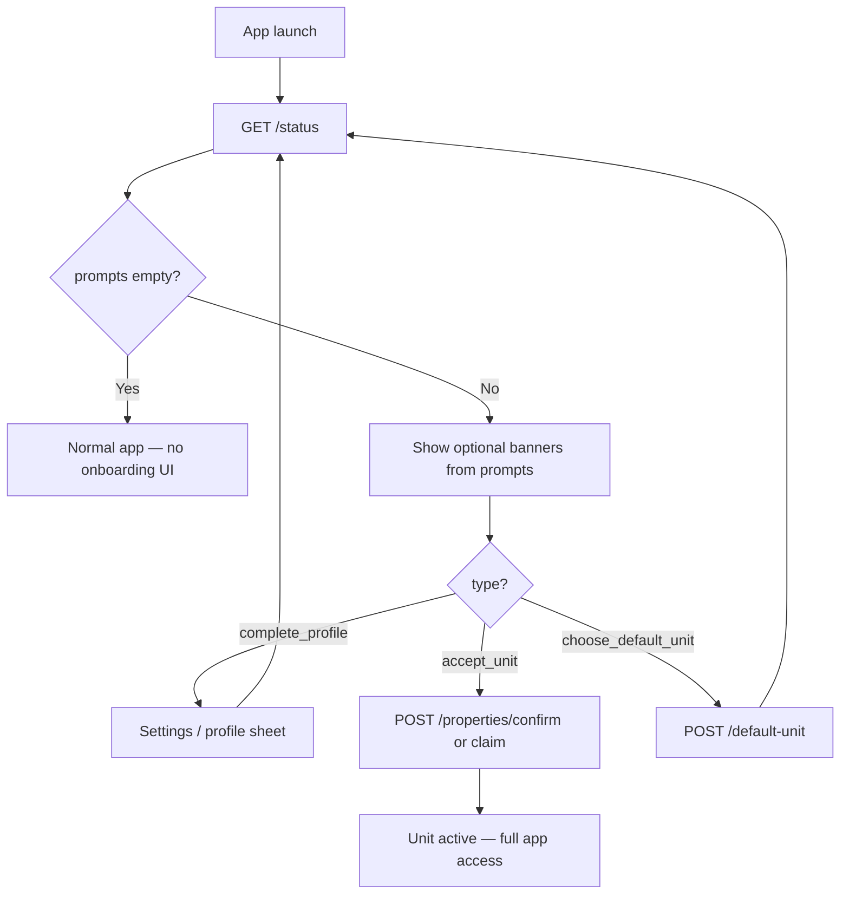

# Contact Onboarding Flow — Context & Change Guide

This document explains the **Contact Onboarding wizard** implemented in `user_service`. It is
written so anyone (developer, reviewer, or product owner) can understand the flow end‑to‑end
and know exactly where to change things.

- **Service:** `ats-home-craft-python-service` → `apps/user_service`
- **API prefix:** `/v1/contact-onboarding`
- **DB schema:** `ats-home-craft-supabase` (migrations `20260629110000_*` enums, `20260629111000_*` tables, `2026073112*_contact_roles_*`)
- **Role model:** [ADR 0010](./adr/0010-contact-roles.md)
- **Full column reference:** `ats-home-craft-supabase/docs/resident-onboarding-schema.md`, `contact-roles-schema.md`

> Naming note: this feature was renamed from "resident onboarding" to "contact onboarding" in
> the code. The **migration/seed/doc filenames still say `resident_onboarding`** (renaming an
> applied migration is unsafe), but the tables, code, and APIs use "contact" terminology.

______________________________________________________________________

## 1. What this flow does

Contact onboarding is **optional and non-blocking**. The app is usable as soon as the contact
has portal access; the backend surfaces **prompts** (profile, accept unit, choose default unit)
that the mobile app may show as banners or settings nudges — nothing gates vehicles, household,
visitor logs, or other features.

The logged-in contact is resolved from the JWT via `extract_onboarding_contact_context()` — there
are **no `PROJECTS_MANAGEMENT_*` RBAC codes**; authorization is "you can only touch your own onboarding".

### Prompt model (current)

`GET /status` returns:

| Field                   | Meaning                                                                 |
| ----------------------- | ----------------------------------------------------------------------- |
| `prompts[]`             | Optional actions: `complete_profile`, `accept_unit`, `choose_default_unit` |
| `profile_complete`      | Whether the profile step is terminal                                    |
| `pending_unit_count`    | Pending `relationship=self` allotments awaiting acceptance              |
| `active_unit_count`     | Active self units                                                       |
| `requires_default_unit` | `true` when 2+ active units and no default login set                    |
| `is_completed`          | `true` when `prompts` is empty (no banners to show)                     |

> **Mobile app integration:** see [contact-onboarding-app-integration.md](./contact-onboarding-app-integration.md) for full scenarios and example API requests.

**Accepting units:** `POST /properties/confirm` and `POST /properties/claim` both activate pending
units immediately (no profile prerequisite, no wizard completion). Response shape:

```json
{ "items": [...], "requires_default_unit": false }
```

**Profile:** `PATCH /profile` is optional but recommended; it completes the `complete_profile` step
and clears the `complete_profile` prompt.

**Vehicles / household:** Available anytime the contact has an active unit link. Unit-level wizard
steps (`POST /steps/vehicles/complete`, `/steps/household/complete`, `/steps/skip`) still exist but
are **not required** before using the app or calling `POST /complete`.

**Legacy finalize:** `POST /complete` marks wizard steps done and sets `activated_at` on units.
It no longer requires vehicles/household steps or a completed profile. Prefer accepting units via
confirm/claim instead of treating `/complete` as a gate.

### Household-only members

Contacts linked with `contact_units.relationship != self` only receive the `complete_profile` prompt.
They do not see accept-unit prompts for units where they are a family member.

### Role labels

`Owner`, `Tenant`, `Family`, … live in **`contact_roles`**, not on `contacts`. Unit-scoped roles are
assigned when a unit is linked (allotment, tenant approve, household). See [ADR 0010](./adr/0010-contact-roles.md).

### Data tracked (persistence)

- **`contact_onboarding_steps`** — contact-level steps (profile, properties, default unit, review).
- **`contact_unit_onboarding_steps`** — per-unit `vehicles` / `household` (optional; legacy wizard).

> **Legacy wizard:** Sections [§6](#6-multi-property-onboarding) and the 8-case scenario index below
> describe the **previous** mandatory wizard. Behavior has been simplified as above; those sections are
> kept for migration context and partial-finalize edge cases.

### Wizard steps (legacy reference)

Enum: `ContactOnboardingStep` in `apps/user_service/app/schemas/enums.py`.

**Contact-level (once per contact):**

| #   | Step key            | Required?                  | Purpose                                                |
| --- | ------------------- | -------------------------- | ------------------------------------------------------ |
| 1   | `complete_profile`  | optional (prompt only)     | Fill contact profile (name, DOB, gender, phones, etc.) |
| 2   | `select_properties` | optional (prompt only)     | Accept pre‑allotted units                              |
| 3   | `choose_unit`       | optional (only if >1 unit) | Pick default login unit                                |
| 4   | `review`            | legacy finalize only       | Final review → `POST /complete`                        |

**Per confirmed unit** (stored in `contact_unit_onboarding_steps`; optional):

| Step key    | Skippable? | Purpose                                   |
| ----------- | ---------- | ----------------------------------------- |
| `vehicles`  | yes        | Register vehicles for that unit           |
| `household` | yes        | Add family members to that unit           |

> **Multiple properties:** see [§6 Multi-property onboarding](#6-multi-property-onboarding).
> **Admin assigns a unit later:** [Case 7](#case-7--post-onboarding-admin-adds-another-unit).
> **Family member later gets own unit:** [Case 9](#case-9--family-member-assigned-own-unit).

______________________________________________________________________

## 2. Architecture (layers)

Same 3‑layer FastAPI pattern as the rest of the service:

```
HTTP → API router → Service (business rules) → Repository (SQL) → Postgres
```

### File map

| Concern                            | File                                                                |
| ---------------------------------- | ------------------------------------------------------------------- |
| API endpoints                      | `app/api/contact_onboarding.py`                                     |
| Route registration                 | `app/api/routes.py` (`contact_onboarding_router`)                   |
| Wizard orchestration / step‑gating | `app/services/contact_onboarding_service.py`                        |
| Contact CRUD (reused)              | `app/services/contacts_service.py`                                  |
| Contact↔unit links                 | `app/services/contact_units_service.py`                             |
| Vehicles                           | `app/services/vehicles_service.py`                                  |
| Step persistence                   | `app/db/repositories/contact_onboarding_repository.py`              |
| Unit step persistence              | `app/db/repositories/contact_unit_onboarding_repository.py`         |
| Unit links persistence             | `app/db/repositories/contact_units_repository.py`                   |
| Vehicles persistence               | `app/db/repositories/vehicles_repository.py`                        |
| Contacts persistence               | `app/db/repositories/contacts_repository.py`                        |
| Request/response models            | `app/schemas/contact_onboarding.py`                                 |
| Enums (mirror Postgres)            | `app/schemas/enums.py`                                              |
| Contact context resolver           | `extract_onboarding_contact_context` in `app/utils/common_utils.py` |
| i18n messages                      | `app/locales/en.json` (`contact_onboarding.*`)                      |

The onboarding service **composes** other services (`ContactsService`, `ContactUnitsService`,
`VehiclesService`) rather than duplicating their logic.

______________________________________________________________________

## 3. Data model

Contact onboarding reuses the existing `contacts` table and adds onboarding tables
(`20260629111000_resident_onboarding_tables.sql`, `20260629113000_household_invitations.sql`).
All carry `organization_id`.

| Table                           | Purpose                                                                        |
| ------------------------------- | ------------------------------------------------------------------------------ |
| `contacts` (existing)           | The person being onboarded (and family members)                                |
| `contact_units`                 | Links a contact to a unit (status, is_primary, is_default_login, relationship) |
| `vehicles`                      | Vehicles registered by the contact for a unit                                  |
| `household_invitations`         | Phone-based SMS invites for portal-access family members (`20260629113000_*`)  |
| `contact_onboarding_steps`      | Per‑contact wizard step status (profile, properties, choose_unit, review)      |
| `contact_unit_onboarding_steps` | Per‑unit wizard step status (`vehicles`, `household`)                          |

Key enums: `ContactOnboardingStep`, `ContactUnitStatus` (`pending`/`active`/`moved_out`),
`ContactUnitRelationship`, `VehicleType` (`two_wheeler`/`four_wheeler`),
`VehicleFuelType` (`non_ev`/`ev` — UI label: Non EV / EV Vehicle),
`VehicleStatus` (`pending`/`approved`/`rejected`/`removed`), `SetupStepStatus`,
`HouseholdInvitationStatus`, `HouseholdMemberStatus`.

### `vehicles` columns (contact-facing)

| Column                   | Type        | Notes                                                           |
| ------------------------ | ----------- | --------------------------------------------------------------- |
| `unit_id`                | uuid FK     | Must be a unit actively assigned to the contact                 |
| `vehicle_type`           | enum        | `two_wheeler`, `four_wheeler`                                   |
| `registration_number`    | text        | Unique per project among active vehicles (`deleted_at IS NULL`) |
| `make`, `model`, `color` | text        | Optional                                                        |
| `photo_paths`            | text[]      | Storage paths only (max 10 per vehicle); not raw blobs          |
| `fuel_type`              | enum        | Optional on create; `non_ev`, `ev` (UI: Non EV / EV Vehicle)    |
| `status`                 | enum        | `pending`, `approved`, `rejected`, `removed`                    |
| `status_updated_at`      | timestamptz | Set whenever `status` changes                                   |
| `deleted_at`             | timestamptz | Set on soft-remove; row retained for audit                      |
| `rejection_reason`       | text        | Set by admin when `status = rejected`                           |
| `approved_by_user_id`    | uuid        | Org member who approved the request                             |
| `rejected_by_user_id`    | uuid        | Org member who rejected the request                             |
| `parking_slot_id`        | uuid FK     | Set by admin on approve; links to `facility_parking_slots`      |

Media/files (profile photo, vehicle images) store **paths only** — no raw blobs in Postgres.

______________________________________________________________________

## 4. API catalog

All routes under `/v1/contact-onboarding`. The acting contact is resolved from the JWT, so
most endpoints take **no** contact id in the path.

| Method | Path                                                                   | Step / purpose                                                    |
| ------ | ---------------------------------------------------------------------- | ----------------------------------------------------------------- |
| GET    | `/v1/contact-onboarding/status`                                        | Onboarding prompts (`prompts[]`, `is_completed`)                  |
| GET    | `/v1/contact-onboarding/properties`                                    | List pre‑allotted units to confirm                                |
| POST   | `/v1/contact-onboarding/properties/confirm`                            | Accept selected units (activates immediately; profile optional) |
| POST   | `/v1/contact-onboarding/properties/claim`                              | Accept pending units (same as confirm; no wizard gate)            |
| GET    | `/v1/contact-onboarding/profile`                                       | Read contact profile for the wizard                               |
| PATCH  | `/v1/contact-onboarding/profile`                                       | Update profile + complete `complete_profile`                      |
| GET    | `/v1/contact-onboarding/vehicles/options`                              | Brand/model/color picker options (static JSON)                    |
| GET    | `/v1/contact-onboarding/vehicles`                                      | List vehicles (`?unit_id=` optional filter)                       |
| GET    | `/v1/contact-onboarding/vehicles/{vehicle_id}`                         | Vehicle detail with unit and parking slot allotment               |
| POST   | `/v1/contact-onboarding/vehicles`                                      | Add a vehicle                                                     |
| PATCH  | `/v1/contact-onboarding/vehicles/{vehicle_id}`                         | Update a vehicle                                                  |
| POST   | `/v1/contact-onboarding/vehicles/{vehicle_id}/resubmit`                | Resubmit a rejected request (`rejected` → `pending`)              |
| POST   | `/v1/contact-onboarding/vehicles/{vehicle_id}/withdraw`                | Withdraw a pending request (hard-delete before approval)          |
| DELETE | `/v1/contact-onboarding/vehicles/{vehicle_id}`                         | Soft-remove an approved vehicle (`status = removed`)              |
| POST   | `/v1/contact-onboarding/steps/vehicles/complete`                       | Complete `vehicles` for one unit (`{ contact_unit_id }`)          |
| POST   | `/v1/contact-onboarding/steps/skip`                                    | Skip unit step (`vehicles`/`household` + `contact_unit_id`)       |
| GET    | `/v1/contact-onboarding/household`                                     | List household/family members (`?unit_id=` optional)              |
| POST   | `/v1/contact-onboarding/household`                                     | Add a family member to a unit                                     |
| PATCH  | `/v1/contact-onboarding/household/{contact_unit_id}`                   | Update a family member (name, relationship, portal_access)        |
| DELETE | `/v1/contact-onboarding/household/{contact_unit_id}`                   | Remove a family member (deletes orphaned family contact)          |
| POST   | `/v1/contact-onboarding/household/{contact_unit_id}/revoke-invitation` | Primary revokes a pending portal invite (member kept)             |
| POST   | `/v1/contact-onboarding/household/{contact_unit_id}/resend-invitation` | Resend SMS for a pending portal invite                            |
| POST   | `/v1/contact-onboarding/household/invitations/validate`                | Validate SMS deep-link token (public)                             |
| POST   | `/v1/contact-onboarding/household/invitations/accept`                  | Accept invitation via token (public)                              |
| POST   | `/v1/contact-onboarding/household/invitations/decline`                 | Decline invitation via token (public)                             |
| POST   | `/v1/contact-onboarding/steps/household/complete`                      | Complete `household` for one unit (`{ contact_unit_id }`)         |
| POST   | `/v1/contact-onboarding/default-unit`                                  | Choose default login unit (step 5)                                |
| GET    | `/v1/contact-onboarding/review`                                        | Aggregate review (contact + units + vehicles + household + steps) |
| POST   | `/v1/contact-onboarding/complete`                                      | Legacy finalize (optional; no unit-step gates)                    |

### Admin vehicle review (project APIs)

These live under `/v1/projects` (community admin RBAC), not contact-onboarding:

| Method | Path                                                               | Purpose                                    |
| ------ | ------------------------------------------------------------------ | ------------------------------------------ |
| GET    | `/v1/projects/{project_id}/vehicle-requests`                       | List vehicle requests (`?status=pending`)  |
| PATCH  | `/v1/projects/{project_id}/vehicle-requests/{vehicle_id}`          | Approve (with `parking_slot_id`) or reject |
| GET    | `/v1/projects/{project_id}/facilities/{facility_id}/parking-slots` | List slots (`?status=available`)           |

______________________________________________________________________

## 5. Business rules & gating

**Nothing in contact onboarding blocks app usage.** Prompts are informational. Enforced rules live
in `contact_onboarding_service.py`, `contact_units_service.py`, and related services:

- **Contact steps auto‑seeded:** `_ensure_onboarding` creates contact-level step rows on first touch.
- **Accept units anytime:** `confirm_properties` and `claim_properties` activate pending units
  immediately via `_accept_pending_units`. No profile or wizard completion required.
- **Profile optional:** `PATCH /profile` completes the profile step and clears the prompt; confirm/claim
  do not check profile status.
- **Default unit:** When exactly one unit is accepted, default login is set automatically. With 2+
  active units, `requires_default_unit` is `true` until `POST /default-unit` (or `default_contact_unit_id`
  on confirm).
- **Unit steps lazy-seeded:** Confirm/claim do **not** create `contact_unit_onboarding_steps` rows.
  Rows are inserted on first `POST /steps/vehicles/complete`, `/steps/household/complete`, or
  `/steps/skip` for that unit (or when a client explicitly completes the vehicles step via
  `VehiclesService`).
- **Skippable unit steps only:** `skip_step` rejects anything except `vehicles` / `household`
  and requires `contact_unit_id` (`unit_step_requires_contact_unit`). Unit steps are optional.
- **Vehicles:**
  - Picker options (brand → models, colors) come from `app/data/vehicle_catalog.json` via
    `GET /vehicles/options?vehicle_type=two_wheeler|four_wheeler` — not stored in Postgres.
    JSON is split by vehicle type; edit the file to add brands/models/colors per type.
    Optional query params: `brand_id` (narrow models), `search` (filter names).
  - Each vehicle is tied to a unit the contact actively owns (`unit_not_assigned` / `unit_not_found`).
  - Create payload: `unit_id`, `vehicle_type`, `registration_number`, optional `make`/`model`/`color`,
    `fuel_type`, and `photo_paths` (list of storage paths, up to 10).
  - New vehicles default to `status = pending`. Contacts cannot set `status`, `rejection_reason`,
    or `parking_slot_id`.
  - **Admin review** (community admin, project APIs):
    1. Resident submits vehicle → `pending`
    1. Admin lists `GET /v1/projects/{id}/vehicle-requests?status=pending`
    1. Admin lists available slots `GET .../facilities/{facility_id}/parking-slots?status=available`
    1. Admin approves `PATCH .../vehicle-requests/{vehicle_id}` with `{ "status": "approved", "parking_slot_id": "..." }`
       or rejects with `{ "status": "rejected", "rejection_reason": "..." }`
    1. On approve/reject the API stores `approved_by_user_id` / `rejected_by_user_id` from the
       authenticated org member (cleared on resubmit). List/detail/review responses also include
       nested `approved_by` / `rejected_by` summaries (`user_id`, `display_name`, `email`, `phone`,
       `avatar_url`) from `organization_members`.
    1. If rejected, resident may fix details and `POST /vehicles/{vehicle_id}/resubmit` → back to `pending`
    1. On approve: slot → `assigned`, vehicle gets `parking_slot_id`. On remove: slot released.
  - Parking slots are provisioned when a **parking** facility is created in project setup
    (`facilities.parking_slots` → `facility_parking_slots` rows). See `docs/project-setup-flow.md`.
  - **Resubmit (rejected only):** `POST /vehicles/{id}/resubmit` sets `status = pending`, clears
    `rejection_reason`, optionally updates `photo_paths` / make / model / color / registration, and
    re-notifies admins. Parking entitlement is re-checked (rejected rows do not consume a slot).
  - **Withdraw (pending only):** `POST /vehicles/{id}/withdraw` permanently deletes the row.
    Allowed only while `status = pending` (before admin approval).
  - **Remove (approved only):** `DELETE /vehicles/{id}` sets `status = removed`, `deleted_at = now()`,
    releases parking slot; row is kept for audit (soft delete).
  - `status_updated_at` is set on create and on every status change (approve, reject, remove).
  - Registration numbers are unique per project among active vehicles (`vehicle_registration_duplicate` on conflict).
- **Household requires an assigned unit:** adding a member checks the primary contact has an
  active link to that unit (`contact_onboarding.errors.unit_not_assigned`) and the unit exists
  (`contact_onboarding.errors.unit_not_found`).
- **Household removal is primary‑occupant scoped:** removing a member only works on a household link
  (`contact_units.relationship != self`) on a unit the primary contact occupies.
  that sits on a unit the primary contact actively owns
  (`contact_onboarding.errors.household_member_not_found`). The `contact_units` link is deleted,
  any pending invitation is cancelled, and if the family contact has no remaining links it is
  soft‑deleted.
- **Household invitation (phone-only, standalone):**
  - `portal_access=false` → auth provisioned immediately, link `active`, `member_status=joined`.
  - `portal_access=true` → contact created without auth, link `pending`, `household_invitations` row created,
    SMS sent to the member's phone with a deep link (`household_invitation_service.py`).
  - `member_status` in list/add responses: `joined` (no portal / accepted) or `invited` (portal, pending).
  - `GET /household` includes `invite_url` + `invitation_expires_at` for pending invites (copy/share manually).
  - Accept: invitee opens SMS link → `POST .../invitations/accept { token, password }` → auth provisioned from phone,
    password set, session tokens returned (phone login), unit activated, family member onboarding seeded.
  - Decline: invitee opens SMS link → `POST .../invitations/decline { token }` → invitation marked `declined`,
    pending unit link removed, orphan family contact soft-deleted (member disappears from primary's `GET /household`).
  - Inviter cancel vs invitee decline: primary `POST .../revoke-invitation` or
    `PATCH .../household/{id}` with `portal_access=false` sets invitation `cancelled` and keeps
    the member on the unit; primary `DELETE /household/{contact_unit_id}` removes the member and
    cancels the invite; invitee decline sets invitation `declined` and removes the member link.
  - **Update:** `PATCH /household/{contact_unit_id}` can change `first_name`, `last_name`,
    `relationship`, and `portal_access`. Enabling `portal_access` requires a primary phone on the
    member, sets the unit link to `pending`, and sends an SMS invite. Disabling `portal_access`
    cancels any pending invitation and reactivates the unit link.
  - SMS provider: wire in `app/utils/household_invitation_sms.py` (currently logs in dev).
- **Legacy finalize (`complete_onboarding`):**
  - not already completed (`already_completed` — `is_completed` true when no prompts),
  - at least one active unit (`no_active_units`),
  - auto-sets default unit on the first completing unit when missing,
  - **does not** require vehicles/household steps or profile completion,
  - optional `contact_unit_ids` finalizes a subset; other active units return to `pending` for
    `POST /properties/claim`,
  - marks all legacy contact-level steps complete and sets `activated_at` on selected units.

______________________________________________________________________

## 6. Multi-property onboarding

Onboarding is **one wizard per contact**, not one wizard per unit. A contact pre‑allotted
three apartments still has a single profile and one set of contact-level steps — but
`vehicles` and `household` are tracked **per confirmed unit** in `contact_unit_onboarding_steps`.

### How it differs from a single property

| Area                         | 1 unit                               | Multiple units                                            |
| ---------------------------- | ------------------------------------ | --------------------------------------------------------- |
| Profile (`complete_profile`) | Once per contact                     | Once per contact (shared)                                 |
| `select_properties`          | Confirm the one pending allotment    | Multi-select which pending allotments to accept           |
| Vehicles / household         | One unit loop (vehicles → household) | Repeat vehicles → household **for each confirmed unit**   |
| `choose_unit`                | Auto-completed on confirm            | Required unless `default_contact_unit_id` sent on confirm |
| Review                       | One unit in payload                  | All active units + all vehicles + all household           |
| Finalize                     | `POST /complete` (no body)           | `POST /complete` (optional `{ contact_unit_ids }`)        |

### Overview — wizard order

Onboarding is **one wizard per contact**. Contact-level steps run once; `vehicles` and
`household` repeat for each **active** (confirmed) unit.



Drive the UI from **`GET /status`** (`setup_current_step`, `current_contact_unit_id`,
`unit_onboarding[]`).

### Unit link states

| `contact_units.status` | Meaning                                                                      |
| ---------------------- | ---------------------------------------------------------------------------- |
| `pending`              | Admin assigned; resident has not confirmed yet. Does **not** block finalize. |
| `active`               | Resident confirmed (`POST /properties/confirm`). Unit steps apply.           |
| After finalize         | Selected units receive `activated_at`. Deferred units return to `pending`.   |

### All onboarding scenarios (8 cases)

Quick index:

| Case | Scenario                             | Section                                                                   |
| ---- | ------------------------------------ | ------------------------------------------------------------------------- |
| 1    | Single unit                          | [Case 1](#case-1--single-unit-simplest)                                   |
| 2    | Confirm one unit only (recommended)  | [Case 2](#case-2--multiple-units-confirm-only-one-up-front-recommended)   |
| 3    | Confirm all, finish all              | [Case 3](#case-3--confirm-all-units-finish-all-at-once)                   |
| 4    | Confirm all, partial finalize one    | [Case 4](#case-4--confirm-all-three-finish-only-one-now-partial-finalize) |
| 5    | Confirm all, skip others, finish all | [Case 5](#case-5--confirm-all-three-skip-others-then-full-complete)       |
| 6    | Partial finalize two of three        | [Case 6](#case-6--partial-finalize-with-two-of-three-units)               |
| 7    | Post-onboarding new allotment        | [Case 7](#case-7--post-onboarding-admin-adds-another-unit)                |
| 8    | Household-only member                | [Case 8](#case-8--household-only-member-family-not-owner)                 |
| 9    | Family member assigned own unit      | [Case 9](#case-9--family-member-assigned-own-unit)                        |

#### Case 1 — Single unit (simplest)

**Setup:** Admin assigns one unit → `pending`.

| Step | API                                                           | Result                                                                   |
| ---- | ------------------------------------------------------------- | ------------------------------------------------------------------------ |
| 1    | `PATCH /profile`                                              | Profile step complete                                                    |
| 2    | `POST /properties/confirm` `{ "contact_unit_ids": ["cu-1"] }` | Unit → `active`; `choose_unit` auto-completed; default login set         |
| 3    | Vehicles + household for unit 1                               | Complete or skip each (`POST /steps/.../complete` or `POST /steps/skip`) |
| 4    | `POST /complete` (no body)                                    | Unit activated; wizard done                                              |

No default-unit screen required. Empty body on `/complete` is correct when only one unit is active.

#### Case 2 — Multiple units, confirm only one up front (recommended)

**Setup:** Admin assigns units A, B, C → all `pending`.

| Step               | Action                                                        |
| ------------------ | ------------------------------------------------------------- |
| Profile            | `PATCH /profile`                                              |
| Confirm **only A** | `POST /properties/confirm` `{ "contact_unit_ids": ["cu-A"] }` |
| B, C               | Remain **`pending`** — no vehicles/household required         |
| Unit steps         | Only for A                                                    |
| Finish             | `POST /complete` (no body)                                    |

B and C never block finalize because they are not `active`.

**Later (after onboarding is complete):**

```text
GET  /properties              → B, C appear as pending
POST /properties/claim        → { "contact_unit_ids": ["cu-B"] }
→ optional vehicles/household for B
POST /default-unit            → if contact now has 2+ active units
```

Uses the **claim** flow (`is_completed: true`), not the full wizard.

#### Case 3 — Confirm all units, finish all at once

**Setup:** Resident confirms A, B, C in one call:

```json
POST /properties/confirm
{
  "contact_unit_ids": ["cu-A", "cu-B", "cu-C"],
  "default_contact_unit_id": "cu-A"
}
```

| Step      | Requirement                                                      |
| --------- | ---------------------------------------------------------------- |
| Unit loop | Vehicles + household for **A, B, and C** (complete or skip each) |
| Default   | Must be set (on confirm or via `POST /default-unit`)             |
| Finish    | `POST /complete` with **no body**                                |

All three active units must have terminal unit steps, or the API returns `unit_steps_incomplete`.

#### Case 4 — Confirm all three, finish only one now (partial finalize)

**Setup:** All three confirmed → all `active`. Resident only completes setup for A.

| Step       | Action                                            |
| ---------- | ------------------------------------------------- |
| Unit steps | Complete/skip vehicles + household **only for A** |
| Finish     | `POST /complete` with body                        |

```json
POST /complete
{
  "contact_unit_ids": ["cu-A"]
}
```

**What happens:**

| Unit          | After `/complete`                                            |
| ------------- | ------------------------------------------------------------ |
| A             | `activated_at` set; stays `active`                           |
| B, C          | Moved back to **`pending`**                                  |
| Default login | **A** auto-set when it is the only unit in the finalize list |
| Wizard        | Done (`review` completed, `is_completed: true`)              |

Response includes `completed_contact_unit_ids` and `deferred_contact_unit_ids`.

**Later for B and C:** `POST /properties/claim` (not `/confirm`).

#### Case 5 — Confirm all three, skip others, then full complete

If all three are already `active` and you want to finalize all without partial body:

```json
POST /steps/skip { "step_key": "vehicles", "contact_unit_id": "cu-B" }
POST /steps/skip { "step_key": "household", "contact_unit_id": "cu-B" }
POST /steps/skip { "step_key": "vehicles", "contact_unit_id": "cu-C" }
POST /steps/skip { "step_key": "household", "contact_unit_id": "cu-C" }
POST /complete
```

All three stay `active` and receive `activated_at`. No units deferred.

#### Case 6 — Partial finalize with two of three units

```json
POST /complete
{
  "contact_unit_ids": ["cu-A", "cu-B"]
}
```

| Rule       | Detail                                                    |
| ---------- | --------------------------------------------------------- |
| Validation | A and B must have vehicles/household completed or skipped |
| Default    | Must be **A or B** (included in `contact_unit_ids`)       |
| C          | Deferred to `pending`                                     |

If the current default login unit is C, either include C in the list or call
`POST /default-unit` for A or B before finalize.

#### Case 7 — Post-onboarding: admin adds another unit

Contact has already finished onboarding (`GET /status` → `is_completed: true`).

| Who      | Action                                                     |
| -------- | ---------------------------------------------------------- |
| Admin    | `POST /v1/contacts/{contact_id}/units` → new row `pending` |
| Resident | Sees “New property to accept” (not the full wizard)        |
| Resident | `POST /properties/claim` `{ "contact_unit_ids": ["..."] }` |
| Resident | Optional vehicles/household scoped to the new unit         |
| Resident | `POST /default-unit` when `requires_default_unit: true`    |

The full wizard does **not** reopen. See [§7 Post-onboarding property assignment](#7-post-onboarding-property-assignment).

#### Case 8 — Household-only member (family, not owner)

A contact linked only as a **family member** (`relationship != self`) on someone else's unit.

- `GET /status` → prompt `complete_profile` only (if profile incomplete); `is_completed` when profile done
- `PATCH /profile` → clears profile prompt
- No accept-unit prompts, vehicles, household, or required `POST /complete`

#### Case 9 — Family member assigned own unit

A contact who was a **family member** on unit A is later assigned their **own** unit B by admin
(`relationship=self`, status `pending`).

| Step | Action | Result |
| ---- | ------ | ------ |
| Before | Family link on A (`relationship=parent`, etc.) | Profile prompt only |
| Admin assigns B | `POST /admin/.../assign-unit` | New pending self link on B |
| Status | `GET /status` | Prompts: optional profile + `accept_unit` for B |
| Accept | `POST /properties/confirm` or `claim` `{ "contact_unit_ids": ["cu-B"] }` | B → `active`; app fully usable |
| A (family link) | Unchanged | Family link on A does not block accepting B |

Both links can coexist: family on A, owner on B. Vehicles/household for each unit are managed
independently when the contact uses those features — no wizard ordering required.

### `POST /complete` decision matrix (legacy)

| Request body                              | Active units  | Unit steps validated | Default login rule                              | Other active units         |
| ----------------------------------------- | ------------- | -------------------- | ----------------------------------------------- | -------------------------- |
| Omitted / `{}`                            | All           | **None** (simplified) | Auto-set when missing                          | All receive `activated_at` |
| `{ "contact_unit_ids": ["cu-1"] }`        | e.g. 3 active | **None**             | Auto-set to cu-1 when finalizing one of several | Rest → `pending`           |
| `{ "contact_unit_ids": ["cu-A","cu-B"] }` | e.g. 3 active | **None**             | Auto-set when missing                           | C → `pending`              |

Optional body schema: `CompleteOnboardingRequest` in `schemas/contact_onboarding.py`.

### Which API when?

| Situation                                  | Endpoint                              |
| ------------------------------------------ | ------------------------------------- |
| Accept pending units (any time)            | `POST /properties/confirm` or `claim` |
| Set default login when 2+ active units     | `POST /default-unit`                |
| Optional legacy finalize / partial defer   | `POST /complete` (+ optional `contact_unit_ids`) |
| Skip vehicles or household for a unit      | `POST /steps/skip` (optional)         |

### Common errors at finalize (legacy)

| Error key                                   | Cause                                              | Fix                                                               |
| ------------------------------------------- | -------------------------------------------------- | ----------------------------------------------------------------- |
| `already_completed`                         | No prompts remain (`is_completed: true`)           | No action needed                                                  |
| `no_active_units`                           | No active self units                               | Accept a unit via confirm/claim first                             |
| `partial_complete_units_not_active`         | `contact_unit_ids` not in active set               | Pass valid active unit ids                                        |

### Mobile app — recommended flow (simplified)



Drive UI from **`prompts[]`** on `GET /status`.

**Simplest paths for product:**

1. **One pending unit:** tap accept → `POST /properties/confirm` → unit active, app usable.
1. **Profile later:** skip profile banner; accept unit first; complete profile from settings anytime.
1. **Multiple units:** accept one or all via confirm; set default when `requires_default_unit` is true.

### Step-by-step flow (multiple units — legacy reference)

```
Admin pre-allots N units (contact_units.status = pending)
        ↓
Step 1  GET  /profile                   → pre-fill profile form (optional)
        PATCH /profile                  → complete_profile
        ↓
Step 2  GET  /properties                → list all pending + active units
        POST /properties/confirm        → { "contact_unit_ids": ["...", "..."],
                                            "default_contact_unit_id": "..." (optional) }
                                        seeds unit onboarding steps per confirmed unit;
                                        auto-completes choose_unit when 1 unit confirmed
        ↓
Step 3  For each confirmed unit (use GET /status → current_contact_unit_id):
        POST /vehicles { unit_id, … }   → optional
        POST /steps/vehicles/complete { contact_unit_id }
        or POST /steps/skip { step_key: "vehicles", contact_unit_id }
        POST /household { unit_id, … }  → optional; family members are per unit
        POST /steps/household/complete { contact_unit_id }
        or POST /steps/skip { step_key: "household", contact_unit_id }
        ↓
Step 4  POST /default-unit              → when 2+ active units and not set on confirm
        ↓
Step 5  GET  /review                    → aggregate + unit_onboarding progress
        POST /complete                  → all active units (no body)
                                     or → subset only ({ "contact_unit_ids": [...] })
                                        (see [All onboarding scenarios](#all-onboarding-scenarios-8-cases))
```

### Step 2 — confirming properties

- **`GET /properties`** returns pending and active `contact_units` **grouped by project**.
  Each item has `project` (name, code, address, city/state, coordinates, `property_types`, etc.)
  and `units[]` with unit display fields (`code`, `tower_name`, `floor_name`, `config_label`,
  `parking_entitlement`, `is_default_login`, etc.). `total` is the number of projects.
- **`POST /properties/confirm`** requires `complete_profile` first. Accepts one or more
  `contact_unit_ids` and optional `default_contact_unit_id` when confirming multiple units.
  Selected pending rows → `active`; unit onboarding steps are seeded for each.
- When exactly one unit is confirmed, `choose_unit` is auto-completed and default login is set.
- Unselected pending units **remain pending** and are excluded from vehicle/household
  validation (`unit_not_assigned`) until confirmed.

**Partial property selection:** See [Case 2](#case-2--multiple-units-confirm-only-one-up-front-recommended)
(confirm one unit at step 2) or [Case 4](#case-4--confirm-all-three-finish-only-one-now-partial-finalize)
(partial finalize at step 5). Pending units never block `POST /complete`.

**Multiple units confirmed in one call:** To finalize all, every active unit needs terminal
unit steps ([Case 3](#case-3--confirm-all-units-finish-all-at-once)). To finish before completing
every unit's setup, use partial finalize ([Case 4](#case-4--confirm-all-three-finish-only-one-now-partial-finalize)),
skip steps ([Case 5](#case-5--confirm-all-three-skip-others-then-full-complete)), or confirm
one unit at a time ([Case 2](#case-2--multiple-units-confirm-only-one-up-front-recommended)).
After onboarding, claim remaining pending units via `POST /properties/claim`.

### Unit-scoped vehicles and household

- **Navigation:** `GET /status` returns `unit_onboarding[]` (per-unit step progress) and
  `current_contact_unit_id` while on vehicles/household.
- **Vehicles:** `POST /vehicles` requires `unit_id`. Complete/skip with `contact_unit_id`.
- **Household:** `POST /household` requires `unit_id`. `GET /household?unit_id=` filters to one unit.
  Complete/skip with `contact_unit_id`.

### Step 5 — default login unit

When the contact has **exactly one active unit** after confirm, `choose_unit` is
auto-completed and default login is set — the mobile app can skip the choose-unit screen.

When the contact has **more than one active unit** after confirm:

- Call **`POST /default-unit`** with `{ "contact_unit_id": "<uuid>" }`.
- Sets `is_default_login = true` on the chosen row and clears it on all other active rows
  for that contact.
- Completes the `choose_unit` wizard step.
- **`POST /complete` fails** with `no_default_unit` if this was not done.

When the contact has **exactly one active unit**, default-login validation is skipped at
finalize. For multiple units, `POST /complete` fails with `no_default_unit` if not set.

> **`is_primary`** (set at admin allotment) and **`is_default_login`** (set on confirm or step 4)
> are independent. Primary marks ownership; default login controls which property opens first
> after sign-in.

### Review and finalize

**`GET /review`** returns:

| Key               | Contents                               |
| ----------------- | -------------------------------------- |
| `contact`         | Profile of the onboarding contact      |
| `units`           | All pending + active property links    |
| `vehicles`        | All vehicles registered by the contact |
| `household`       | All family members across owned units  |
| `steps`           | Contact-level wizard step statuses     |
| `unit_onboarding` | Per-unit vehicles/household progress   |

**`POST /complete`** prerequisites (enforced in `complete_onboarding`):

1. Wizard not already completed.
1. At least one active unit.
1. If finalizing **all** active units and there is more than one, a default login unit must be set.
1. Every contact-level step except `review` must be `completed` or `skipped`.
1. Every **selected** active unit must have `vehicles` and `household` `completed` or `skipped`
   (`unit_steps_incomplete` when omitted, all active units are selected).
1. On success: `activated_at` is set on selected units; unselected active units move back to
   `pending` for later `POST /properties/claim`; `review` step is completed.

Optional body:

```json
POST /complete
{
  "contact_unit_ids": ["<contact-unit-uuid>"]
}
```

When `contact_unit_ids` is omitted, behavior matches the original all-units finalize. When
provided, only those units are validated and activated; other active units are deferred to
`pending`. Finalizing a single unit while others remain active auto-sets it as the default
login property.

### Mobile UI recommendations

1. **Profile first:** `GET /profile` → `PATCH /profile` before property selection.
1. **Properties:** Multi-select checklist; send `contact_unit_ids` (+ optional `default_contact_unit_id`).
1. **Unit loop:** Drive UI from `GET /status` — iterate `unit_onboarding` or follow
   `current_contact_unit_id` until all unit steps are terminal.
1. **Vehicles / household:** Scope forms to the active unit; pass `contact_unit_id` on complete/skip.
1. **Choose unit:** Show only when `setup_current_step === "choose_unit"`.
1. **Review:** Group vehicles and household members by unit (use `unit_id` / tower + code).

### Quick API reference (multi-unit)

| Action            | Endpoint                        | Notes                                            |
| ----------------- | ------------------------------- | ------------------------------------------------ |
| Check progress    | `GET /status`                   | `setup_current_step` + `current_contact_unit_id` |
| Read profile      | `GET /profile`                  | Pre-fill step 1                                  |
| List allotments   | `GET /properties`               | Pending + active                                 |
| Accept units      | `POST /properties/confirm`      | After profile; seeds unit steps                  |
| Complete vehicles | `POST /steps/vehicles/complete` | `{ contact_unit_id }`                            |
| Skip unit step    | `POST /steps/skip`              | `step_key` + `contact_unit_id`                   |
| Add vehicle       | `POST /vehicles`                | Requires `unit_id`                               |
| Add family        | `POST /household`               | Requires `unit_id`                               |
| Set login default | `POST /default-unit`            | When 2+ active units                             |
| Preview all       | `GET /review`                   | Includes `unit_onboarding`                       |
| Finish            | `POST /complete`                | Optional `{ contact_unit_ids }`; defers others   |

______________________________________________________________________

## 7. Post-onboarding property assignment

This is [Case 7 — Post-onboarding: admin adds another unit](#case-7--post-onboarding-admin-adds-another-unit).

When a contact **already finished onboarding** (`GET /status` → `is_completed: true`) and an
admin assigns another unit later, the **full wizard does not reopen**. The new allotment is a
**property claim** flow instead.

### What the admin does

```
GET  /v1/contacts/{contact_id}/units              → list all unit assignments (optional ?status=)
POST /v1/contacts/{contact_id}/units
{ "unit_id": "...", "relationship": "self", "is_primary": false }
```

Creates a new `contact_units` row with `status = pending`. Existing wizard step rows stay
`completed` / `skipped`.

### What the contact sees

| API               | Result                                             |
| ----------------- | -------------------------------------------------- |
| `GET /status`     | `is_completed: true`, `setup_current_step: null`   |
| `GET /properties` | Existing active units **plus** new pending unit(s) |

The mobile app should show a **“New property to accept”** banner — not the 6-step wizard.

### Claim flow (recommended)

```
GET  /properties                         → detect pending rows while is_completed
POST /properties/claim                   → { "contact_unit_ids": ["..."] }
POST /default-unit (if requires_default_unit === true)
POST /vehicles, POST /household (optional) → scoped to new unit_id
```

**`POST /properties/claim`** (post-onboarding only):

- Requires onboarding to be **already complete**; otherwise returns
  `onboarding_not_completed_use_confirm` (use `POST /properties/confirm` during the wizard).
- Activates selected pending rows (`status → active`, `claimed_at` set).
- Sets **`activated_at`** on the claimed rows (same as finalize does for first onboarding).
- Returns:

```json
{
  "items": [{ "id": "...", "status": "active" }],
  "requires_default_unit": true
}
```

`requires_default_unit` is `true` when the contact now has **2+ active units** and no
`is_default_login` unit is set — prompt for `POST /default-unit`.

### During vs after onboarding

| Endpoint                   | When to use                                         |
| -------------------------- | --------------------------------------------------- |
| `POST /properties/confirm` | Step 1 of the wizard (`is_completed: false`)        |
| `POST /properties/claim`   | After onboarding is complete (`is_completed: true`) |

Both accept one or more `contact_unit_ids`. `confirm` also marks the `select_properties`
step complete. `claim` does **not** change wizard steps or call `POST /complete` again
(that endpoint returns `already_completed`).

### Example timeline

```text
Day 1 — Contact1 + Unit A
  Full onboarding → POST /complete → Unit A active, activated_at set

Day 30 — Admin assigns Unit B (pending)
  Contact logs in:
    GET /status      → is_completed: true
    GET /properties  → Unit A (active), Unit B (pending)
    POST /properties/claim { Unit B }
    POST /default-unit (if requires_default_unit)
    POST /vehicles / POST /household for Unit B as needed
```

### Mobile UI recommendation

```text
On app open:
  GET /status + GET /properties

If is_completed && any property.status === "pending":
  → Show claim modal
  → POST /properties/claim
  → If requires_default_unit, prompt POST /default-unit

Else if !is_completed:
  → Normal onboarding wizard (POST /properties/confirm at step 1)
```

______________________________________________________________________

## 8. How to make common changes

| I want to…                          | Change here                                                                        |
| ----------------------------------- | ---------------------------------------------------------------------------------- |
| Add/remove a wizard step            | `ContactOnboardingStep` enum + Postgres enum + `ONBOARDING_STEP_KEYS` ordering     |
| Make a step skippable / required    | `allowed_skip` set in `skip_step` (`contact_onboarding_service.py`)                |
| Change finalize prerequisites       | `complete_onboarding` in `contact_onboarding_service.py`                           |
| Add a field to a request/response   | matching model in `schemas/contact_onboarding.py`                                  |
| Add/rename a DB column              | new migration in `ats-home-craft-supabase` + repository SQL + schema model         |
| Change how "current step" is chosen | `_derive_current_step`                                                             |
| Add an endpoint                     | route in `api/contact_onboarding.py` → service method → repository method          |
| Change a user‑facing message        | `app/locales/en.json` under `contact_onboarding.*`                                 |
| Change vehicle approval workflow    | `vehicles_service.review_vehicle` + `PATCH /v1/projects/.../vehicle-requests/{id}` |
| Wire household SMS delivery         | `app/utils/household_invitation_sms.py`                                            |
| Change who can act                  | `extract_onboarding_contact_context` (context resolution)                          |

______________________________________________________________________

## 9. Tests

- `tests/unit/test_contact_onboarding_service.py` — step derivation, skip rules, finalize gating,
  partial finalize (`test_complete_onboarding_partial_finalize`).
- `tests/unit/test_contact_units_service.py` — property confirm/claim after onboarding.

Run: `.venv/bin/python -m pytest apps/user_service/tests/unit`

______________________________________________________________________

## Related

- Project setup wizard (admin side): `docs/project-setup-flow.md`. The two flows meet at
  **units** (project setup) and **vehicles** (onboarding submit → project admin review + parking slot).
  Schema reference: `ats-home-craft-supabase/docs/project-setup-schema.md`.
