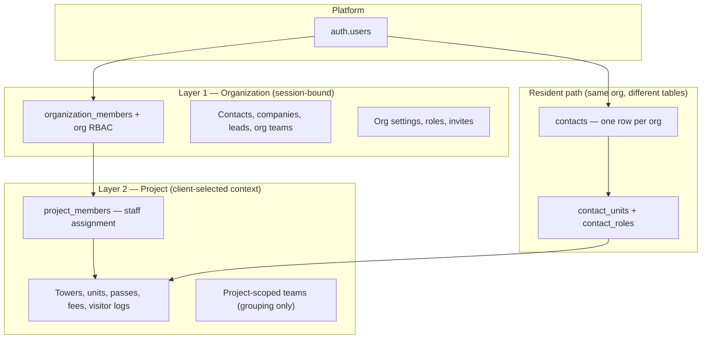
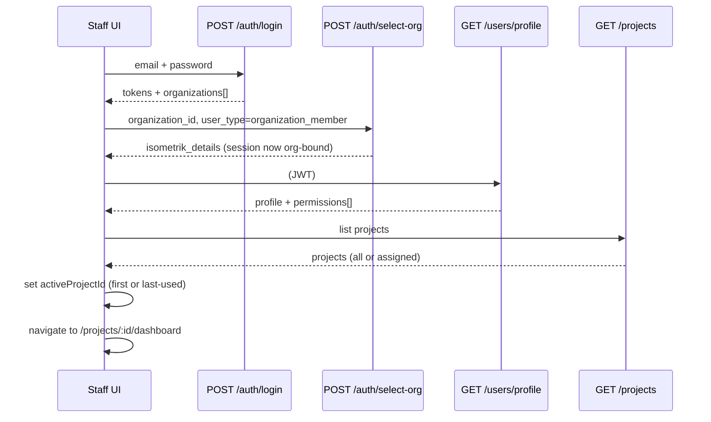
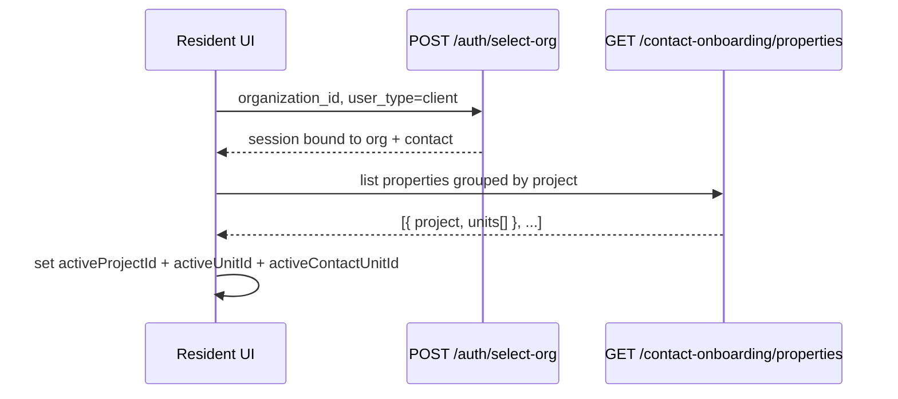
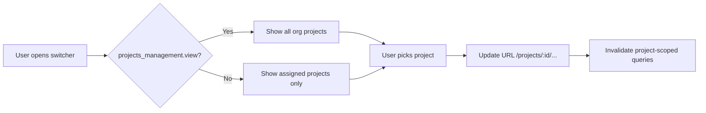
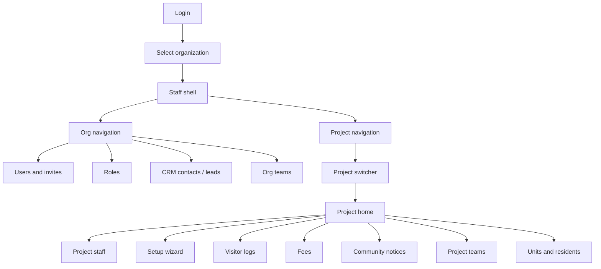

# Frontend Membership Flow — Org, Staff, and Project Layers

> How staff admin and resident portal apps should implement organization context,
> RBAC, project switching, and API scoping.
> **Status:** Proposed (companion to [membership-architecture.md](./membership-architecture.md)).
> Backend reference: [ADR 0011](./adr/0011-project-membership.md).

______________________________________________________________________

## Table of contents

1. [Mental model](#mental-model)
1. [Personas and app modes](#personas-and-app-modes)
1. [Bootstrap flows](#bootstrap-flows)
1. [Organization layer](#organization-layer)
1. [Staff layer](#staff-layer)
1. [Project layer](#project-layer)
1. [Teams — org vs project](#teams--org-vs-project)
1. [Resident portal](#resident-portal)
1. [Client state and caching](#client-state-and-caching)
1. [Screen map (staff admin)](#screen-map-staff-admin)
1. [Error handling](#error-handling)
1. [Deferred / not needed yet](#deferred--not-needed-yet)
1. [Implementation checklist](#implementation-checklist)

______________________________________________________________________

## Mental model



| Layer                 | What the user sees                   | Backend truth                              | Who uses it       |
| --------------------- | ------------------------------------ | ------------------------------------------ | ----------------- |
| **Organization**      | Company name in header, org settings | `user_sessions.organization_id`            | Staff + residents |
| **Staff**             | Team, roles, permissions             | `organization_members` → `permissions`     | Staff admin app   |
| **Project**           | Community / project switcher         | `project_id` on routes + `project_members` | Staff ops modules |
| **Resident property** | My properties                        | `contact_units.project_id` + `unit_id`     | Resident portal   |

### Rules the frontend must follow

1. **Session is org-scoped only** — never send `organization_id` from the client as authority; JWT/session carries it after `POST /v1/auth/select-org`.
1. **Project is client context** — store `activeProjectId` in app state or URL; pass it on every project-scoped API call.
1. **Staff access = permission AND assignment** — org RBAC alone is not enough for project ops unless the user has org-wide project view.
1. **Teams are not access control** — project teams are labels/grouping; `project_members` is what gates APIs.

### UI labels vs backend terms

| App             | Suggested label     | Backend term |
| --------------- | ------------------- | ------------ |
| Staff dashboard | Community / Project | `project_id` |
| Resident portal | My properties       | `project_id` |
| Code & API      | project             | `projects`   |

______________________________________________________________________

## Personas and app modes

### Staff personas

| Persona         | Org member? | Project member?   | Typical permissions                                 | Project switcher    |
| --------------- | ----------- | ----------------- | --------------------------------------------------- | ------------------- |
| Org owner / HQ  | Yes         | Optional          | `projects_management.view` (all projects)           | All org projects    |
| Project manager | Yes         | Yes (assigned)    | `projects_management.view_assigned` + module perms  | Assigned only       |
| Gate security   | Yes         | Yes (one project) | `visitor_management.view` etc.                      | Usually one project |
| CRM sales       | Yes         | No                | `contacts_management.view`, `leads_management.view` | Hidden / N/A        |

### Resident persona

- One `contacts` row per org.
- Multiple projects via `contact_units` (each row has `project_id`, `unit_id`, role).
- Portal picks **project + unit**, not staff-style community admin assignment.

### Dual-role user (staff + resident)

Same `auth.users`, different membership tables. UI should offer:

```
[ Admin mode ]  |  [ Resident mode ]
```

Each mode runs its own bootstrap (staff: projects; resident: properties).

______________________________________________________________________

## Bootstrap flows

### Staff app — full bootstrap



**Steps:**

1. **Login** → `AuthResponse` includes `organizations[]` (id, name, slug, status).
1. **Org selection** (if multiple orgs or first login):
   - `POST /v1/auth/select-org`
   - Body: `{ "organization_id": "...", "user_type": "organization_member" }`
   - On success, all subsequent API calls use session org (403 if org not selected).
1. **Load profile + permissions**:
   - `GET /v1/users/profile` → includes `permissions[]` when org is selected.
   - Cache permission **codes** client-side for menu gating (server still enforces).
1. **Load project list** (see [Project list — which API](#project-list--which-api)).
1. **Pick active project**:
   - Persist in `localStorage` or URL segment `/projects/:projectId/...`.
   - If user has exactly one project, auto-select.
   - If zero projects and no org-wide access → show “No communities assigned” empty state.

**Org switch (already logged in):**

- `POST /v1/auth/switch-org` (same body shape as select-org).
- Clear `activeProjectId`, permissions cache, and project-scoped query caches.
- Re-run profile + project list steps.

### Resident portal — bootstrap



1. `select-org` with `user_type: "client"` validates against `contacts`, not `organization_members`.
1. `GET /v1/contact-onboarding/properties` returns units grouped by project.
1. Store resident context (see [Resident portal](#resident-portal)).
1. All portal APIs use session contact — **never** pass `contact_id` from the client on portal routes.

______________________________________________________________________

## Organization layer

Org-scoped screens work with **only** session org context (`organization_id` from JWT/session).

### Org-scoped navigation

| Area                    | Permission gate (examples)          | Notes                                     |
| ----------------------- | ----------------------------------- | ----------------------------------------- |
| Org settings            | `organization.settings.manage`      | Users, roles, billing                     |
| Roles & permissions     | Admin                               | Org-wide RBAC                             |
| CRM — contacts registry | `contacts_management.view`          | Optional `project_id` filter              |
| CRM — companies, leads  | `*_management.view`                 | Org-wide                                  |
| Org CRM teams           | `teams_management.view`             | `GET /teams` without `project_id`         |
| Invites                 | `users_management.*`                | Can include `project_id` + `project_role` |
| Audit logs              | `audit_logs_management.view_system` | Cross-project                             |

### Routing pattern

```
/settings/*
/crm/contacts
/crm/leads
/crm/companies
/teams                    ← org CRM teams (project_id absent)
/users
/roles
```

No project switcher required on these pages. If the user navigates here from a project context, **do not** clear `activeProjectId` — they may return to ops.

### Project list — which API

Backend behavior in `list_projects`:

| User has                                 | `GET /v1/projects` returns                     |
| ---------------------------------------- | ---------------------------------------------- |
| `projects_management.view`               | **All** org projects                           |
| `projects_management.view_assigned` only | **Assigned** projects only (`project_members`) |
| Neither                                  | 403                                            |

`GET /v1/projects/mine` always returns projects where the user is an active `project_members` row. Use it when you need the user’s **project role** on each row (`community_admin`, `security`, etc.).

**Frontend recommendation:**

```typescript
function canViewAllProjects(permissions: string[]) {
  return permissions.includes("projects_management.view");
}

async function loadProjectSwitcherOptions(permissions: string[]) {
  // Backend filters to assigned-only when user lacks org-wide view.
  return GET("/v1/projects");
}

async function loadMyProjectRoles() {
  // Optional: badges in switcher (role per project).
  return GET("/v1/projects/mine");
}
```

______________________________________________________________________

## Staff layer

### Two concepts the UI must explain

When assigning staff to a project, admins manage **two separate things**:

| Concept                | Where configured                | What it controls                       |
| ---------------------- | ------------------------------- | -------------------------------------- |
| **Org membership**     | Invite → `organization_members` | Can log in, org role, permission codes |
| **Project assignment** | Project → Staff / Members       | Which communities they can operate on  |

**Suggested UI copy:**

> “Add them to your organization first, then assign them to one or more communities.”

### Invite flow (staff)

**Invite user form fields:**

- Email, name, org role (RBAC)
- Optional: org CRM `team_id`
- Optional: **`project_id`** + **`project_role`**
  - Roles: `community_admin`, `security`, `accountant`, `facility_manager`, `viewer`

On accept, backend:

1. Creates `organization_members`
1. If invite metadata had `project_id` → upserts `project_members`
1. If invited to a **project-scoped team** without explicit project → syncs `project_members` from team’s `project_id`

**Confirmation copy after invite with project:**

> “User will be added to **Green Valley** as **Security** when they accept.”

### Org members vs project members

| Screen              | API                                                  | Purpose                        |
| ------------------- | ---------------------------------------------------- | ------------------------------ |
| Settings → Users    | Org users API                                        | Everyone in the company        |
| Project → Staff tab | `GET /v1/projects/{project_id}/members`              | Who can work on this community |
| Assign to project   | `POST /v1/projects/{project_id}/members`             | Body: `{ user_id, role }`      |
| Change role         | `PATCH /v1/projects/{project_id}/members/{user_id}`  | `{ role?, status? }`           |
| Remove              | `DELETE /v1/projects/{project_id}/members/{user_id}` | Remove assignment              |

**Assign dialog flow:**

1. Search org members (must already be active org members).
1. Pick `ProjectMemberRole`.
1. Submit → `POST .../members`.

Requires `project_members.manage` **and** project access on that `project_id`.

### Permission-driven menus

After `GET /users/profile`, build nav from permission **codes**:

```typescript
const NAV = [
  {
    path: "/projects",
    perm: ["projects_management.view", "projects_management.view_assigned"],
  },
  { path: "/crm/contacts", perm: ["contacts_management.view"] },
  { path: "/visitor-logs", perm: ["visitor_management.view"], scoped: "project" },
  { path: "/fees", perm: ["fee_management.view"], scoped: "project" },
];
```

For `scoped: "project"` items:

- Hide entirely if no `activeProjectId`, or
- Show disabled with tooltip: “Select a community first.”

**Do not** infer project access from permissions alone — a user can have `visitor_management.view` but still get 403 on a project they’re not assigned to.

______________________________________________________________________

## Project layer

### URL and state conventions

**Preferred routing:**

```
/projects
/projects/:projectId
/projects/:projectId/visitor-logs
/projects/:projectId/fees
/projects/:projectId/units
/projects/:projectId/members
/projects/:projectId/teams
```

`:projectId` in the URL **is** the source of truth for `activeProjectId`. Sync to global store on route enter.

**Query/body param (list APIs):**

```
GET  /v1/visitor-logs?project_id={uuid}
POST /v1/contacts/list  { "project_id": "..." }
GET  /v1/teams?project_id={uuid}
```

Prefer path param for detail screens; query/body for filtered lists.

### Project switcher



Behavior:

- Show project name + code; optionally badge with user’s `project_members.role` from `/projects/mine`.
- On switch: update route, refetch current page data.
- If current route is invalid for new project, redirect to project home.

### Access check before rendering project pages

On mount of any `/projects/:projectId/*` route:

1. Confirm `projectId` is in the loaded project list (client-side fast check).
1. Call a lightweight project endpoint, e.g. `GET /v1/projects/{projectId}` or `GET /v1/projects/{projectId}/status`.
1. Handle errors (see [Error handling](#error-handling)).

This mirrors backend `ensure_staff_project_access`:

```
permission OK  AND  (org-wide view  OR  active project_members row)
```

### Module-by-module project scoping

| Module                         | API pattern                          | Frontend must send                           |
| ------------------------------ | ------------------------------------ | -------------------------------------------- |
| Project setup / towers / units | `/projects/{project_id}/...`         | Path `project_id`                            |
| Visitor logs                   | `GET /visitor-logs?project_id=`      | Query; omit for org-wide admin if API allows |
| Fees / invoices                | Mix of org-wide vs project routes    | Check each screen’s API                      |
| Move events                    | Resolved from unit → project         | Unit picker within active project            |
| **Notices (Community)**        | `/projects/{project_id}/notices`     | Path; Live tab banner slots (6 pins)         |
| Contact registry filter        | `POST /contacts/list` + `project_id` | Filter “This community only”                 |
| Project teams                  | `GET /teams?project_id=`             | Inside project settings                      |
| Project members                | `/projects/{id}/members`             | Path                                         |

**Contacts registry UX:**

- Default: all org contacts (CRM).
- When inside project context, offer filter **“Residents & contacts in this community”** → pass `project_id` (joins via `contact_units` / Typesense `project_ids`).

______________________________________________________________________

## Teams — org vs project

| Team type        | Create form           | List API                 | Shown in           |
| ---------------- | --------------------- | ------------------------ | ------------------ |
| Org CRM team     | No project picker     | `GET /teams`             | CRM / org settings |
| Project ops team | Required `project_id` | `GET /teams?project_id=` | Project → Teams    |

**Warning when adding members to a project team:**

> “Adding someone to this team does **not** grant community access. Assign them under **Project staff** as well.”

Optionally, after adding to a project team, prompt: “Also assign as project member?”

______________________________________________________________________

## Resident portal

### Property picker

After `GET /contact-onboarding/properties`:

```
Green Valley
  └─ Unit 101 (Owner)     ← contact_unit_id
  └─ Unit 102 (Family)

Sunrise Towers
  └─ Unit 205 (Tenant)
```

**Resident context shape:**

```typescript
type ResidentContext = {
  activeProjectId: string;
  activeUnitId: string;
  activeContactUnitId: string; // contact_units.id
  role: string; // Owner | Tenant | Family | ...
};
```

### Scoped features

| Feature             | Scope to                                  |
| ------------------- | ----------------------------------------- |
| Gate passes         | `project_id` + `unit_id`                  |
| Visitors            | Same unit                                 |
| Fee invoices        | Unit / contact_unit                       |
| Documents, vehicles | `contact_unit_id`                         |
| Tenant requests     | Unit in project                           |
| **Notices feed**    | `project_id` + role/tower match (Phase 2) |
| **Notice banner**   | Up to 6 pinned live notices for project   |

Switching property clears unit-scoped caches the same way staff project switch works.

______________________________________________________________________

## Client state and caching

```typescript
// Global auth store
type AuthState = {
  tokens: { access: string; refresh: string };
  user: UserInfo;
  organizations: OrganizationBasicDetails[];
  selectedOrganizationId: string | null;
  appMode: "staff" | "resident"; // if dual-role
};

// Staff store (after org selected)
type StaffContext = {
  permissions: string[];
  projects: ProjectSummary[];
  activeProjectId: string | null;
  myProjectRoles: Record<string, ProjectMemberRole>; // from /projects/mine
};

// Resident store
type ResidentContext = {
  propertyGroups: ProjectPropertyGroup[];
  activeProjectId: string | null;
  activeContactUnitId: string | null;
};
```

**Example cache keys (React Query or equivalent):**

```typescript
["projects", orgId]
["projects", orgId, "mine"]
["project", orgId, projectId, "members"]
["visitor-logs", orgId, projectId, filters]
["notices", orgId, projectId, filters]
["contacts", orgId, { projectId }] // null = org-wide
```

Invalidate on org switch and project switch.

______________________________________________________________________

## Screen map (staff admin)



______________________________________________________________________

## Error handling

| HTTP | Key                                 | UI action                                           |
| ---- | ----------------------------------- | --------------------------------------------------- |
| 401  | session invalid                     | Redirect to login                                   |
| 403  | `errors.insufficient_permissions`   | Hide action / show “Contact admin”                  |
| 403  | `auth.errors.project_access_denied` | Remove project from switcher or show request-access |
| 404  | project/contact not found           | Back to list                                        |
| 409  | select-org conflict                 | Force re-login or switch-org flow                   |

Never trust client-side permission checks for security — they only control visibility.

______________________________________________________________________

## Deferred / not needed yet

| Item                                 | Status                                                     |
| ------------------------------------ | ---------------------------------------------------------- |
| `contact_project_profiles`           | Not needed — no per-project prefs UI                       |
| `user_sessions.active_project_id`    | Optional server default — client can own `activeProjectId` |
| Project-scoped RBAC matrix           | Org permissions + `project_members` is enough for now      |
| Separate contact records per project | Blocked by design — use filters on one registry            |

______________________________________________________________________

## Implementation checklist

- [ ] Login → org picker (`select-org` / `switch-org`) with correct `user_type`
- [ ] Load permissions from `GET /users/profile` after org select
- [ ] Project switcher wired to `GET /projects` (backend filters assigned vs all)
- [ ] All project ops routes include `:projectId` in URL
- [ ] API client attaches JWT; never sends client-controlled `organization_id`
- [ ] Project members admin UI: list / assign / patch / delete on `/projects/:id/members`
- [ ] Invite form: optional project + project role
- [ ] Teams: separate org vs project create/list flows
- [ ] Contacts list: optional `project_id` filter when in project context
- [ ] Resident: property picker from `GET /contact-onboarding/properties`
- [ ] Dual-role: mode toggle with separate bootstrap
- [ ] 403 project access empty states

______________________________________________________________________

## Related documentation

| Doc                     | Location                                                                        |
| ----------------------- | ------------------------------------------------------------------------------- |
| Membership architecture | [membership-architecture.md](./membership-architecture.md)                      |
| ADR 0011 (decision)     | [adr/0011-project-membership.md](./adr/0011-project-membership.md)              |
| Schema reference        | [membership-schema.md](../../ats-home-craft-supabase/docs/membership-schema.md) |
| Resident onboarding     | [adr/0001-resident-onboarding.md](./adr/0001-resident-onboarding.md)            |
| Project setup flow      | [project-setup-flow.md](./project-setup-flow.md)                                |
