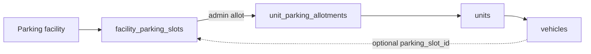

# Parking Allotment Flow — Context & Change Guide

This document explains **parking facilities**, **slot provisioning**, **unit-first allotment**,
and how **vehicles** optionally reference allotted slots. It complements the wizard coverage in
[`project-setup-flow.md`](project-setup-flow.md) and resident vehicle onboarding in
[`contact-onboarding-flow.md`](contact-onboarding-flow.md).

- **Service:** `ats-home-craft-python-service` → `apps/user_service`
- **API prefixes:** `/v1/projects` (setup + allotment + vehicle review)
- **DB migrations:**
  - `20260629101000_property_setup_tables.sql` — `facilities`, `facility_parking_slots`
  - `20260826120000_facility_parking_numbering.sql` — facility numbering columns
  - `20260826140000_parking_vehicle_category_entitlements.sql` — facility vehicle category + split unit entitlements
  - `20260826130000_facility_parking_slot_codes.sql` — `slot_code` on slots
  - `20260824180000_parking_allotment_tables.sql` — `unit_parking_allotments`, `parking_slot_events`
  - `20260629111000_resident_onboarding_tables.sql` — `vehicles.parking_slot_id`
- **Full column reference:** `ats-home-craft-supabase/docs/project-setup-schema.md`

______________________________________________________________________

## 1. Concepts (read this first)

There are **three related but distinct** parking concepts in the product:

| Concept                | Table(s)                               | Purpose                                                                                    |
| ---------------------- | -------------------------------------- | ------------------------------------------------------------------------------------------ |
| **Parking facilities** | `facilities`, `facility_parking_slots` | Amenity bays created in Step 7 (facilities wizard). Auto-provisioned slots.                |
| **Parking zones**      | `parking_zones`                        | Tower basement **ranges** created in Step 8 (floor plans). Not individual assignable bays. |
| **Parking allotment**  | `unit_parking_allotments`              | Admin assigns a **facility slot** to a **unit** (post-setup operations screen).            |

> **Source of truth for slot occupancy:** `unit_parking_allotments` + `facility_parking_slots.status`.
> Only the **parking allotment** flow sets a slot to `assigned` or back to `available`.

### Slot fields

Each row in `facility_parking_slots`:

| Column        | Role                                                                           |
| ------------- | ------------------------------------------------------------------------------ |
| `slot_number` | Internal integer sequence (sorting, ranges, FKs). Always ≥ 1.                  |
| `slot_code`   | Human label shown in UI (e.g. `SLT-A-1`, `101`, `B2-01`). Unique per facility. |
| `status`      | `available` · `assigned` · `blocked`                                           |

When a parking **facility** is created, the API provisions `parking_slots` rows with both
`slot_number` and `slot_code` according to the facility numbering settings (see §3).

______________________________________________________________________

## 2. Architecture (layers)

```
HTTP → API router → Service → Repository → Postgres
```

| Layer                 | Parking setup                                             | Parking allotment                 | Vehicle review                              |
| --------------------- | --------------------------------------------------------- | --------------------------------- | ------------------------------------------- |
| **API**               | `app/api/projects.py`                                     | `app/api/parking_allotment.py`    | `app/api/projects.py` (`/vehicle-requests`) |
| **Service**           | `facilities_service.py`                                   | `parking_allotment_service.py`    | `vehicles_service.py`                       |
| **Repository**        | `facilities_repository.py`, `parking_slots_repository.py` | `parking_allotment_repository.py` | `vehicles_repository.py`                    |
| **Validation**        | `project_setup_validation.py`                             | inline in allotment service       | `ReviewVehicleRequest` + allotment check    |
| **Slot label helper** | `app/utils/parking_slot_numbering.py`                     | uses stored `slot_code`           | optional link only                          |

______________________________________________________________________

## 3. Step 7 — Create parking facilities (wizard)

**Endpoint:** `POST /v1/projects/{project_id}/facilities`

When `facility_type = "parking"`, the request supports numbering options (same enum as towers):

| Field                   | Default      | Notes                                        |
| ----------------------- | ------------ | -------------------------------------------- |
| `numbering_pattern`     | `floor_unit` | `floor_unit` · `sequential` · `custom`       |
| `starting_slots_number` | `1`          | First `slot_number` when provisioning        |
| `custom_prefix`         | —            | Required when `numbering_pattern = "custom"` |

Also required for parking facilities: `parking_slots` (> 0), `parking_user_type` (`resident` / `visitors`), and `parking_vehicle_category` (`two_wheeler` / `four_wheeler` / `both`).

| Field | Values | Notes |
| ----- | ------ | ----- |
| `parking_vehicle_category` | `two_wheeler` · `four_wheeler` · `both` | All slots in the facility inherit this category unless `both` (then use `facility_subtype` per bay) |

Unit configurations store split entitlements: `two_wheeler_parking_entitlement` and `four_wheeler_parking_entitlement` (`parking_entitlement` is kept as their sum).

When allotting with `allotment_basis = included_with_unit`, the service checks the slot category against the matching entitlement bucket (two-wheeler slots vs four-wheeler/car/EV slots).

### Example — custom prefix

```json
POST /v1/projects/{project_id}/facilities
{
  "name": "Visitor Parking",
  "facility_type": "parking",
  "location_type": "outdoor_standalone",
  "parking_slots": 10,
  "parking_user_type": "visitors",
  "parking_vehicle_category": "four_wheeler",
  "numbering_pattern": "custom",
  "custom_prefix": "SLT-A",
  "starting_slots_number": 1
}
```

**Provisioned slots:**

| slot_number | slot_code |
| ----------- | --------- |
| 1           | SLT-A-1   |
| 2           | SLT-A-2   |
| …           | …         |

### `slot_code` generation rules

Implemented in `app/utils/parking_slot_numbering.py`:

| Pattern                            | Example codes                                      |
| ---------------------------------- | -------------------------------------------------- |
| `custom` + `SLT-A`                 | `SLT-A-1`, `SLT-A-2`, …                            |
| `sequential`                       | `1`, `2`, `100`, … (plain string of `slot_number`) |
| `floor_unit` + numeric floor `"1"` | `101`, `102`, …                                    |
| `floor_unit` + text floor `"B2"`   | `B2-01`, `B2-02`, …                                |

Numbering fields are **rejected** on non-parking facility types.

**List slots:** `GET /v1/projects/{project_id}/facilities/{facility_id}/parking-slots`

______________________________________________________________________

## 4. Unit-first allotment model



| Link               | Mechanism                                        | Changes slot status?                                |
| ------------------ | ------------------------------------------------ | --------------------------------------------------- |
| **Unit → slot**    | `unit_parking_allotments` (active row)           | **Yes** — allot → `assigned`; release → `available` |
| **Vehicle → slot** | `vehicles.parking_slot_id` (optional on approve) | **No** — reference only                             |
| **Vehicle → unit** | `vehicles.unit_id`                               | —                                                   |

### Rules

1. **Admin allots slot to unit** → creates `unit_parking_allotments`, sets `facility_parking_slots.status = assigned`.
1. **Admin approves vehicle** → may set `vehicles.parking_slot_id` **only if** that slot has an **active allotment to the vehicle's unit**. Does not change slot status.
1. **Vehicle removed / move-out** → clears `vehicles.parking_slot_id` on soft-remove; slot **stays assigned** to the unit.
1. **Admin releases unit allotment** → marks allotment released, clears any `vehicles.parking_slot_id` pointing at that slot, sets slot `available`.
1. **No parking entitlement limit** on vehicle create/approve — residents may submit any number of requests; admin decides approvals and slot links.

______________________________________________________________________

## 5. Parking allotment API catalog

All routes under `/v1/projects/{project_id}/parking-allotment/…`
Router: `app/api/parking_allotment.py` · Tag: **Parking Allotment**

RBAC: reads `PROJECTS_MANAGEMENT_VIEW`, writes `PROJECTS_MANAGEMENT_EDIT`.

### Reads

| Method | Path                                         | Purpose                                                               |
| ------ | -------------------------------------------- | --------------------------------------------------------------------- |
| GET    | `/parking-allotment/summary`                 | Dashboard counts (`?tower_id`, `?facility_id`)                        |
| GET    | `/parking-allotment/slots`                   | By-slot table (filters: tower, facility, floor, type, status, search) |
| GET    | `/parking-allotment/slots/{slot_id}`         | Slot detail + current unit allotment                                  |
| GET    | `/parking-allotment/slots/{slot_id}/history` | Audit events from `parking_slot_events`                               |
| GET    | `/parking-allotment/units`                   | By-unit table (entitlement vs slots held)                             |
| GET    | `/parking-allotment/units/{unit_id}`         | One unit with `slots_held` and entitlement summary                    |

### Mutations

| Method | Path                                          | Purpose                          |
| ------ | --------------------------------------------- | -------------------------------- |
| POST   | `/parking-allotment/slots/{slot_id}/allot`    | Allot free resident slot to unit |
| POST   | `/parking-allotment/slots/{slot_id}/reassign` | Move slot to another unit        |
| POST   | `/parking-allotment/slots/{slot_id}/release`  | Release slot from unit           |
| POST   | `/parking-allotment/slots/{slot_id}/block`    | Block a free slot                |
| POST   | `/parking-allotment/slots/{slot_id}/unblock`  | Unblock a blocked slot           |
| POST   | `/parking-allotment/units/{unit_id}/allot`    | Allot from unit-centric UI       |

Visitor-pool slots (`parking_user_type = visitors`) cannot be allotted to units.

### Allot request body (example)

```json
POST /v1/projects/{project_id}/parking-allotment/slots/{slot_id}/allot
{
  "unit_id": "<uuid>",
  "effective_from": "2026-08-26",
  "allotment_basis": "included_with_unit"
}
```

`allotment_basis`: `included_with_unit` · `additional_chargeable` · `temporary`

______________________________________________________________________

## 6. Vehicle review (optional slot link)

**Not part of the allotment router** — lives on project APIs for community admins.

| Method | Path                                                      | Purpose                            |
| ------ | --------------------------------------------------------- | ---------------------------------- |
| GET    | `/v1/projects/{project_id}/vehicle-requests`              | Queue (`?status=pending`, filters) |
| PATCH  | `/v1/projects/{project_id}/vehicle-requests/{vehicle_id}` | Approve or reject                  |

### Approve without slot

```json
{ "status": "approved" }
```

### Approve with slot (must be allotted to vehicle's unit)

```json
{
  "status": "approved",
  "parking_slot_id": "<facility_parking_slots.id>"
}
```

Validation (`vehicles_service._validate_vehicle_parking_slot`):

- Slot exists in the project.
- Active `unit_parking_allotments` row exists for `(unit_id, parking_slot_id)`.

Reject:

```json
{
  "status": "rejected",
  "rejection_reason": "Documents incomplete"
}
```

See [`contact-onboarding-flow.md`](contact-onboarding-flow.md) for resident-side vehicle CRUD.

______________________________________________________________________

## 7. Data model

### `facilities` (parking-specific columns)

| Column                  | Type                     | Notes                               |
| ----------------------- | ------------------------ | ----------------------------------- |
| `numbering_pattern`     | `unit_numbering_pattern` | Set when `facility_type = parking`  |
| `starting_slots_number` | integer                  | First slot number when provisioning |
| `custom_prefix`         | text                     | Required when pattern is `custom`   |

### `facility_parking_slots`

| Column        | Notes                              |
| ------------- | ---------------------------------- |
| `facility_id` | Parent parking facility            |
| `slot_number` | Integer, unique per facility       |
| `slot_code`   | Display label, unique per facility |
| `status`      | Managed by allotment flow          |

### `unit_parking_allotments`

| Column            | Notes                         |
| ----------------- | ----------------------------- |
| `unit_id`         | Allotted unit                 |
| `parking_slot_id` | FK → `facility_parking_slots` |
| `allotment_basis` | `included_with_unit`, etc.    |
| `effective_from`  | Date                          |
| `status`          | `active` · `released`         |

Unique partial index: one **active** allotment per slot.

### `parking_slot_events`

Append-only audit: `allotted`, `released`, `reassigned`, `blocked`, `unblocked`.

### `vehicles.parking_slot_id`

Optional FK after admin approval. Does **not** drive slot status.

______________________________________________________________________

## 8. Display status (allotment UI)

Computed in `parking_allotment_repository._DISPLAY_STATUS_SQL`:

| display_status | Meaning                                        |
| -------------- | ---------------------------------------------- |
| `free`         | Available resident slot                        |
| `allotted`     | Assigned to a unit (or slot status `assigned`) |
| `blocked`      | Admin-blocked                                  |
| `visitor_pool` | Visitor facility slot, still available         |

List/detail responses expose `slot_code` (stored label). Legacy rows without `slot_code` fall back
to `{tower}-{floor}-{slot_number:03d}` formatting in `ParkingAllotmentService._resolve_slot_code`.

______________________________________________________________________

## 9. End-to-end workflow (recommended)

1. **Project setup (Step 7)** — Create parking facility with numbering → slots provisioned.
1. **Parking allotment (post-setup)** — Admin allots slot(s) to unit → slot `assigned`.
1. **Contact onboarding** — Resident submits vehicle(s) (no entitlement cap).
1. **Vehicle review** — Admin approves; optionally sets `parking_slot_id` to one of the unit's allotted slots.
1. **Release** — When unit no longer needs a bay, admin **releases allotment** (not vehicle delete).

______________________________________________________________________

## 10. How to make common changes

| I want to…                        | Change here                                                           |
| --------------------------------- | --------------------------------------------------------------------- |
| Change slot label rules on create | `app/utils/parking_slot_numbering.py`                                 |
| Change facility create validation | `project_setup_validation.py`, `facilities_service.py`                |
| Change allot / release behaviour  | `parking_allotment_service.py`                                        |
| Change vehicle approve slot rules | `vehicles_service._validate_vehicle_parking_slot`                     |
| Add allotment endpoint            | `parking_allotment.py` → service → repository                         |
| Change user-facing messages       | `app/locales/en.json` (`parking_allotment.*`, `contact_onboarding.*`) |

### Tests

- `tests/unit/test_parking_slot_numbering.py` — label generation
- `tests/unit/test_facilities_service.py` — provisioning + custom codes
- `tests/unit/test_parking_allotment_service.py` — allotment mutations
- `tests/unit/test_vehicles_service.py` — approve without slot, no slot status changes

Run: `.venv/bin/python -m pytest apps/user_service/tests/unit`
