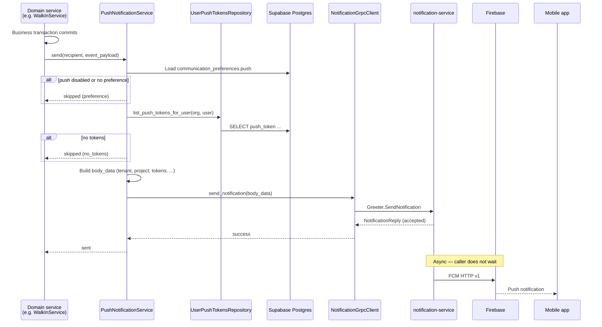

# Push Notifications Flow — Context & Integration Guide

> **Status: Proposed (ADR + integration plan).** Device registration is implemented; gRPC sender and feature wiring are follow-ups.
>
> Architecture rationale: [ADR 0009](./adr/0009-push-notifications-grpc.md).
>
> External reference: notification-service `docs/fcm-flow.md`.

- **Service:** `ats-home-craft-python-service` → `apps/user_service`
- **Registration API:** `POST /v1/users/me/push-devices`, `DELETE /v1/users/me/push-devices/{device_id}`
- **Sender (planned):** `PushNotificationService` → gRPC `notification-service:50051`
- **Token storage:** `public.user_push_tokens` (`ats-home-craft-supabase`)
- **In-app feed (read):** notification-service HTTP `GET /api/v1/notifications/logs` (mobile / gateway)

______________________________________________________________________

## 1. What this flow does

Home Craft sends **push notifications** and optional **in-app feed rows** when domain events occur (walk-in approval needed, pass check-in, tenant request update, fee reminder, etc.).

**python-service responsibilities:**

| Step                                                     | Owner                      |
| -------------------------------------------------------- | -------------------------- |
| Register / unregister FCM device tokens                  | `user_service` (done)      |
| Resolve recipient Supabase `user_id` + `organization_id` | Domain service             |
| Load FCM tokens from Postgres                            | `UserPushTokensRepository` |
| Build `body_data` JSON with tenant/project scope         | `PushNotificationService`  |
| Call gRPC `SendNotification`                             | `NotificationGrpcClient`   |

**notification-service responsibilities:**

| Step                                   | Owner                         |
| -------------------------------------- | ----------------------------- |
| Validate payload                       | notification-service API      |
| Persist feed row (`notification_logs`) | notification-service Postgres |
| Enqueue FCM job                        | Redis / Asynq                 |
| Deliver to FCM                         | notification-service worker   |
| Serve feed + unread count              | notification-service HTTP     |

______________________________________________________________________

## 2. Identifier mapping

Every gRPC payload **must** include these top-level fields:

| Field        | Source in Home Craft                                              | Example                  |
| ------------ | ----------------------------------------------------------------- | ------------------------ |
| `tenant_id`  | `shared_settings.isometrik.client_name` (`ISOMETRIK_CLIENT_NAME`) | `home-craft-prod`        |
| `project_id` | `organization_id` (UUID)                                          | `a1b2c3d4-...`           |
| `user_id`    | Recipient Supabase user id (`auth.users.id`)                      | `e5f6g7h8-...`           |
| `tokens`     | `user_push_tokens.push_token` for `(organization_id, user_id)`    | `["dK3x...", "fM9y..."]` |

```python
# Conceptual mapping (implementation in PushNotificationService)
tenant_id = shared_settings.isometrik.client_name
project_id = str(organization_id)
user_id = str(recipient_supabase_user_id)
tokens = await push_tokens_repo.list_push_tokens_for_user(
    organization_id=project_id,
    user_id=user_id,
)
```

The mobile app uses the **same** `tenant_id` and `project_id` when calling notification-service feed APIs (`x-tenant-id`, `x-project-id` headers).

______________________________________________________________________

## 3. Device registration (implemented)

### 3.1 Register on login / token refresh

```http
POST /v1/users/me/push-devices
Authorization: Bearer <supabase_jwt>

{
  "device_id": "stable-client-id",
  "push_token": "<fcm_registration_token>",
  "platform": "android",
  "app_version": "1.2.0"
}
```

**Behaviour:**

1. JWT provides Supabase `user_id`; session/org context provides `organization_id`.
1. Upsert on `device_id` — same physical device reassigned when another user logs in.
1. Row stored in `user_push_tokens` with `provider = 'fcm'`.

**Code:** `user_push_tokens.py` → `UserPushTokenService.register_device`.

### 3.2 Unregister on logout

```http
DELETE /v1/users/me/push-devices/{device_id}
```

Idempotent delete scoped to authenticated user.

### 3.3 Schema

```text
user_push_tokens
├── device_id          (unique)
├── organization_id    → organizations.id
├── user_id            → auth.users.id
├── push_token
├── platform           ios | android | web
├── provider           fcm (default)
└── last_seen_at / updated_at
```

Migration: `20260728153000_user_push_tokens.sql`.

______________________________________________________________________

## 4. Send flow (planned)

### 4.1 End-to-end sequence



### 4.2 gRPC call shape

**RPC:** `notification.Greeter/SendNotification`

**Request:**

```json
{
  "body_data": "<stringified JSON — full payload>"
}
```

**Success:** `NotificationReply.message` is a non-empty JSON string, e.g.:

```json
{
  "status": "accepted",
  "notificationLogId": "550e8400-e29b-41d4-a716-446655440000",
  "deliveryMode": "multi",
  "targetCount": 2
}
```

**Important:** gRPC returns after accept + enqueue. It does **not** guarantee FCM delivery.

### 4.3 Example payload (walk-in approval)

```json
{
  "tenant_id": "home-craft-prod",
  "project_id": "a1b2c3d4-e5f6-7890-abcd-ef1234567890",
  "user_id": "f47ac10b-58cc-4372-a567-0e02b2c3d479",
  "title": "Walk-in approval needed",
  "body": "Security registered a visitor for Flat A-2102",
  "type": "NOTIFICATION_TYPE_WALK_IN",
  "feed_type": "walk_in",
  "tokens": ["fcm_token_phone", "fcm_token_tablet"],
  "data": {
    "walk_in_entry_id": "entry-uuid",
    "visit_unit_id": "visit-unit-uuid",
    "tower_id": "tower-uuid",
    "unit_id": "unit-uuid",
    "screen": "walk_in_detail"
  },
  "actor": {
    "user_id": "security-user-uuid",
    "display_name": "Gate Security"
  },
  "entity": {
    "kind": "walk_in",
    "id": "entry-uuid"
  },
  "options": {
    "priority": "PRIORITY_HIGH",
    "collapse_key": "walk_in:visit-unit-uuid",
    "ttl_seconds": 3600,
    "save_to_db": true,
    "push_enabled": true,
    "click_action": "OPEN_WALK_IN",
    "idempotency_key": "walk_in:visit-unit-uuid:awaiting"
  }
}
```

### 4.4 Skip conditions (no gRPC call)

| Condition                                          | Log reason       | Business tx |
| -------------------------------------------------- | ---------------- | ----------- |
| `NOTIFICATION_ENABLED=false`                       | `disabled`       | Unaffected  |
| Recipient `communication_preferences.push != true` | `preference_off` | Unaffected  |
| No rows in `user_push_tokens`                      | `no_tokens`      | Unaffected  |
| gRPC error (default)                               | `grpc_failed`    | Unaffected  |

When `NOTIFICATION_RAISE_ON_FAILURE=true`, gRPC errors propagate to the caller (use only in tests or strict batch jobs).

______________________________________________________________________

## 5. Planned code layout

| Path                                                                   | Role                                             |
| ---------------------------------------------------------------------- | ------------------------------------------------ |
| `libs/shared_config/app_settings.py`                                   | `NotificationSettings`                           |
| `libs/shared_utils/notification_grpc_client.py`                        | Async gRPC client, JSON encode, channel cache    |
| `libs/grpc_stubs/notification/`                                        | Generated `notification_service_pb2*` from proto |
| `apps/user_service/app/services/push_notification_service.py`          | Payload builder + token lookup + preference gate |
| `apps/user_service/app/db/repositories/user_push_tokens_repository.py` | `list_push_tokens_for_user`                      |
| `apps/user_service/app/schemas/push_notifications.py`                  | Pydantic models for send params (optional)       |

Domain services (walk-in, passes, etc.) depend on `PushNotificationService` only — not on gRPC directly.

### 5.1 Localized title and body

Use the existing **`Translator`** and `apps/user_service/app/locales/*.json` — same system as API `success_response` messages.

| Concern            | Approach                                                                                                  |
| ------------------ | --------------------------------------------------------------------------------------------------------- |
| Where strings live | `en.json` (and future `hi.json`, …) under `notifications.push.*`                                          |
| How to resolve     | `translator.get("notifications.push.walk_in.awaiting.title", language, **params)`                         |
| Dynamic values     | `{unit_label}`, `{visitor_name}`, `{actor_name}`, etc. in JSON strings                                    |
| When to resolve    | At send time inside `PushNotificationService`, before gRPC                                                |
| Language           | Recipient `preferred_language` when available, else `en` (not the triggering HTTP request's `lan` header) |

**Why not hard-code in Python?** Keeps copy editable in one place, matches API i18n patterns, and allows new languages without code changes.

**Caller pattern:**

```python
await push_notification_service.send(
    organization_id=org_id,
    recipient_user_id=user_id,
    message_key="notifications.push.walk_in.awaiting",
    language="en",
    params={"unit_label": "Flat A-2102"},
    type="NOTIFICATION_TYPE_WALK_IN",
    feed_type="walk_in",
    data={...},
    entity={...},
    options={...},
)
```

`PushNotificationService` expands `message_key` → `.title` / `.body`, then sends the resolved strings in gRPC `body_data`.

______________________________________________________________________

## 6. Feature integration map

| Trigger                                | Caller (planned)             | Recipient                       | `type` / `feed_type`                    | `click_action`        |
| -------------------------------------- | ---------------------------- | ------------------------------- | --------------------------------------- | --------------------- |
| Walk-in created; visit unit `awaiting` | `WalkInService` after create | Residents on visit unit flat    | `NOTIFICATION_TYPE_WALK_IN` / `walk_in` | `OPEN_WALK_IN`        |
| Pass checked in (notify household)     | Pass validation service      | Household contacts with push on | `NOTIFICATION_TYPE_PASS` / `pass`       | `OPEN_PASS`           |
| Tenant request status change           | Tenant request service       | Owner / admin                   | `NOTIFICATION_TYPE_TENANT` / `tenant`   | `OPEN_TENANT_REQUEST` |
| Fee invoice / reminder                 | Fee worker                   | Owner                           | `NOTIFICATION_TYPE_FEE` / `fee`         | `OPEN_FEE`            |
| Move event recorded                    | Move events service          | Relevant contacts               | `NOTIFICATION_TYPE_MOVE` / `move`       | `OPEN_MOVE`           |

Each integration passes:

- `organization_id` → `project_id`
- Resolved recipient **Supabase user id** (via `contacts.supabase_user_id` or membership lookup — per feature)
- `actor` from triggering user when applicable
- `entity.kind` + `entity.id` for deep links
- Stable `options.idempotency_key` per event instance

______________________________________________________________________

## 7. Resolving recipient Supabase user id

Push targets **`auth.users.id`**, not `contacts.id`. Domain services must map contact → Supabase user:

| Context                        | Resolution                                                  |
| ------------------------------ | ----------------------------------------------------------- |
| Logged-in resident / owner     | JWT `sub` or `user_context.user_id`                         |
| Another household contact      | `contacts.supabase_user_id` (or join via onboarding tables) |
| Organization member (security) | Member's linked Supabase user                               |

If a contact has no Supabase account yet (invite pending), **skip push** — no `user_push_tokens` row will exist anyway.

______________________________________________________________________

## 8. In-app notification feed (mobile read path)

notification-service stores feed rows when `options.save_to_db = true` (default).

**List notifications:**

```http
GET /api/v1/notifications/logs?skip=0&limit=20
x-tenant-id: <ISOMETRIK_CLIENT_NAME>
x-project-id: <organization_id>
Authorization: Bearer <supabase_jwt>
```

**Unread badge:**

```http
GET /api/v1/notifications/unread-count
```

Same headers. Opening logs marks matching unread rows as read (notification-service behaviour).

Home Craft python-service **does not** proxy these endpoints in Phase 1 — mobile calls notification-service (via API gateway) directly.

______________________________________________________________________

## 9. Environment variables

Add to `.env` / deployment config:

| Variable                        | Example                      | Description                            |
| ------------------------------- | ---------------------------- | -------------------------------------- |
| `NOTIFICATION_ENABLED`          | `true`                       | Master switch                          |
| `NOTIFICATION_GRPC_TARGET`      | `notification-service:50051` | gRPC address                           |
| `NOTIFICATION_GRPC_TIMEOUT_MS`  | `3000`                       | RPC timeout                            |
| `NOTIFICATION_RAISE_ON_FAILURE` | `false`                      | Fail domain tx on gRPC error           |
| `ISOMETRIK_CLIENT_NAME`         | `home-craft-prod`            | Maps to `tenant_id` (already required) |

Existing registration flow also requires valid JWT + org context; no new env vars for token storage.

______________________________________________________________________

## 10. Topic-based delivery (Phase 2, optional)

`UserPushTokenService.user_push_topic(org_id, user_id)` returns:

```text
org:{organization_id}:user:{user_id}
```

If the mobile app subscribes to this topic via Firebase SDK on login, callers may send:

```json
{
  "topics": ["org:a1b2...:user:f47a..."],
  ...
}
```

instead of or in addition to `tokens[]`.

**Phase 1 uses tokens only** because registration already persists FCM tokens server-side. Topic mode requires coordinated mobile changes and does not replace token registration.

______________________________________________________________________

## 11. Local development checklist

1. Postgres with `user_push_tokens` migration applied.
1. Register a device: `POST /v1/users/me/push-devices` with a test FCM token.
1. Run notification-service API (`:50051`) and worker (`FCM_MOCK=true` for local).
1. Set `NOTIFICATION_ENABLED=true`, `NOTIFICATION_GRPC_TARGET=localhost:50051`.
1. Trigger a domain event or call `PushNotificationService` from a test script.
1. Confirm gRPC `accepted` response and `notification_logs` row in notification-service DB.
1. With real FCM: valid token + worker with service account JSON.

______________________________________________________________________

## 12. Troubleshooting

| Symptom                           | Likely cause                                    | Fix                                         |
| --------------------------------- | ----------------------------------------------- | ------------------------------------------- |
| Business action succeeds, no push | `NOTIFICATION_ENABLED=false`                    | Enable flag                                 |
| Log `no_tokens`                   | User never registered device                    | Call push-devices API                       |
| Log `preference_off`              | `communication_preferences.push` is false       | User opt-in                                 |
| gRPC connection refused           | notification-service not running / wrong target | Check `NOTIFICATION_GRPC_TARGET`            |
| Accepted but no FCM               | Worker down or `FCM_MOCK=true`                  | Start worker, check FCM creds               |
| Feed empty in app                 | Wrong `x-tenant-id` / `x-project-id`            | Must match `ISOMETRIK_CLIENT_NAME` + org id |
| Wrong user's device gets push     | Token reassigned on shared device login         | Expected — upsert by `device_id`            |

______________________________________________________________________

## Related

- [ADR 0009 — Push notifications gRPC](./adr/0009-push-notifications-grpc.md)
- [walk-in-flow.md](./walk-in-flow.md) — first planned push consumer
- [ADR 0001 — Resident onboarding](./adr/0001-resident-onboarding.md) — `communication_preferences`
- notification-service: `docs/adr/0001-grpc-topic-push-notifications.md`, `docs/fcm-flow.md`
